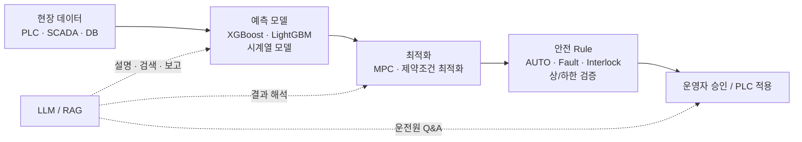

# Water AI · 공정/AI 기술

하수장·정수장에 공통으로 적용하는 **공정 예측·이상탐지·운전 최적화·안전제어·LLM/RAG 역할**을 정리합니다.

## 바로가기

- [[10-하수장-정수장-AI-모델-적용-원칙|하수장·정수장 AI 모델 적용 원칙]]

## 한눈에 보기

> [!important] 기본 원칙
> **LLM이 PLC 값을 직접 결정하지 않는다.** 실제 수치 예측·최적화·제어는 전용 모델과 Rule Engine이 담당하고, LLM은 설명·검색·보고·의사결정 지원을 담당한다.

[[../00-Water-AI-공통-홈|← Water AI 공통 홈]]
