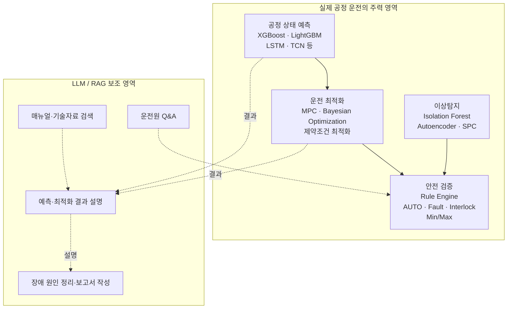
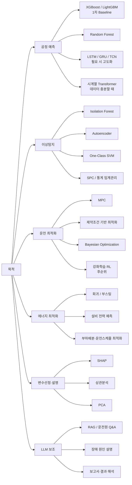
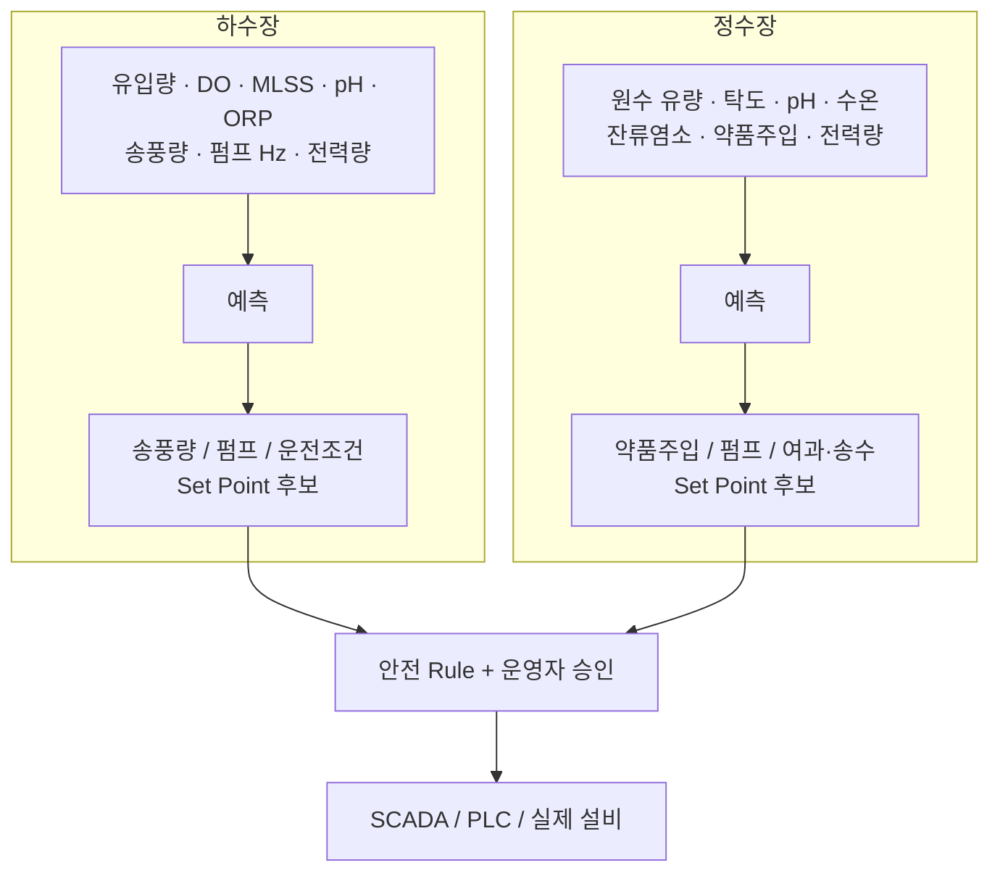
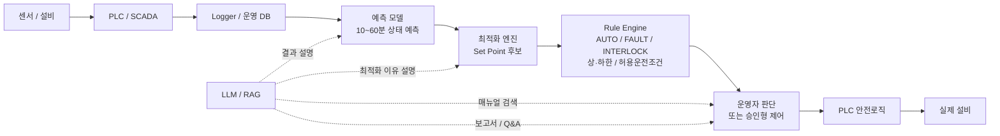
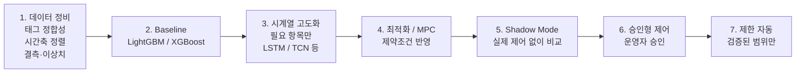
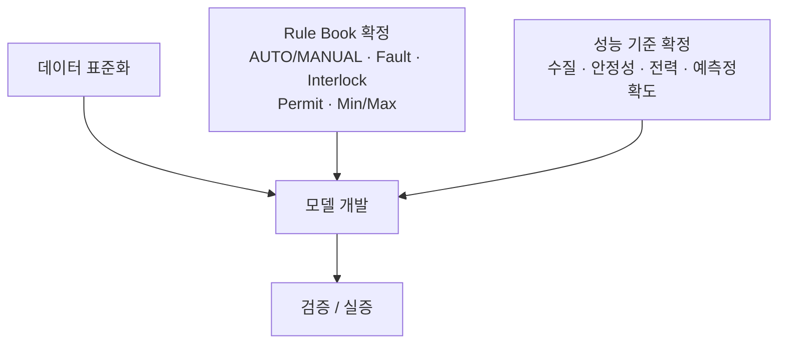
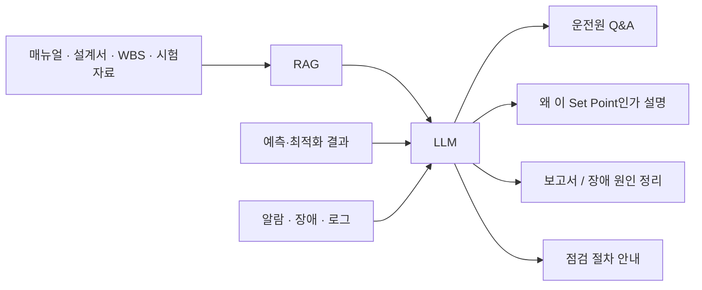
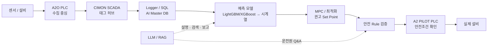
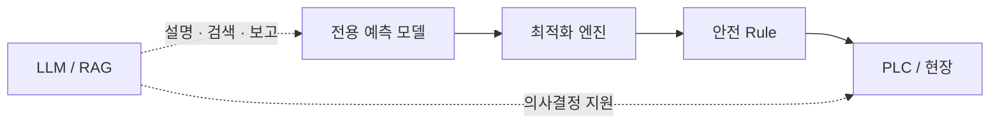

# 하수장·정수장 AI 모델 적용 원칙

> [!summary] 결론
> 하수장·정수장 **실제 운전 예측·최적화에는 LLM보다 전용 수치모델이 주력**이다.  
> **XGBoost/LightGBM → 필요한 항목만 시계열 딥러닝 → MPC/제약조건 최적화 → 안전 Rule → 현장 실증** 순으로 가고, **LLM/RAG는 옆에서 설명·검색·보고를 지원**한다.

---

## 1. 전체 역할 분리

### 핵심 경계

| 구분 | 담당 | 비고 |
|---|---|---|
| 수질·유량·전력 수치 예측 | 전용 ML/시계열 모델 | LLM 주력 사용 금지 |
| Set Point 후보 계산 | MPC/최적화 엔진 | 공정 제약조건 반영 |
| 이상 징후 탐지 | 이상탐지 모델 | 센서·설비·공정 이상 |
| 최종 안전 확인 | Rule Engine / PLC 안전로직 | AI가 우회하면 안 됨 |
| 설명·검색·Q&A·보고 | LLM/RAG | 운전원 의사결정 지원 |

---

## 2. 목적별로 어떤 기법을 쓰나

> [!tip] 1차 모델 추천
> 처음부터 딥러닝으로 가지 말고 **LightGBM/XGBoost로 Baseline을 먼저 만든다.**  
> Baseline으로 부족한 예측 항목에만 LSTM/TCN/Transformer 계열을 추가한다.

---

## 3. 하수장과 정수장의 입력·출력 예시

### 하수장 주요 목표 예

- 방류 수질 유지
- DO 등 공정 상태 안정화
- 송풍기·펌프 전력 최소화
- 이상상태 조기 탐지
- 운전조건 변경 시 향후 상태 예측

### 정수장 주요 목표 예

- 탁도·잔류염소 등 수질 기준 유지
- 약품 주입량 최적화
- 펌프·송수·여과 에너지 절감
- 원수 변화에 따른 선제 운전
- 설비 이상·센서 이상 조기 탐지

---

## 4. 권장 시스템 구조

> [!danger] 금지선
> - LLM이 PLC 값을 직접 산출하여 즉시 쓰는 구조
> - LLM이 Interlock/Permit/Min-Max Rule을 우회하는 구조
> - 검증되지 않은 모델을 처음부터 자동제어에 연결하는 구조

---

## 5. 실제 구축 순서

### 선행조건

---

## 6. LLM은 어디에 붙이나

### 예시

**질문**  
`왜 지금 송풍량을 줄이라고 했어?`

**LLM이 설명해야 할 내용**  
- 최근 DO 추세
- 유입부하 변화
- 예측모델의 10~60분 전망
- 최적화 모델이 계산한 전력 절감 효과
- Rule Engine에서 확인한 안전범위
- 최종적으로 운전자가 판단해야 할 항목

즉, **LLM이 값을 만든 것이 아니라 이미 계산된 근거를 사람이 이해하기 쉽게 설명**하는 구조다.

---

## 7. 중랑 적용 시 현재 권장 형태

> [!warning] 중랑 현장 확인 필요
> A2 PILOT PLC의 실제 RUN/STOP, AUTO/MANUAL, Interlock, Permit, 최소/최대 Hz 등 **제어 Rule을 확정한 뒤** AI 권고값을 연결한다.

---

## 8. 기술 선택 우선순위

**권장 순서**

`XGBoost / LightGBM → 시계열 모델 → MPC/최적화 → 이상탐지 → Shadow 실증 → 승인형/제한자동 → LLM/RAG 통합`

### 판단 기준

| 단계 | 먼저 확인할 것 | 다음 단계로 가는 조건 |
|---|---|---|
| 데이터 | 시간축·태그·단위·결측 | 학습 가능한 품질 확보 |
| Baseline | 예측 정확도·재현성 | 단순모델 한계 확인 |
| 시계열 | 시간 의존성 개선 효과 | Baseline 대비 실질 개선 |
| 최적화 | 수질·공정 제약 준수 | 안전 범위 안에서 절감효과 |
| Shadow | 실제 운전과 비교 | 충분한 기간 안정성 확인 |
| 자동화 | 운영자 승인·안전 Rule | 제한된 범위부터 단계 확대 |
| LLM/RAG | 근거 추적·문서 정확성 | 설명·지원 용도로만 적용 |

---

## 9. 최종 원칙

> [!important] 한 문장 정리
> **공정을 움직이는 것은 수치 예측·최적화·안전검증 체계이고, LLM은 그 옆에서 사람에게 이유를 설명하고 자료를 찾아주는 역할이다.**

[[00-공정-AI-기술-홈|← 공정/AI 기술 홈]] · [[../00-Water-AI-공통-홈|Water AI 공통 홈]]
