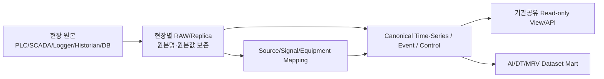
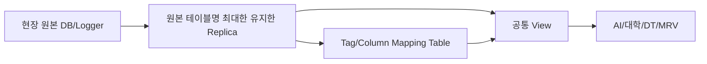
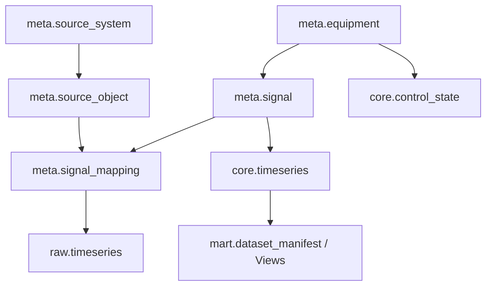

# 원천 데이터 DB 구축 가이드

> **이 문서의 목적**  
> 에이치코비·서울시립대·경기대·KTC 등 과제 연관기관이 같은 원천을 참조할 수 있도록, **실증지별 원천 데이터 DB를 어떤 구조로 구축할지 선택하고 실행하기 위한 기준서**다.

## 1. 먼저 결론

원천 데이터 DB는 **코이넷이 구축 수행**한다. 다만 한 사람이 임의로 설계하지 않고 아래 4명이 각 관점에서 확인한 뒤 기준선을 고정한다.

| 확인자 | 확인 관점 |
|---|---|
| 김광민 | PLC/통신/현장 상호운용, 접근·보안·장애복구 |
| 홍효헌 | 과업범위, 백엔드/연계, 대외기관 제공·수용 기준 |
| 정교석 | 수집기, PLC/SCADA/Logger/DB Source Mapping, 수집주기 |
| 윤석훈 | AI 학습 적합성, Timestamp/Feature/Target/Quality, Dataset 재현성 |

**4인 확인 전에는 현장 공통 기준선으로 확정하지 않는다.**

> **구분 원칙**  
> - 중랑/광암의 기존 DB·Table·Logger/Historian 명칭은 현재 확보자료에서 확인된 내용이다.  
> - `waterai_*`, `meta/raw/core/mart/audit`, A안/B안은 **우리가 제안하는 구축 방향**이며 4인 검토 후 확정한다.  
> - 용인/명장은 실제 DB/Table 원본 분석이 부족하므로 Source Inventory 전에는 테이블명을 확정하지 않는다.

## 2. 반드시 지킬 원칙

1. **실증지별 원천 DB는 분리한다.** 중랑·용인·광암·명장을 하나의 물리 테이블에 억지로 합치지 않는다.
2. **현장 원본 DB/SCADA/Historian은 수정하지 않는다.** 원본은 읽기 전용 Source로 본다.
3. **원본 이름을 버리지 않는다.** `source_database / source_schema / source_table / source_column / source_tag / source_address`를 메타데이터로 보존한다.
4. **기관에는 운영 DB 직접접속보다 읽기전용 View/API를 제공한다.**
5. **공통 Canonical 구조는 동일하게 유지하되 현장별 Mapping은 별도 관리한다.**
6. `sample_time`과 `received_at`을 구분하고 원본 Timestamp도 보존한다.
7. 수질·운전·전력·제어값뿐 아니라 `AUTO/MANUAL`, `RUN`, `Fault`, `Interlock`, `Set Point`, `실제 적용값`, `Quality`를 가능한 범위에서 함께 저장한다.
8. 적재 데이터는 반드시 **어디서 왔는지 역추적(Lineage)** 할 수 있어야 한다.

## 3. 현재까지 확인된 원천 DB/저장구조 요약

| 현장 | 확인된 원천 | 현재 성격 | 상세 링크 |
|---|---|---|---|
| 중랑 | `suyo.tb_suyo`, CIMON AI/DI/DI2 Logger, `ELECTRIC_DATA`/`OPERATOR_DATA` 등 SQL 설정 | Long Tag History + Logger + Wide SQL 설정이 혼재 | [[10-중랑-원천DB-적용가이드|중랑 상세]] |
| 광암 | `WWALMDB`, `Runtime`, `Runtime.dbo.History`, Historian Storage, InTouch DBDump/`dde.cfg` | Alarm/Event와 Historian 시계열/메타가 분리 | [[20-광암-원천DB-적용가이드|광암 상세]] |
| 용인 | 중앙 시계열 저장/DX 인프라 방향은 확인, 실제 Database/Schema/Table명은 미확보 | 상세 Source Inventory 필요 | [[11-용인-원천DB-적용가이드|용인 상세]] |
| 명장 | 최종 정수 적용/실증 대상, 실제 Database/Schema/Table명은 미확보 | 광암 표준을 참조하되 현장 Source 별도 확인 | [[21-명장-원천DB-적용가이드|명장 상세]] |

## 4. 선택 가능한 설계안

### 설계안 A — 원본 보존 + Canonical Master DB 분리형 **[권고]**



**핵심**
- 기존 DB 이름·테이블을 원본 Source로 보존한다.
- 새 DB에서는 원본 테이블 자체를 메인 모델로 삼지 않고, `source_id / signal_id / equipment_id` 외래키로 참조한다.
- 공통 시계열/이벤트/제어 구조로 정리한 뒤 기관별 View를 제공한다.

**장점**
- 중랑 `tb_suyo` Long 구조와 광암 Historian 구조처럼 서로 완전히 다른 원천을 같은 방식으로 참조할 수 있다.
- 원본 변경에 대한 결합도가 낮다.
- AI/DT/MRV/대학 연구에서 같은 Signal ID를 재사용할 수 있다.
- 데이터 Lineage와 감사 추적이 가장 좋다.

**단점**
- 초기 Metadata/Mapping 설계가 필요하다.
- 처음 1개 현장을 만들 때 설계 시간이 더 든다.

**권고 사용처**: 본 과제 정식 원천 데이터 DB.

---

### 설계안 B — 원본 테이블 Replica + Mapping/View 중심형 **[신속 이행안]**



**핵심**
- 현재 테이블 구조와 이름을 최대한 그대로 복제한다.
- 별도의 Mapping Table과 View로 공통 필드명을 제공한다.

**장점**
- 구현이 빠르다.
- 기존 운영자/개발자가 원본 구조를 그대로 찾아보기 쉽다.

**단점**
- 현장마다 구조가 달라질수록 View와 Mapping 유지비용이 증가한다.
- 중랑/광암처럼 저장철학이 다른 현장을 장기적으로 통합하기 어렵다.
- 원본 Schema가 바뀌면 연쇄 영향이 크다.

**권고 사용처**: 일정이 매우 촉박한 현장의 1차 이행 또는 A안 구축 전 임시 Staging.

## 5. 선택 기준

| 판단기준 | A안 | B안 |
|---|---:|---:|
| 장기 표준화 | ★★★★★ | ★★ |
| 기관 공동참조 | ★★★★★ | ★★★ |
| 데이터 추적성 | ★★★★★ | ★★★ |
| 초기 구축속도 | ★★★ | ★★★★★ |
| 현장별 이질성 대응 | ★★★★★ | ★★ |
| AI/DT/MRV 확장성 | ★★★★★ | ★★★ |
| 유지보수 | ★★★★★ | ★★ |

> **기본 선택은 A안**으로 한다. B안을 선택하려면 일정·인프라 제약 때문에 A안을 즉시 적용하기 어려운 이유를 기록한다.

## 6. A안 권고 논리구조

### 데이터베이스 단위

실증지별 분리 예시(명칭은 제안이며 실제 구축 전 확정):

```text
waterai_jungnang
waterai_yongin
waterai_gwangam
waterai_myeongjang
```

각 DB 내부 공통 Schema 예시:

```text
meta   : Source/Signal/Equipment/Mapping 기준정보
raw    : 원천값/원천이벤트/수집로그 보존
core   : 공통 시계열·이벤트·제어 상태
mart   : AI/DT/MRV/기관별 Dataset·View
audit  : 품질·스키마버전·적재이력·변경추적
```

### 최소 공통 테이블

| Schema.Table | 목적 | 핵심키/필드 |
|---|---|---|
| `meta.source_system` | PLC/SCADA/Logger/Historian/DB Source 등록 | `source_id`, type, host, db_name |
| `meta.source_object` | 원본 DB/Schema/Table/File 등록 | `source_object_id`, `source_id`, object_name |
| `meta.equipment` | 설비 Master | `equipment_id`, plant_id, equipment_code |
| `meta.signal` | Canonical Signal Master | `signal_id`, name, unit, data_type |
| `meta.signal_mapping` | 원본주소↔Canonical ID | `mapping_id`, `signal_id`, `source_object_id`, source_tag/address |
| `raw.timeseries` | 원본 시계열 보존 | `source_object_id`, source_tag, source_time, raw_value |
| `raw.event` | Alarm/Fault/Event 원천 | event_time, source_tag, state/message |
| `raw.ingest_log` | 수집/적재 실행이력 | batch_id, row_count, error_count, started_at |
| `core.timeseries` | 기관/AI 공통 시계열 | `signal_id`, `sample_time`, value, quality |
| `core.control_state` | Mode/Set Point/Run/Interlock 등 | equipment_id, sample_time, mode, setpoint, applied_value |
| `core.event` | 정규화 Event | equipment_id/signal_id, event_time, event_type |
| `mart.dataset_manifest` | Dataset 버전/기간/Feature 목록 | dataset_id, version, start/end, schema_version |
| `audit.data_quality` | 결측/중복/범위/품질 결과 | signal_id, period, metric, result |
| `audit.schema_version` | DDL/Mapping 버전 | version, changed_at, change_ref |

### 핵심 외래키 방향



**중요:** 원본 `TAGNAME`, Historian `TagName`, PLC `MW주소`를 지우고 새 이름만 남기는 방식은 금지한다. Canonical ID와 원본 식별자를 함께 보존한다.

## 7. 기관이 참조하는 방식

기관에 운영 Source DB 계정을 직접 주는 구조를 기본안으로 하지 않는다.

### 공통 제공 View/API 권고

```text
v_signal_dictionary
v_equipment
v_timeseries_common
v_control_state
v_event_common
v_data_quality
v_dataset_catalog
```

| 기관/사용자 | 권고 접근범위 |
|---|---|
| 서울시립대/경기대 | `mart` 읽기전용 View + Dataset Manifest |
| 에이치코비 DT | 설비/Signal/실시간·준실시간 View 또는 API |
| KTC | Dataset Manifest + 품질/버전/Audit View |
| 파이브텍 | 통합검토·수용·대외 인터페이스 |
| 코이넷 | 수집/적재/Mapping/Core DB 구축·운영 |

## 8. 구현용 논리 ERD·DDL

- [[01-원천DB-논리ERD-DDL-초안|원천 DB 논리 ERD·DDL 초안]]

## 9. 현장별 가이드

- [[10-중랑-원천DB-적용가이드|중랑 원천 DB 적용 가이드]]
- [[11-용인-원천DB-적용가이드|용인 원천 DB 적용 가이드]]
- [[20-광암-원천DB-적용가이드|광암 원천 DB 적용 가이드]]
- [[21-명장-원천DB-적용가이드|명장 원천 DB 적용 가이드]]
- [[90-현장별-설계안-선택현황|현장별 설계안 선택현황]]

## 10. 설계안 선택·착수 절차

1. 해당 현장 가이드의 **현재 Source 현황**을 확인한다.
2. 실제 DB/Logger/Historian에서 Source Object 목록을 채운다.
3. A안/B안 중 하나를 선택한다.
4. ERD와 DDL 초안을 만든다.
5. 대표 1일 또는 1주 데이터로 적재시험한다.
6. `원본행 → raw → core → 기관 View`를 역추적해본다.
7. 4인 검토 후 Schema v1.0을 고정한다.
8. 외부기관에는 읽기전용 View/API와 데이터사전을 전달한다.

## 11. 4인 검토 Gate

현장별 설계문서에 아래 항목을 남긴다.

```text
현장:
선택안: [ ] A안(권고)   [ ] B안(신속)
선택사유:
DB/Schema 명칭:
Source 목록 확인: [ ]
ERD 확인: [ ]
FK/Mapping 확인: [ ]
Timestamp/Quality 확인: [ ]
기관 공유 View 확인: [ ]
적재/조회 시험: [ ]

김광민 확인: ________  일자: ________
홍효헌 확인: ________  일자: ________
정교석 확인: ________  일자: ________
윤석훈 확인: ________  일자: ________
```

## 12. 관련 WBS

- [[../../00-프로젝트관리/WBS/1.1.2 인공지능 학습용 빅데이터 DB 설계 및 구축|WBS 1.1.2]]
- [[../../00-프로젝트관리/WBS/1.2.2 인공지능 학습용 빅데이터 DB 설계 및 구축|WBS 1.2.2]]
- [[../../00-프로젝트관리/WBS/1.3.2 인공지능 학습용 빅데이터 DB 설계 및 구축|WBS 1.3.2]]
- [[../../00-프로젝트관리/04-RACI|RACI]]
- [[../../00-프로젝트관리/23-기관간-인터페이스-합의항목|기관 간 인터페이스]]

