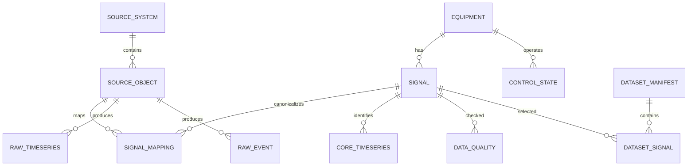

# 원천 DB 논리 ERD·DDL 초안

> **제안 문서**다. DBMS(MSSQL/PostgreSQL/MariaDB 등)는 현장 인프라·라이선스·운영조건을 확인한 뒤 선택한다. 아래는 특정 DBMS에 종속되지 않는 **논리 Schema 기준**이다.

## 1. 논리 ERD



## 2. 최소 컬럼 정의

### `meta.source_system`

| 컬럼 | 의미 |
|---|---|
| `source_id` PK | Source ID |
| `plant_id` | 현장 ID |
| `source_type` | PLC/SCADA/LOGGER/DB/HISTORIAN/API |
| `source_name` | 원본 시스템명 |
| `host_name` | 서버/노드명 |
| `database_name` | DB명(해당 시) |
| `active_yn` | 사용 여부 |

### `meta.source_object`

| 컬럼 | 의미 |
|---|---|
| `source_object_id` PK | 원본 객체 ID |
| `source_id` FK | `source_system` 참조 |
| `object_type` | TABLE/VIEW/LOGGER/FILE/TOPIC |
| `schema_name` | 원본 Schema |
| `object_name` | 원본 Table/View/Logger/File 이름 |
| `time_column` | 원본 Timestamp 컬럼 |
| `quality_column` | 원본 Quality 컬럼 |

### `meta.equipment`

| 컬럼 | 의미 |
|---|---|
| `equipment_id` PK | 공통 설비 ID |
| `plant_id` | 현장 ID |
| `equipment_code` | M203 등 현장 설비코드 |
| `equipment_type` | BLOWER/PUMP/METER 등 |
| `process_area` | 유입/반응조/침전/여과 등 |

### `meta.signal`

| 컬럼 | 의미 |
|---|---|
| `signal_id` PK | Canonical Signal ID |
| `equipment_id` FK nullable | 관련 설비 |
| `signal_name` | 공통 명칭 |
| `signal_role` | PV/SV/RUN/FAULT/MODE/ENERGY 등 |
| `unit` | 공통단위 |
| `data_type` | numeric/bool/text |

### `meta.signal_mapping`

| 컬럼 | 의미 |
|---|---|
| `mapping_id` PK | Mapping ID |
| `signal_id` FK | Canonical Signal |
| `source_object_id` FK | 원본 객체 |
| `source_tag` | 원본 Tag/Column |
| `source_address` | PLC MW/M/D 주소 등 |
| `scale` / `offset` | 값 변환 필요 시 |
| `valid_from` / `valid_to` | Mapping 유효기간 |
| `mapping_version` | 버전 |

### `raw.timeseries`

| 컬럼 | 의미 |
|---|---|
| `raw_id` PK | 적재행 ID |
| `source_object_id` FK | 원본 출처 |
| `source_tag` | 원본 Tag |
| `source_time` | 원본 Timestamp |
| `received_at` | 수집/적재시각 |
| `raw_value_num` | 원본 수치값 |
| `raw_value_text` | 문자/상태값 |
| `raw_quality` | 원본 품질코드 |
| `batch_id` | 수집 Batch |

### `core.timeseries`

| 컬럼 | 의미 |
|---|---|
| `signal_id` FK | Canonical Signal |
| `sample_time` | 기준 시각 |
| `value_num` | 정규화 수치 |
| `value_text` | 정규화 상태값 |
| `quality_code` | 공통 품질코드 |
| `raw_id` FK/참조 | 원본 역추적 |
| `mapping_version` | 적용 Mapping 버전 |

권고 고유키: `(signal_id, sample_time, raw_id)` 또는 현장 정책에 맞는 동등한 키.

### `core.control_state`

| 컬럼 | 의미 |
|---|---|
| `equipment_id` FK | 설비 |
| `sample_time` | 기준 시각 |
| `run_state` | RUN/STOP |
| `auto_manual` | AUTO/MANUAL/UNKNOWN |
| `setpoint` | 목표값 |
| `applied_value` | 실제 적용값 |
| `interlock_state` | Interlock |
| `fault_state` | Fault |
| `control_reason` | 제어 Rule/원인코드 |

### `raw.event` / `core.event`

Alarm/Fault/ACK/복귀 등 이벤트는 연속 PV와 별도 저장한다. 광암 `WWALMDB` 같은 Event DB를 연속값 테이블에 섞지 않는다.

## 3. 필수 Index/Partition 방향

- `core.timeseries`: `(signal_id, sample_time)`
- `raw.timeseries`: `(source_object_id, source_tag, source_time)`
- `core.control_state`: `(equipment_id, sample_time)`
- `core.event`: `(equipment_id, event_time)` 또는 `(signal_id, event_time)`
- 장기 대용량 시계열은 월/일 단위 Partition 여부를 DBMS에 맞게 검토

## 4. 기관공유 View 논리

```text
v_signal_dictionary   = signal + equipment + source mapping 요약
v_timeseries_common   = sample_time + signal_id + value + unit + quality
v_control_state       = 설비별 Mode/Run/Set Point/Fault/Interlock
v_event_common        = Alarm/Fault/Event
v_data_quality        = 기간별 결측/중복/범위/Quality
v_dataset_catalog     = Dataset 버전/기간/Feature/Source
```

기관별로 필요한 Signal만 권한 필터링할 수 있게 한다.

## 5. DBMS 선택 시 별도 결정할 것

- DBMS 제품/버전
- 시계열 Partition 방식
- 대용량 보존기간/압축
- HA/Backup/Restore
- 계정/Role/암호화
- API/ODBC/JDBC 연결방식
- 원본 Source Polling/CDC/Batch 방식

이 항목들은 논리 Schema 확정과 분리해서 결정한다.

## 관련 문서

- [[00-원천데이터-DB-구축-가이드|공통 원천 데이터 DB 구축 가이드]]
- [[90-현장별-설계안-선택현황|현장별 설계안 선택현황]]

