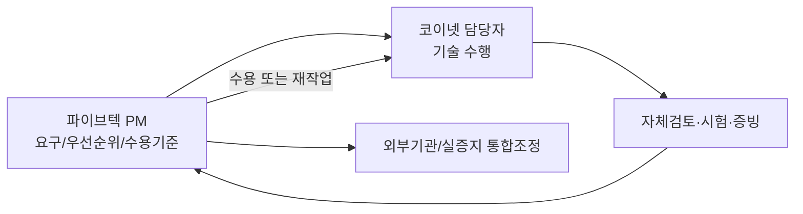

# 프로젝트관리계획

## 1. 거버넌스

파이브텍 PM 홍효헌이 코이넷에 작업을 지시하고 결과를 수용하며, 코이넷의 윤석훈·정교석·김광민이 전문영역을 수행합니다. 공식 컨소시엄 대외책임은 연구개발계획서의 기관별 RnR를 따릅니다. [[03-이해관계자등록부]]와 [[04-RACI]]를 기준으로 합니다.

## 2. 수행 순서

1. 요구사항·현장 데이터·Signal Master 확정
2. Rule Book/보안/접근조건 선확정
3. DB·스토리지·수집 기반 구축
4. 전처리·품질·예측/최적화 설계
5. Model I/O/DT API/Validation Matrix 확정
6. Shadow 검증 → 승인형 → 제한 자동 적용(현장 승인 후)

## 3. 기준선과 단일 원본

- 범위/WBS: [[07-범위-WBS]]
- 일정: Task Gantt / [[20-WBS-Gantt-자동]]
- 요구사항: [[06-요구사항추적표]]
- 책임: [[04-RACI]]
- 이해관계자: [[03-이해관계자등록부]]
- 품질: [[16-품질-인수기준]]
- 산출물: [[17-산출물등록부]]
- 이슈/리스크: [[10-이슈로그]], [[09-리스크등록부]]
- **단일 데이터 원본**: `20-Water-AI/00-프로젝트관리/WBS/*.md` frontmatter

## 4. 작업지시·수용 프로세스

1. 작업지시 시 WBS ID + REQ + DEL + QA + 목표일을 같이 전달
2. 코이넷은 코드/설계/시험증빙과 함께 결과 제출
3. 파이브텍은 수용기준 확인 후 `done/100%` 승인
4. 미달은 이슈, 범위·일정 변경은 변경로그로 전환

## 5. 변경 통제

WBS 날짜·범위·담당·수용기준의 기준선 영향 변경은 [[13-변경로그]]에 등록하고 관련 REQ/DEL/QA와 리스크 영향평가를 수행합니다. 단순 진행률 갱신은 WBS 원본만 수정합니다.

## 6. 보고/회의

[[15-커뮤니케이션계획]] 기준. 코이넷→파이브텍 보고가 기본이며, 기관 간 기술협의는 파이브텍 PM이 창구를 조정합니다.

## 7. 품질·인수

[[16-품질-인수기준]]의 QG-01~08을 적용합니다. 현장/제어 관련 항목은 기술 완료와 별개로 현장 승인 없이는 완료로 보지 않습니다.

## 8. 형상·문서관리

Obsidian Markdown과 Git/OpenProject 연계 시 동일 WBS/REQ ID를 유지합니다. 원본 근거자료는 `중랑/10-받은자료`, 분석결과는 해당 시설 폴더에 보존합니다.
