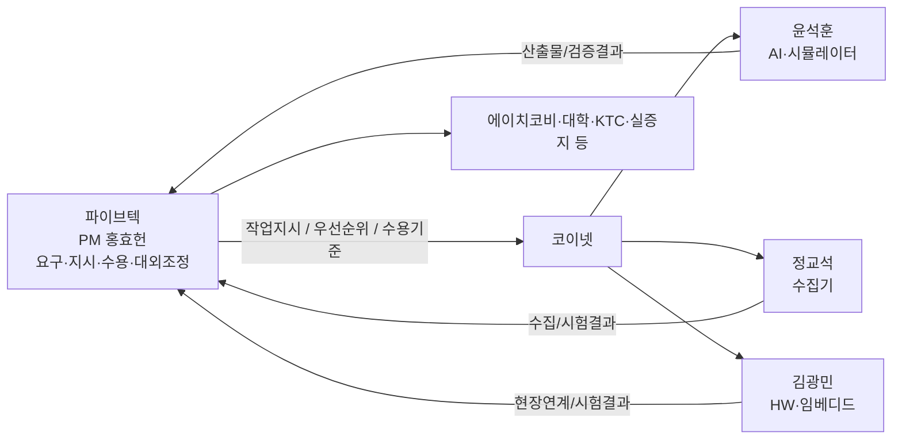

# 이해관계자등록부

> **조직 관계 핵심**: 공식 연구개발계획서에서 파이브텍은 AI 기반 수질·에너지 최적화 및 통합 모델 연계 담당 공동연구기관이고, 현재 실무 수행에서는 **파이브텍이 코이넷에 작업을 지시하고 코이넷이 기술 작업을 수행**합니다. 홍효헌은 파이브텍 소속 PM/백엔드/프론트엔드이며, 윤석훈·정교석·김광민은 코이넷 소속입니다. 코이넷의 작업 결과는 파이브텍의 요구·승인·대외 인터페이스를 통해 관리합니다.

## A. 핵심 조직·개인 이해관계자

| ID | 이해관계자 | 소속/구분 | 역할·책임 | 주요 요구·기대 | 영향력 | 관심도 | 참여전략 | 내부 창구 | 관련 요구/WBS |
|---|---|---|---|---|---|---|---|---|---|
| STK-001 | 에이치코비 | 주관연구개발기관 | Pilot 운영·데이터 신뢰성·DX·설비진단·DT/현장 통합 | 현장 안정성, 신뢰 가능한 데이터, DT 연계 가능한 표준 I/O | 매우높음 | 매우높음 | 긴밀관리 | 홍효헌 | REQ-P-002, P-007, P-011 / 1.*, 2.5.4 |
| STK-002 | 파이브텍 | 공동연구기관 / 발주·관리 | AI 수질·에너지 최적화, 통합 모델 연계, 코이넷 작업지시·수용 | 일정·범위·품질 준수, 기관 간 I/O 합의, 검증 가능한 산출물 | 매우높음 | 매우높음 | 주도관리 | 홍효헌 | REQ-P-003~004 / 전체 WBS |
| STK-003 | 홍효헌 | 파이브텍 | PM, 백엔드, 프론트엔드, 코이넷 작업지시 및 통합조정 | 범위·일정·리스크·변경·산출물 수용, DB/API/UI 통합 | 매우높음 | 매우높음 | 주도 | 본인 | 전체 |
| STK-004 | 코이넷 | 파이브텍 실무 수행 파트너 | 파이브텍 지시에 따른 AI·수집기·하드웨어/임베디드 수행 | 명확한 요구/수용기준, 현장자료·인터페이스 접근, 일정 우선순위 | 높음 | 매우높음 | 긴밀관리 | 윤석훈/정교석/김광민 | 전체 WBS |
| STK-005 | 윤석훈 | 코이넷 | AI·시뮬레이터 | 데이터 품질, 모델 I/O, 검증기준, 공정 제약조건 확보 | 높음 | 매우높음 | 주도수행 | 홍효헌 | 2.1~2.5, REQ-P-003/005/006/012 |
| STK-006 | 정교석 | 코이넷 | 수집기 | PLC/SCADA/Logger/DB 태그·주기·시간축·수집 안정성 확보 | 높음 | 매우높음 | 주도수행 | 홍효헌 | 1.x.1, 2.x.1, REQ-P-002 |
| STK-007 | 김광민 | 코이넷 | 하드웨어·임베디드 | 현장 통신/장비/SCADA 상호운용, 안전 Rule/제어 인터페이스 확보 | 높음 | 높음 | 주도수행 | 홍효헌 | 1.2.5, 1.3.5, 2.5.2/4, REQ-P-011/012 |
| STK-008 | 서울시립대학교 | 공동연구기관 | 하수 공정 시뮬레이션, 자동운전 로직, 공정 안정성·Microbiome 평가 | AI 결과가 공정 제약과 양립, 검증용 I/O·시나리오 명확화 | 높음 | 높음 | 공동설계 | 윤석훈 | REQ-P-005 / 2.1,2.2,2.5 |
| STK-009 | 경기대학교 | 공동연구기관 | 정수 공정 알고리즘, Pilot 평가, 운영인자/전력패턴, 표준화 | 정수 AI와 공정·표준화 모델 간 입력/출력 합의 | 높음 | 높음 | 공동설계 | 윤석훈 | REQ-P-006 / 1.3,2.3~2.5 |
| STK-010 | 아이디알서비스 | 공동연구기관 | DR 전략, ESS-PV 최적화, Auto DR·사이트 제어 | 에너지 예측/최적화 결과를 DR 로직과 연계할 수 있는 I/O | 중간 | 높음 | 인터페이스 협의 | 홍효헌 | REQ-P-008 / 2.2,2.3,2.5 |
| STK-011 | 한국에너지4.0산업협회 | 공동연구기관 | 가이드라인, 이해관계자 인터뷰, 환경·경제 성과·순환경제 | 추적 가능한 성과데이터와 현장 적용 결과 | 중간 | 중간 | 정기공유 | 홍효헌 | REQ-P-010 / 성과자료 |
| STK-012 | 한국기계전기전자시험연구원(KTC) | 공동연구기관 / 검증 | AI 신뢰성, MRV, 표준/인증·온실가스/편익 검증 | 제3자 검증 가능한 원시근거·산식·버전·시험기록 | 높음 | 높음 | 검증단계 조기참여 | 홍효헌/윤석훈 | REQ-P-009/013 |
| STK-013 | 서울특별시 중랑물재생센터 | 실증지 제공기관 | 하수 실증지 제공·운전/데이터 협조 | 운전안전, 비간섭, 승인된 시험, 데이터 사용·보안 준수 | 매우높음 | 높음 | 현장 승인 중심 | 홍효헌/김광민 | REQ-P-011 / 하수 WBS |
| STK-014 | 이정연 / 이준규 | 중랑물재생센터 | 계획서상 실증지 책임자 / 실무담당자 | 현장운영 영향 최소화, 시험·접근 사전협의 | 높음 | 높음 | 시험 전 사전승인/결과공유 | 홍효헌 | REQ-P-011 |
| STK-015 | 서울특별시 광암아리수정수센터 | 실증지 제공기관 | 정수 실증지 제공·운전/데이터 협조 | 정수 운영 안정성, 접근·보안·시험 승인 | 매우높음 | 높음 | 현장 승인 중심 | 홍효헌/김광민 | REQ-P-011 / 정수 WBS |
| STK-016 | 조우현 / 이승제 | 광암아리수정수센터 | 계획서상 실증지 책임자 / 실무담당자 | 현장운영 영향 최소화, 시험·접근 사전협의 | 높음 | 높음 | 시험 전 사전승인/결과공유 | 홍효헌 | REQ-P-011 |
| STK-017 | 포스코이앤씨 | 수요기업·실증지 제공기관(계획서 기재) | 수요기업 관점 실증·적용성·현장 구축/데이터 확인 | 사업화·적용성, 검증 가능한 성과, 확장성 | 높음 | 높음 | 마일스톤/실증결과 공유 | 홍효헌 | REQ-P-013/014 |
| STK-018 | 물관리시설 운영자/최종 사용자 | 운영 사용자 | 개발 시스템 실제 사용·운영 인수 | 직관성, 안전성, 최소 개입, 매뉴얼·교육·장애대응 | 높음 | 높음 | 사용성 피드백/교육 | 홍효헌 | REQ-P-014 |

## B. 파이브텍 ↔ 코이넷 업무관계

## C. 관리 원칙

- 공식 컨소시엄의 기관별 책임과 코이넷의 실무 수행 책임을 **구분**합니다. 코이넷은 파이브텍의 공식 대외책임을 대체하지 않습니다.
- 현장 실증지와의 통신/제어/시험은 파이브텍 PM을 통해 사전 조정하며, AI가 현장 PLC 안전 Rule을 우회하지 않습니다.
- 대학/에이치코비/KTC와의 인터페이스는 `Model I/O Spec`, `Rule Book`, `DT/API Spec`, `Validation Matrix`로 문서화합니다.

## 근거

- 연구개발계획서: 기관별 업무구분 및 2차년도 개발목표(p64~65, p91), 실증지 제공기관(p256~257), 수요기업/실증지 제공기관 기재, 4차년도 운영자 교육(p120).
- [[../중랑/80-산출물/01-2차년도-RnR-통합연계-운영구조|2차년도 RnR 통합연계 운영구조]] (원본은 SRC-RNR-01-PDF/PPT로 외부보관).
- 2026-09-06 실무 확인: 홍효헌=파이브텍, 윤석훈·정교석·김광민=코이넷, 파이브텍→코이넷 작업지시 구조.
