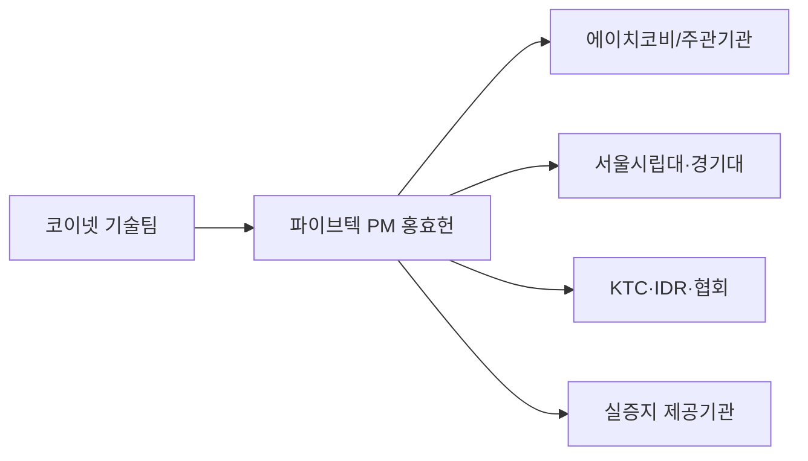

# 커뮤니케이션계획

| 대상 | 관계/목적 | 공유정보·산출물 | 주기/시점 | 작성/발신 | 승인/조정 | 기록 |
|---|---|---|---|---|---|---|
| 파이브텍 ↔ 코이넷 | 작업지시·우선순위·진척·수용 | WBS/Gantt, 요구사항, 이슈/리스크, 산출물 리뷰 | 주 1회 + 필요시 | 홍효헌 / 각 담당 | 홍효헌 | PM 문서/WBS |
| 코이넷 수집 담당 ↔ AI 담당 | 중랑 M203 데이터 인계 | Mapping 표, 실제 Tag/주소/단위/주기/기간/결측 확인결과 | 매핑 갱신 시 | 수집 담당 | AI 검토 / PM 조정 | 데이터수집팀 작업지시서 + Mapping 표 |
| 에이치코비 | 주관기관·DX/DT/현장 인터페이스 | Signal/API/DT Spec, 일정, 현장 영향, 통합시험 | 인터페이스 변경·마일스톤 전 | 홍효헌 | 기관 간 합의 | 회의록/인터페이스 문서 |
| 서울시립대 | 하수 공정모델/자동운전 검증 | 하수 데이터, AI 결과, Model I/O, Scenario, 제약조건 | 모델 인터페이스 설계/변경 시 | 윤석훈 | 홍효헌 조정 | Model I/O/회의록 |
| 경기대 | 정수 공정/표준화 검증 | 정수 데이터, AI 결과, 운영인자/전력 KPI, Model I/O | 정수 모델 설계/변경 시 | 윤석훈 | 홍효헌 조정 | Model I/O/회의록 |
| 중랑물재생센터 | 하수 실증 안전/데이터/시험 | 시험계획, 접근범위, Rule, 롤백, 결과 | 현장시험 전/후 | 홍효헌·김광민 | 현장 승인 | 현장시험기록 |
| 광암아리수정수센터 | 정수 실증 안전/데이터/시험 | 자료요청, 시험계획, 접근범위, 결과 | 자료수집/현장시험 전/후 | 홍효헌·김광민 | 현장 승인 | 현장시험기록 |
| KTC | MRV·신뢰성·성과검증 | Validation Matrix, 원시근거, 산식, 시험결과 | 검증 설계 시 + 마일스톤 | 홍효헌·윤석훈 | KTC 검토 | 검증 기록 |
| 아이디알서비스 | DR/ESS-PV 인터페이스 | 에너지 예측/최적화 I/O, DR 시나리오 | DR 연계 설계 시 | 홍효헌 | 상호 합의 | 인터페이스 문서 |
| 한국에너지4.0산업협회 | 가이드라인/성과 | 적용 결과, 성과지표, 운영자 피드백 | 성과 정리/연차 시 | 홍효헌 | 상호 확인 | 성과자료 |
| 포스코이앤씨/수요기업 | 적용성·사업화·실증 결과 | 성능, 안정성, 운영성, 확장성 | 주요 실증/마일스톤 | 홍효헌 | 파이브텍/주관기관 조정 | 결과보고 |

## 긴급 보고 기준

1. PLC/SCADA 연동이 현장운전에 영향을 줄 가능성
2. 데이터 손실·오염·보안사고 또는 권한오류
3. 마일스톤 1주 이상 지연 가능성
4. 수용기준 미달로 재작업/범위변경 필요
5. 기관 간 모델/제어 책임경계 충돌

## 기본 보고 경로

