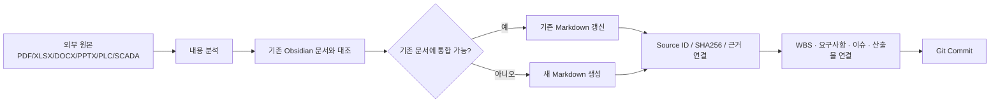

# 자료 문서화 및 버전관리 규칙

## 목적

Water-AI Git/Obsidian 저장소를 **외부 파일 창고가 아니라 프로젝트 지식·관리 문서의 기준 저장소**로 운영한다.

## 기본 원칙

1. PDF, XLSX, DOCX, PPTX, HWP/HWPX, ZIP, PLC/SCADA 원본, DB Dump는 **분석 입력자료**로 본다.
2. 분석이 끝난 내용은 가능한 한 **Markdown + YAML Frontmatter + Markdown Table + Mermaid**로 변환한다.
3. 외부 원본은 Git/Vault에 기본 저장하지 않는다.
4. 원본 추적은 `Source ID + 파일명 + SHA256 + 수신일/출처`로 남긴다.
5. 같은 문서의 `v1`, `v2`, `최종`, `진짜최종` 파일을 복제하지 않는다. **문서 파일은 하나를 유지하고 Git History로 변경 이력을 관리**한다.
6. 자료에서 확인된 내용, 합리적 추정, 추가 확인 필요, 개발 제안을 구분한다.
7. WBS, 요구사항, 산출물, 품질, 이슈, 리스크와 관련 기술문서를 Wikilink로 연결한다.

## 외부파일 처리 흐름



## 권장 Frontmatter

```yaml
---
doc_id: JN-SYS-001
title: 중랑 데이터 흐름 및 시스템 경계
plant: 중랑
category: 시스템분석
status: reviewed
revision: 0.1
last_updated: 2026-09-07
source_refs:
  - SRC-FIELD-01
  - SRC-FIELD-02
related_wbs:
  - 1.1.1
  - 1.1.2
---
```

## 문서 본문 표준

```markdown
## 현재 확인된 내용

## 추가 확인 필요

## 합리적 추정

## 개발 제안

## 관련 문서
```

## 버전관리 기준

- `revision: 0.x` : 정리/검토 중
- `revision: 1.0` : 내부 검토 후 기준선
- `revision: 1.x` : 기준선 이후 보완
- 구조나 책임 범위가 크게 바뀐 경우에만 `2.0` 검토
- 실제 변경 이력은 Git Commit이 기준이며 `revision`은 사람이 읽는 문서 상태를 보조한다.

## 원본 보관

원본이 재검증에 필요하면 NAS/별도 원본 보관소에 유지한다. Obsidian에는 원본 자체가 아니라 **Source ID와 해시, 변환문서**를 남긴다.
