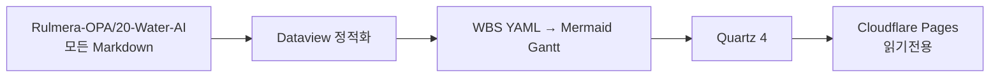

# Water-AI 고객용 Web 공개 정책

## 공개 범위

**`Rulmera-OPA/20-Water-AI`의 모든 Obsidian Markdown 문서를 고객 웹에 공개한다.**

별도의 `web_publish: true` 승인 절차를 사용하지 않는다.

## 제외 대상

다음 외부 원본파일은 Git과 Web에 올리지 않는다.

- PDF
- XLS/XLSX
- DOC/DOCX
- PPT/PPTX
- HWP/HWPX
- ZIP/7Z/RAR
- PLC/SCADA 프로젝트 원본
- DB Dump / SQLite / 대용량 CSV

원본은 로컬/NAS에서 관리하고, 웹에는 정리된 Obsidian Markdown만 게시한다.

## 예외적으로 숨겨야 하는 문서

정말 웹에서 제외해야 할 문서가 생긴 경우에만:

```yaml
---
web_exclude: true
---
```

를 추가한다.

`web_exclude`가 없으면 **공개가 기본값**이다.

## 빌드 흐름



## Dataview 처리

고객 웹에서는 Obsidian Dataview 플러그인을 실행하지 않는다.

빌드 시 WBS Frontmatter를 읽어 다음을 정적 생성한다.

- PM 대시보드
- WBS 목록
- 범위/WBS 표
- 담당자 배분
- 마일스톤
- 요구사항 추적
- 품질·인수기준
- 리스크
- 산출물
- RACI
- WBS 통합 추적
- Mermaid Gantt

## 운영 순서

1. Obsidian에서 `Rulmera-OPA/20-Water-AI` 수정
2. `PUBLISH-RULMERA-OPA.ps1` 실행
3. `Water-AI` Git 자동 미러
4. Cloudflare Pages 자동 빌드
5. 고객은 Water-AI 전체 Markdown을 읽기전용 웹에서 확인

## 주의

외부 원본파일 자체는 웹에 게시하지 않는다.
