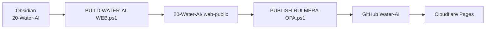

# Water-AI 고객용 Web 공개 정책

## 공개 범위

`Rulmera-OPA/20-Water-AI`의 모든 Obsidian Markdown 문서를 고객 웹에 공개한다.

외부 원본파일은 Git/Web에 올리지 않는다.

## 정적 웹 위치

완성된 Quartz 정적 웹은 다음 위치에 생성한다.

```text
Rulmera-OPA/20-Water-AI/.web-public
```

이 폴더는 `PUBLISH-RULMERA-OPA.ps1` 실행 시 GitHub `Water-AI` 저장소에도 같이 반영한다.

## 최종 흐름



## Dataview

Obsidian Dataview/DataviewJS는 웹에서 실행하지 않는다.

웹 빌드 시 정적 Markdown 표와 Mermaid Gantt로 변환한다.

## 예외적 비공개

정말 숨겨야 하는 문서만:

```yaml
web_exclude: true
```

를 사용한다.

## 외부 원본 제외

- PDF
- XLS/XLSX
- DOC/DOCX
- PPT/PPTX
- HWP/HWPX
- ZIP/7Z/RAR
- PLC/SCADA 원본
- DB Dump / SQLite / 대용량 CSV

원본은 로컬/NAS에서 관리한다.

## 평소 운영

```powershell
.\BUILD-WATER-AI-WEB.ps1
.\PUBLISH-RULMERA-OPA.ps1
```

Cloudflare는 Quartz를 다시 빌드하지 않고 Git에 올라간 `.web-public`을 그대로 서비스한다.
