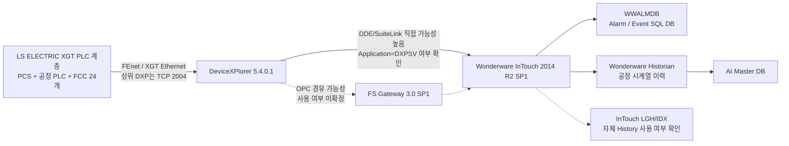

# Water AI · 광암

## 현재 상태

- **현장 확인**: 2026-09-07 현장방문 완료
- **PLC 원본**: XG5000 `.xgwx` **155개 수집 완료(오류 0)**. 단, 동일 설비의 과거본/수정본/OLD가 포함되어 있어 155개를 PLC 155대로 해석하지 않음
- **PLC 구조**: PCS1/2/4/5/6, PCS_M, P22 약품, P23 오존, CO2, 염소 및 **FCC 24개 여과지 로컬 PLC** 계층 확인
- **PLC 통신**: 주요 PCS에서 `192.9.211.x / 192.9.212.x` FEnet 계열의 복수 통신 경로 확인. Primary/Standby 의미는 추가 확인
- **PLC 과거이력**: PLC 자체 장기 백업 없음
- **HMI**: Wonderware **InTouch HMI 2014 R2 SP1 (v11.1)** 구성 확인
- **PLC 통신 미들웨어**: TAKEBISHI **DeviceXPlorer 5.4.0.1**. 산업용 통신 미들웨어/OPC·SuiteLink Server이며 `DXPSV.dxp`에서 `LsisEthernet` 구성 확인
- **PLC 통신 대상**: 광암 설비 13개 대상, 설정상 원격 IP `192.9.211.10~32` 범위의 개별 주소와 TCP `2004` 사용 확인
- **Historian**: Wonderware **Historian Server 2014 R2 SP1 (v11.6.13100)** 구성요소 확인
- **알람 DB**: 기존 분석한 `WWALMDB`는 **InTouch Alarm DB Logger 계열의 알람·이벤트 SQL DB**로 분류. Historian 공정 시계열 DB와 구분
- **InTouch 연결 핵심 확인점**: DeviceXPlorer Ver.5 SuiteLink 기본 Application Name은 `DXPSV`. InTouch `Access Names`에서 `Application=DXPSV` 여부 확인 시 직접 연결 판단 가능
- **FSGateway**: 설치 구성요소 존재는 확인했으나 **실제 런타임 통신 경로 사용 여부는 미확정**
- **학습 데이터 상태**: Historian의 실제 Tag, 저장기간, 저장주기, Export 경로는 추가 확인 필요
- **다음 작업 1순위**: **XGWX 최신본/구버전 정규화 + PLC 통신 Matrix/Address Dictionary 생성**을 병행하고, **InTouch DBDump CSV 확보** → `PLC 주소 ↔ Access Name/Item ↔ InTouch Tag` 매핑 → Historian `Imported Nodes/Tag Configuration` → AI Master DB로 연결

## 현재 핵심 구조



> 현재 가장 중요한 구분은 **`WWALMDB ≠ Historian`** 이다. `WWALMDB`는 알람/이벤트 분석용이고, AI 학습용 장기 PV 시계열은 Historian 쪽을 우선 확인해야 한다.

## 현장 시스템

- [[20-현장-시스템/01-광암-데이터흐름-및-통신구조]]
- [[20-현장-시스템/02-Wonderware-DeviceXPlorer-InTouch-Historian-구조]]
- [[20-현장-시스템/03-광암-실제-연결-확인-파일-및-설정위치]]
- [[20-현장-시스템/04-광암-PLC-XG5000-구조-및-통신맵]]
- [[30-데이터-분석/02-광암-PLC-태그-Historian-데이터계보-구축]]
- [[30-데이터-분석/01-WWALMDB-AlarmDB-vs-Historian]]
- [[90-근거-기록/2026-09-07-광암-현장방문-확인기록]]
- [[90-근거-기록/2026-09-08-Wonderware-자료분석-기록]]
- [[90-근거-기록/2026-09-08-XG5000-PLC원본-분석-기록]]
- [[90-근거-기록/2026-09-08-광암-Wonderware-추가확보-체크리스트]]

## 정수 AI 개발 원칙

광암은 **정수 AI 학습·검증 기준 시설**이다.

```text
광암정수장 장기 운전데이터
→ Historian/기존 저장계층 확인
→ AI Master DB
→ 정수 수요·수질·약품·전력 분석
→ 정수 AI 예측/최적화 모델 개발
→ 모델 검증 및 표준화
→ 명장 최종 적용장에 적용
```

PLC 자체에 과거이력이 없으므로 실제 학습데이터는 **Wonderware Historian 등 상위 저장계층에서 확보**해야 한다. 실시간 보완이 필요한 경우에만 기존 PLC 통신에 영향이 없도록 별도 Read-only Collector를 검토한다.

## 공통 AI 설계 기준

- [[20-Water-AI/00-공통/20-공정-기술/10-하수장-정수장-AI-모델-적용-원칙|예측·최적화·안전제어·LLM/RAG 역할 분리]]

## 폴더

| 폴더 | 내용 |
|---|---|
| `10-받은자료` | PLC·SCADA·SQL·CSV 등 원본 |
| `20-현장-시스템` | 공정, 설비, PLC, SCADA, 통신 구조 |
| `30-데이터-분석` | 학습 데이터, 태그, 컬럼, 품질 분석 |
| `40-회의록` | 광암 관련 회의 |
| `50-의사결정` | 광암 관련 확정 사항 |
| `60-문제해결` | 데이터·학습·검증 문제 해결 |
| `70-개발-검증` | 모델 학습과 검증 기록 |
| `80-산출물` | 보고서, 데이터 정의서, 결과 자료 |
| `90-근거-기록` | 현장방문·직접확인·근거 추적 |

[[Rulmera-OPA|전체 홈]] · [[20-Water-AI/00-프로젝트관리/00-PM-대시보드|Water AI PM]] · [[20-Water-AI/00-공통/00-Water-AI-공통-홈|Water AI 공통]]
