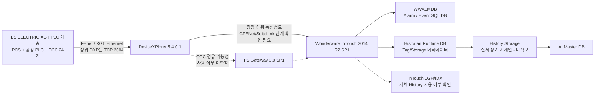

---
type: project-home
project: Water AI 광암
status: active
last_updated: 2026-09-09
---

# Water AI · 광암

## 현재 상태

- **현장 확인**: 2026-09-07 현장방문 완료
- **PLC 원본**: XG5000 `.xgwx` **155개 수집 완료(오류 0)**. 단, 동일 설비의 과거본/수정본/OLD가 포함되어 있어 155개를 PLC 155대로 해석하지 않음
- **PLC 구조**: PCS1/2/4/5/6, PCS_M, P22 약품, P23 오존, CO2, 염소 및 **FCC 24개 여과지 로컬 PLC** 계층 확인
- **PLC 통신**: 주요 PCS에서 `192.9.211.x / 192.9.212.x` FEnet 계열의 복수 통신 경로 확인. Primary/Standby 의미는 추가 확인
- **PLC 과거이력**: PLC 자체 장기 백업 없음
- **HMI**: Wonderware **InTouch HMI 2014 R2 SP1 (v11.1)** 구성 확인
- **PLC 통신 미들웨어**: TAKEBISHI **DeviceXPlorer 5.4.0.1**. 산업용 통신 미들웨어/OPC·SuiteLink Server이며 `DXPSV.dxp`에서 `LsisEthernet` 구성 확인
- **PLC 통신 대상**: 광암 설비 13개 대상, 설정상 원격 IP `192.9.211.10~32` 범위의 개별 주소와 TCP `2004` 사용 확인
- **Historian**: Wonderware **Historian Server 2014 R2 SP1 (v11.6.13100)** 구성 확인. `historian.txt`와 `Runtime` DB 백업으로 실제 Historian Tag/Storage 메타구조까지 확인
- **알람 DB**: 기존 분석한 `WWALMDB`는 **InTouch Alarm DB Logger 계열의 알람·이벤트 SQL DB**로 분류. Historian 공정 시계열 DB와 구분
- **현재 HMI 통신 근거**: 2026 `dde.cfg`에서 주요 PLC Source는 `\\192.9.211.120\GFENet / SuiteLink`로 확인. `GFENet`과 DeviceXPlorer의 실제 런타임 관계는 별도 확인 필요
- **FSGateway**: 설치 구성요소 존재는 확인했으나 **실제 런타임 통신 경로 사용 여부는 미확정**
- **학습 데이터 상태**: Historian **설정/메타 DB는 확보**했으나, AI 학습에 필요한 장기간 `Timestamp + Tag + Value + Quality` 실제 History Storage 데이터는 **현재 BAK에 포함된 것으로 확인되지 않음**
- **다음 작업 1순위(데이터 확보)**: **2026 현재 Historian 실제 History Storage 또는 장기간 Tag Export 확보**. 구조 분석은 병행하여 `DDE Item(MW주소) ↔ XG5000 Symbol/Comment/Program Block` JOIN을 진행

## 현재 핵심 구조



> 현재 가장 중요한 구분은 **`WWALMDB ≠ Historian Runtime DB ≠ 실제 History Storage`** 이다. `WWALMDB`는 알람/이벤트, `Runtime`은 Historian Tag/Storage 메타데이터, AI 학습용 장기 PV 값은 별도 History Storage/Export에서 확보해야 한다.

## 현장 시스템

- [[20-현장-시스템/01-광암-데이터흐름-및-통신구조]]
- [[20-현장-시스템/02-Wonderware-DeviceXPlorer-InTouch-Historian-구조]]
- [[20-현장-시스템/03-광암-실제-연결-확인-파일-및-설정위치]]
- [[20-현장-시스템/04-광암-PLC-XG5000-구조-및-통신맵]]
- [[30-데이터-분석/02-광암-PLC-태그-Historian-데이터계보-구축]]
- [[30-데이터-분석/01-WWALMDB-AlarmDB-vs-Historian]]
- [[90-근거-기록/2026-09-07-광암-현장방문-확인기록]]
- [[90-근거-기록/2026-09-08-Wonderware-자료분석-기록]]
- [[90-근거-기록/2026-09-08-XG5000-PLC원본-분석-기록]]
- [[90-근거-기록/2026-09-08-광암-Wonderware-추가확보-체크리스트]]

## 정수 AI 개발 원칙

광암은 **정수 AI 학습·검증 기준 시설**이다.

```text
광암정수장 장기 운전데이터
→ Historian/기존 저장계층 확인
→ AI Master DB
→ 정수 수요·수질·약품·전력 분석
→ 정수 AI 예측/최적화 모델 개발
→ 모델 검증 및 표준화
→ 명장 최종 적용장에 적용
```

PLC 자체에 과거이력이 없으므로 실제 학습데이터는 **Wonderware Historian 등 상위 저장계층에서 확보**해야 한다. 실시간 보완이 필요한 경우에만 기존 PLC 통신에 영향이 없도록 별도 Read-only Collector를 검토한다.

## 공통 AI 설계 기준

- [[20-Water-AI/00-공통/20-공정-기술/10-하수장-정수장-AI-모델-적용-원칙|예측·최적화·안전제어·LLM/RAG 역할 분리]]

## 폴더

| 폴더 | 내용 |
|---|---|
| `10-받은자료` | PLC·SCADA·SQL·CSV 등 원본 |
| `20-현장-시스템` | 공정, 설비, PLC, SCADA, 통신 구조 |
| `30-데이터-분석` | 학습 데이터, 태그, 컬럼, 품질 분석 |
| `40-회의록` | 광암 관련 회의 |
| `50-의사결정` | 광암 관련 확정 사항 |
| `60-문제해결` | 데이터·학습·검증 문제 해결 |
| `70-개발-검증` | 모델 학습과 검증 기록 |
| `80-산출물` | 보고서, 데이터 정의서, 결과 자료 |
| `90-근거-기록` | 현장방문·직접확인·근거 추적 |

[[Rulmera-OPA|전체 홈]] · [[20-Water-AI/00-프로젝트관리/00-PM-대시보드|Water AI PM]] · [[20-Water-AI/00-공통/00-Water-AI-공통-홈|Water AI 공통]]


## 2026-09-09 최신 통합대조 결론

`GWANGAM-ARCH-COLLECT-20260909-152414.zip`을 기준으로 현재 HMI/통신/Historian을 다시 대조했다.

- **2026-05-18 InTouch IO Tag = 15,147개**
- **2026-06-22 dde.cfg 전체 Point = 15,153개 / GFENet = 15,139개**
- DBDump의 **15,147 IO Tag 전부가 dde.cfg와 TagName 기준 100% 매칭**
- 2024 GFENet 14,983개 → 2026 15,139개로 **순증 +156**
- **2022 Wonderware Historian Export를 실제 확보**: `192.9.211.120 / GFENet / SuiteLink`, Historian Tag **2,235개**
- Historian Storage 경로: `D:\Historian\Data\Circular / Buffer / Permanent`
- 현재 InTouch `dhistcfg.ini`의 로컬 History Logging은 **Disabled**
- **P16 신규 수질 Source**: 침전지/여과지 잔류염소
- **PLC10 신규 수질 Source**: 혼화/침전 pH·알카리도 + 조류측정기
- **P21 CO2 / P22 PAC에 AI 연계 Tag 6개가 2026-06-22 실제 HMI Tag DB와 dde.cfg에 존재**

AI 연계 신규 Tag:

```text
CO2_AI_USE     → P21 / MW260.0
CO2_AI_COM_ERR → P21 / MW260.1
PAC_AI_USE     → P22 / MW20.12
PAC_AI_COM_ERR → P22 / MW20.13
AI_SYSTEM      → P22 / MW300.0
AI_SYS_STOP    → P22 / MW300.0
```

상세: [[30-데이터-분석/05-광암-2026-HMI-DDE-Historian-통합매핑-결과]]

## 2026-09-09 추가 문서

- [[30-데이터-분석/05-광암-2026-HMI-DDE-Historian-통합매핑-결과]]
- [[90-근거-기록/2026-09-09-2026-HMI-DDE-Historian-통합대조-기록]]
- [[90-근거-기록/2026-09-09-Obsidian-v6-업데이트내역]]


## 2026-09-09 Historian DB 백업 직접분석 결론 — v7

`GWANGAM-HISTORIAN-DB-ANALYSIS-20260909-154026` 결과를 반영한다.

| 확보 BAK | 원래 DB | 분석 결과 | AI 학습용 장기 공정값 |
|---|---|---|---|
| `Runtime.bak` | `Runtime` | Historian Tag/Storage 메타 DB, Tag 2,336 / AnalogTag 2,309 | **미확보** |
| `backup2.bak` | `Runtime` | 2026-07-23 최신 Runtime 백업, Tag 2,434 / AnalogTag 2,402 | **미확보** |
| `Holding.bak` | `Holding` | 주요 테이블 0건 | **아님** |
| `WWALMDB.bak` | `WWALMDB` | Alarm/Event DB | **아님** |

`backup2.bak`의 `Runtime`에는 `Tag`, `AnalogTag`, `IOServer`, `Topic`, `StorageLocation`, `StorageNode` 및 `History/AnalogHistory/DiscreteHistory/StringHistory` View가 존재한다. 그러나 실제 장기 공정값이 들어 있는 테이블은 확인되지 않았다. `Manual*History`는 모두 0건이고, `EventHistory` 168건도 약 1주 구간의 이벤트성 기록이다.

예시 Historian Tag:

```text
AE_901          / 오존처리수 탁도              / MW128/U / StorageRate 1000
AE_902A         / 활성탄 처리수 탁도            / MW129/U / StorageRate 1000
AOP_INJQUAN_PV  / AOP 과산화수소 현재주입량(PV) / MW2002  / StorageRate 1000
```

따라서 **Historian이 실제 운전되도록 구성돼 있었다는 것은 확정 수준이 높아졌지만, AI 학습용 장기간 값 데이터는 아직 확보되지 않았다.**

다음 요청자료는 단순히 “Historian DB”가 아니라 다음으로 명확히 지정한다.

> **Wonderware Historian의 실제 History Storage 원본 또는 장기간 Tag별 `Timestamp / Value / Quality` Export**

상세: [[30-데이터-분석/06-광암-Historian-Runtime-DB-분석-및-AI학습데이터-확보판정]]


## 2026-09-09 v7 추가 문서

- [[30-데이터-분석/06-광암-Historian-Runtime-DB-분석-및-AI학습데이터-확보판정]]
- [[90-근거-기록/2026-09-09-Historian-Runtime-Holding-backup2-분석기록]]
- [[90-근거-기록/2026-09-09-Obsidian-v7-Historian-DB분석-업데이트내역]]
