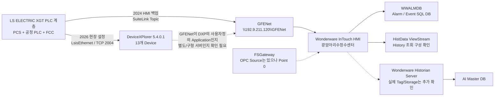

# Water AI · 광암

## 현재 상태

- **현장 확인**: 2026-09-07 현장방문 완료
- **PLC 원본**: XG5000 `.xgwx` **155개 수집 완료(오류 0)**. 단, 동일 설비의 과거본/수정본/OLD가 포함되어 있어 155개를 PLC 155대로 해석하지 않음
- **PLC 구조**: PCS1/2/4/5/6, PCS_M, P22 약품, P23 오존, CO2, 염소 및 **FCC 24개 여과지 로컬 PLC** 계층 확인
- **PLC 통신**: 주요 PCS에서 `192.9.211.x / 192.9.212.x` FEnet 계열의 복수 통신 경로 확인. 전체 망의 Primary/Standby 역할은 아직 미확정
- **PLC 과거이력**: PLC 자체 장기 백업 없음
- **HMI**: Wonderware **InTouch HMI 2014 R2 SP1 (v11.1)** 구성 확인
- **PLC 통신 미들웨어**: TAKEBISHI **DeviceXPlorer 5.4.0.1** 설정에서 `LsisEthernet` 13개 Device와 TCP `2004` 대상 확인
- **사전 제공 HMI 백업 대조**: 2023/2024 InTouch Application 백업 3개 계열이 존재하며, 2024-03-29 `dde.cfg`에서 **SuiteLink Application=`\\192.9.211.120\GFENet`** 및 P1/P2/P4/P6/P7/P8/P21/P22/P23/P25/P26/P27/P30 Topic을 직접 확인
- **중요 정정**: `DXPSV`는 DeviceXPlorer Ver.5의 기본 Application Name이자 현장 확보 `.dxp` 파일명 단서일 뿐, **광암 InTouch의 실제 Application Name이 `DXPSV`라고 확정할 수 없음**. 사전 제공 2024 HMI 백업에서는 실제 값이 `GFENet`
- **HMI↔PLC 논리구조 대조**: 2024 HMI의 GFENet 13개 주 Topic이 2026 현장 DeviceXPlorer의 13개 Device 이름과 **완전 일치**. 따라서 동일 PLC 논리대상을 바라보는 구조는 강하게 교차검증됨
- **추가 HMI Source**: `P52`, `P56`, `PLC3`가 2024 HMI 백업에 추가 존재. 현재 DeviceXPlorer 13개 Device에는 없으므로 과거/보조/별도 Topic인지 추가 확인 필요
- **InTouch 통신 포인트**: 2024 `dde.cfg`에서 GFENet 경유 포인트 **14,983개**, 전체 DDE Point **14,997개**를 추출
- **FSGateway**: 2024 InTouch에 `OPC → \\localhost\FSGateway / OPC_DeviceGroup` Source가 실제 정의되어 있으나 **Point 0개**. 적어도 이 백업 시점의 주 PLC 경로였다는 증거는 없음
- **211/212 이중 경로**: 2024 InTouch `INTOUCH` Source에서 `\\192.9.211.120\VIEW`를 Primary, `\\192.9.212.120\VIEW`를 Secondary로 직접 설정. 211/212 이중망이 실제 HMI 계층에서도 사용된 흔적은 확인됨. 단 이를 모든 PLC의 Primary/Standby 구조로 일반화하지 않음
- **History 기능**: `HistdataViewstr → \\192.9.211.120\HistData / ViewStream1` 13개 Point와 `aaHistClient*` ActiveX 구성 확인. **History 조회 기능이 HMI에 구성된 것은 확인**됐지만 이것만으로 Wonderware Historian Server의 실제 저장 Tag/보존기간을 확정하지 않음
- **알람 DB**: 기존 분석한 `WWALMDB`는 **InTouch Alarm DB Logger 계열의 알람·이벤트 SQL DB**로 분류. Historian 공정 시계열 DB와 구분
- **기존 사전자료에 이미 존재하는 미수집 핵심파일**: `tagname.x`, `dhistcfg.ini`, `alarm.cfg`, `historian.txt`가 원본 HMI 자료 트리에 존재함이 `00_ALL_FILES.csv`로 확인됨. Upload-Lite에서 제외되었으므로 **현장 재방문보다 기존 제공자료에서 선택 재수집이 우선**
- **다음 작업 1순위**: 사전자료의 `tagname.x / dhistcfg.ini / alarm.cfg / historian.txt` 선택 재수집 + 현재 2026 DeviceXPlorer DDE/SuiteLink Application Name 확인 + Historian 실제 Tag/기간 확인

## 현재 핵심 구조 — 시점 분리



> 현재 가장 중요한 정리는 두 가지다.  
> 1) **`WWALMDB ≠ Historian`**  
> 2) **`DXPSV`를 광암의 실제 InTouch Application Name으로 확정하면 안 된다. 2024 HMI 백업에서는 `GFENet`이 직접 확인된다.**

## 현장 시스템

- [[20-현장-시스템/01-광암-데이터흐름-및-통신구조]]
- [[20-현장-시스템/02-Wonderware-DeviceXPlorer-InTouch-Historian-구조]]
- [[20-현장-시스템/03-광암-실제-연결-확인-파일-및-설정위치]]
- [[20-현장-시스템/04-광암-PLC-XG5000-구조-및-통신맵]]
- [[30-데이터-분석/02-광암-PLC-태그-Historian-데이터계보-구축]]
- [[30-데이터-분석/03-광암-InTouch-dde-cfg-통신매핑-분석]]
- [[30-데이터-분석/01-WWALMDB-AlarmDB-vs-Historian]]
- [[90-근거-기록/2026-09-07-광암-현장방문-확인기록]]
- [[90-근거-기록/2026-09-08-Wonderware-자료분석-기록]]
- [[90-근거-기록/2026-09-08-XG5000-PLC원본-분석-기록]]
- [[90-근거-기록/2026-09-09-사전제공-HMI-자료-대조-기록]]
- [[90-근거-기록/2026-09-08-광암-Wonderware-추가확보-체크리스트]]
- [[90-근거-기록/2026-09-09-Obsidian-v4-업데이트내역]]

## 정수 AI 개발 원칙

광암은 **정수 AI 학습·검증 기준 시설**이다.

```text
광암정수장 장기 운전데이터
→ Historian/기존 저장계층 확인
→ AI Master DB
→ 정수 수요·수질·약품·전력 분석
→ 정수 AI 예측/최적화 모델 개발
→ 모델 검증 및 표준화
→ 명장 최종 적용장에 적용
```

PLC 자체에 과거이력이 없으므로 실제 학습데이터는 **Wonderware Historian 또는 별도 History 저장계층**에서 확보해야 한다. 사전 HMI 백업에서 History 조회 기능은 확인됐지만, 실제 장기 저장소와 보존기간은 별도로 증명한다.

## 공통 AI 설계 기준

- [[20-Water-AI/00-공통/20-공정-기술/10-하수장-정수장-AI-모델-적용-원칙|예측·최적화·안전제어·LLM/RAG 역할 분리]]

## 폴더

| 폴더 | 내용 |
|---|---|
| `10-받은자료` | PLC·SCADA·SQL·CSV 등 원본 |
| `20-현장-시스템` | 공정, 설비, PLC, SCADA, 통신 구조 |
| `30-데이터-분석` | 학습 데이터, 태그, 컬럼, 품질 분석 |
| `40-회의록` | 광암 관련 회의 |
| `50-의사결정` | 광암 관련 확정 사항 |
| `60-문제해결` | 데이터·학습·검증 문제 해결 |
| `70-개발-검증` | 모델 학습과 검증 기록 |
| `80-산출물` | 보고서, 데이터 정의서, 결과 자료 |
| `90-근거-기록` | 현장방문·직접확인·근거 추적 |

[[Rulmera-OPA|전체 홈]] · [[20-Water-AI/00-프로젝트관리/00-PM-대시보드|Water AI PM]] · [[20-Water-AI/00-공통/00-Water-AI-공통-홈|Water AI 공통]]
