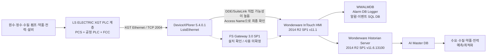
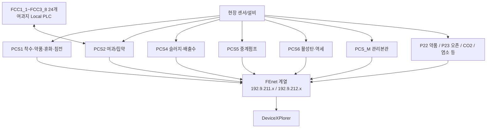

# 광암 데이터 흐름 및 통신 구조

## 1. 현재 결론

2026-09-07 현장 확인, 2026-09-08 `Wonderware.zip`, XG5000 원본 155개 수집/분석을 합치면 광암의 데이터 흐름은 다음처럼 보는 것이 가장 타당하다.



## 2. 확인 수준

| 항목 | 상태 | 근거/해석 |
|---|---|---|
| LS ELECTRIC XGT/FEnet 계열 PLC | **확정** | 2026-09-07 현장 확인 |
| PLC 자체 장기 과거이력 없음 | **확정** | 2026-09-07 현장 확인 |
| DeviceXPlorer 사용 | **확정** | `InTouch/DXPSV.dxp` 존재 및 DeviceXPlorer 5 설정 파일 확인 |
| DeviceXPlorer 버전 | **확정** | `ProductVersion="5, 4, 0, 1"` |
| LS PLC용 드라이버 | **확정** | Device `LibType="LsisEthernet"` |
| PLC 통신 TCP 포트 2004 | **확정(설정 기준)** | 13개 Ethernet Port 설정 모두 원격 Port `2004` |
| InTouch HMI 2014 R2 SP1 v11.1 | **확정** | InTouch Readme |
| Historian Server 2014 R2 SP1 v11.6.13100 | **확정** | Historian Readme |
| FS Gateway 3.0 SP1 설치 | **확정** | FSGateway 구성요소 및 InTouch Readme |
| FS Gateway가 실제 PLC→InTouch 경로에 사용됨 | **미확정** | 이 InTouch 버전에서 FS Gateway가 hidden feature로 설치될 수 있어 파일 존재만으로 런타임 사용을 증명할 수 없음 |
| `WWALMDB`가 알람/이벤트 DB | **강한 확정 수준** | 기존 BAK 스키마 분석 + InTouch Alarm DB Logger의 SQL Server 알람 이력 구조와 일치 |
| Historian의 실제 광암 Tag/보존기간/저장주기 | **미확정** | 설치 구성요소는 있으나 현장 Historian 설정/데이터 저장소 미확보 |
| DeviceXPlorer → InTouch 연결 방식 | **강한 추정 / 최종 미확정** | TAKEBISHI Ver.5는 InTouch 직접 DDE/SuiteLink 지원, 기본 Application=`DXPSV`; 광암 InTouch Access Name 확인 필요 |


## 3. PLC 내부 계층 — XG5000 원본 반영

이번 XG5000 원본 수집으로 광암 PLC가 단일 계층이 아니라는 점이 명확해졌다.



- `.xgwx` 155개가 확보됐지만 과거본/수정본이 포함되어 있으므로 PLC 대수로 보지 않는다.
- 주요 PCS에서 `211.x`와 `212.x` 두 대역이 반복적으로 확인된다. **두 망의 정확한 이중화 역할은 미확정**이다.
- PCS2의 Station 1~24 통신구조와 FCC 24개 프로젝트는 강하게 대응한다. 개별 Station↔FCC 이름 매핑은 추가 검증한다.

세부: [[04-광암-PLC-XG5000-구조-및-통신맵]]

## 4. DeviceXPlorer에서 확인된 PLC 통신 대상

`DXPSV.dxp`에는 13개의 `LsisEthernet` Device와 이에 대응하는 Ethernet Port가 정의되어 있다.

| Device | 설비 | 설정 내 로컬측 IP | PLC/원격 IP | TCP Port |
|---|---|---:|---:|---:|
| P1 | PCS#1 약품투입동 | 192.9.211.120 | 192.9.211.10 | 2004 |
| P2 | PCS#2 여과지동 | 192.9.211.120 | 192.9.211.12 | 2004 |
| P4 | PCS#4 탈수기동 | 192.9.211.120 | 192.9.211.14 | 2004 |
| P7 | PCS_M 관리본관 | 192.9.211.120 | 192.9.211.16 | 2004 |
| P8 | 관리본관 워터나우 프로그램 | 192.9.211.120 | 192.9.211.18 | 2004 |
| P21 | CO2 설비 | 192.9.211.120 | 192.9.211.21 | 2004 |
| P22 | PAC설비 | 192.9.211.120 | 192.9.211.22 | 2004 |
| P23 | 오존투입설비 | 192.9.211.120 | 192.9.211.23 | 2004 |
| P25 | 염소투입설비 | 192.9.211.120 | 192.9.211.25 | 2004 |
| P26 | PCS#4 탈수기제어반 | 192.9.211.120 | 192.9.211.26 | 2004 |
| P27 | 과산화수소 설비 | 192.9.211.120 | 192.9.211.28 | 2004 |
| P30 | PCS#5 중계펌프장 | 192.9.211.120 | 192.9.211.30 | 2004 |
| P6 | PCS#6 활성탄여과지동 | 192.9.211.120 | 192.9.211.32 | 2004 |

> `192.9.211.120`은 `DXPSV.dxp`의 각 Ethernet Port `Info` 필드에서 반복되는 로컬측 주소 위치로 해석했다. 실제 NIC 주소/서버 주소 여부는 현장 PC 네트워크 설정과 대조하여 최종 확정한다.

## 5. `WWALMDB`와 Historian을 분리해서 봐야 하는 이유

`WWALMDB`는 알람 발생, 상태변경, ACK, 정상복귀 등의 이벤트 이력을 저장하는 InTouch Alarm DB Logger 계열 SQL DB로 보는 것이 맞다. 반면 AI 학습에 필요한 연속 PV 데이터는 Wonderware Historian 계층을 우선 확인해야 한다.

```text
WWALMDB
→ 알람/이벤트 분석
→ Fault, Alarm, ACK, 상태 변화

Wonderware Historian
→ 공정 시계열 분석
→ 수량, 수질, 약품, Hz, 전력, Set Point 등
```

따라서 `WWALMDB`만 분석해서는 광암의 전체 운전 데이터를 재구성할 수 없다.

## 6. 실제 연결 확인의 최우선 파일

가장 먼저 **InTouch DBDump CSV**를 확보한다. DBDump에는 `:IOAccess` Access Name 정의와 Tag의 Access Name/Item 정보가 포함되므로 다음을 한 번에 확인할 수 있다.

```text
DeviceXPlorer Application(DXPSV 여부)
→ Topic
→ InTouch Tag
→ Item Name / PLC 주소
```

현장 상세 확인 위치는 [[03-광암-실제-연결-확인-파일-및-설정위치]]에 정리한다.

## 7. 다음에 반드시 확보할 설정/데이터

1. **InTouch Application 원본**
   - Tag Dictionary
   - Access Name
   - Topic / Application
   - I/O Tag Item Name
2. **DeviceXPlorer 실제 Tag/Item 정의**
   - 현재 `DXPSV.dxp`에는 통신 Device 구조는 확인되나 전체 공정 Item 매핑 확보가 필요
3. **Wonderware Historian 설정**
   - Historian Tag 목록
   - Tag Source
   - Scan/Storage 설정
   - 보존기간
   - 현재 데이터 저장 위치
4. **Historian 데이터 샘플 Export**
   - 최소 수일~수주 샘플
   - Timestamp, Quality 포함
5. **WWALMDB와 Historian Tag 연결 규칙**
   - 동일 설비/태그를 Alarm과 PV 양쪽에서 연결할 수 있는지 확인

## 8. AI 수집 설계 원칙

- 과거 학습 데이터는 **Historian 우선**으로 확보한다.
- `WWALMDB`는 장애/알람/운전상태 이벤트를 보강하는 보조 데이터로 사용한다.
- Historian에 없는 실시간 항목만 별도 XGT/FEnet Read-only Collector를 검토한다.
- 기존 InTouch/DeviceXPlorer 통신에 영향을 주지 않도록 세션 수와 Polling 부하를 확인한다.
- 최종 Master DB에서는 **공정 PV + Set Point + 운전모드 + 알람/이벤트**를 동일 시간축으로 결합한다.

## 관련 문서

- [[02-Wonderware-DeviceXPlorer-InTouch-Historian-구조]]
- [[03-광암-실제-연결-확인-파일-및-설정위치]]
- [[04-광암-PLC-XG5000-구조-및-통신맵]]
- [[../30-데이터-분석/02-광암-PLC-태그-Historian-데이터계보-구축]]
- [[../30-데이터-분석/01-WWALMDB-AlarmDB-vs-Historian]]
- [[../90-근거-기록/2026-09-07-광암-현장방문-확인기록]]
- [[../90-근거-기록/2026-09-08-Wonderware-자료분석-기록]]
- [[../90-근거-기록/2026-09-08-XG5000-PLC원본-분석-기록]]
- [[../../00-프로젝트관리/12-현장방문기록]]
- [[../../00-프로젝트관리/WBS/1.3.1 정수시설 운영 데이터 수집 체계 구축]]
