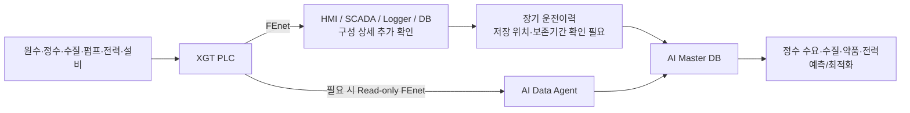

# 광암 데이터 흐름 및 통신 구조

## 현재 확인된 내용

- 2026-09-07 현장방문에서 광암의 확인 대상 PLC 통신이 **LS ELECTRIC XGT / FEnet 기반**임을 직접 확인했다.
- PLC 자체에는 과거 운전데이터를 별도로 장기 백업하지 않는다.
- 따라서 정수 AI 학습용 장기 운전이력은 PLC가 아니라 **상위 HMI/SCADA/Logger/DB/Export 계층에서 확보해야 한다.**
- 광암은 정수 AI 모델의 학습·검증 기준 시설이다.

## 현재 데이터 흐름 이해

> 위 그림에서 **XGT/FEnet과 PLC 자체 장기이력 미보관은 현장 확인 사항**이다.  
> HMI/SCADA/Logger/DB의 실제 제품·구성·저장위치는 추가 확인이 필요하다.

## AI 학습용 우선 확인 데이터

- 원수 및 정수량
- 탁도 등 수질
- 약품 사용량
- 펌프 RUN/STOP
- 인버터 운전 Hz
- 가동대수
- 설비별 전력
- 운전조건 및 Set Point
- AUTO/MANUAL
- Alarm/Fault
- 가능하면 운전 변경 사유

## 추가 확인 필요

1. PLC별 IP와 FEnet 구성
2. HMI/SCADA Tag와 PLC 주소 Mapping
3. Logger/DB 저장주기와 보존기간
4. 과거 데이터 Export 방법
5. Timestamp 기준과 시간동기 방식
6. FEnet 외부 Read-only 접속의 세션 여유·보안·현장 승인조건
7. 데이터 기간·결측률·품질

## 개발 제안

- 장기 이력은 기존 상위 저장계층에서 우선 확보한다.
- 부족한 실시간 항목만 XGT/FEnet Read-only Collector를 병렬 구성한다.
- 정수 AI Master DB는 동일 시간축으로 수질·수량·약품·펌프·전력·운전모드를 통합한다.
- 데이터 확보상태를 확인한 뒤 통계 시계열 예측모델, 머신러닝 회귀모델, 딥러닝 시계열 예측모델의 적용범위를 최종 결정한다.

## 관련 문서

- [[../90-근거-기록/2026-09-07-광암-현장방문-확인기록]]
- [[../../00-프로젝트관리/12-현장방문기록]]
- [[../../00-프로젝트관리/WBS/1.3.1 정수시설 운영 데이터 수집 체계 구축]]
