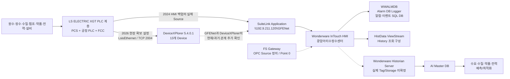
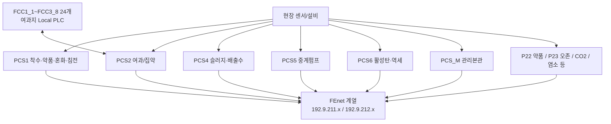

# 광암 데이터 흐름 및 통신 구조

## 1. 현재 결론

2026-09-07 현장 확인, 2026-09-08 Wonderware/XG5000 분석, 그리고 **현장 방문 전에 제공받았던 2023/2024 InTouch HMI 백업**을 대조하면 기존 Obsidian의 큰 방향은 유지해도 된다.

다만 **`DeviceXPlorer → InTouch Application=DXPSV`를 사실처럼 쓰면 안 된다.** 사전 제공 HMI 백업의 2024-03-29 `dde.cfg`에는 실제 통신 Application이 다음처럼 기록되어 있다.

```text
Application Name = \\192.9.211.120\GFENet
Topic = P1 / P2 / P4 / P6 / P7 / P8 / P21 / P22 / P23 / P25 / P26 / P27 / P30 ...
SuiteLink = 1
```

따라서 현재는 **시점을 분리해서** 본다.



### 유지해도 되는 핵심

- LS ELECTRIC XGT/FEnet PLC 계층
- 13개 주요 PLC 논리대상 P1/P2/P4/P6/P7/P8/P21/P22/P23/P25/P26/P27/P30
- InTouch HMI 사용
- DeviceXPlorer의 LSIS Ethernet 설정
- `WWALMDB`는 공정 Historian이 아니라 Alarm/Event DB라는 구분
- Historian/History 계층에서 AI 학습용 장기 데이터를 찾아야 한다는 방향

### 수정해야 하는 핵심

- `DXPSV`를 광암 InTouch의 실제 SuiteLink Application Name으로 확정하던 표현
- P8 `.18`을 WaterNow로 확정하던 표현 — 과거 IP 문서에서는 `.18=PCS-M_XGI`, `.19=WATER NOW`로 분리
- FSGateway를 단순 “설치만 있음”으로만 표현하던 부분
- InTouch Access Name/Item 정보가 전혀 없다고 보던 부분
- 211/212 이중망에 대한 근거 수준
- History 기능의 존재 근거 수준

---


### 2026-09-09 추가 교차검증 — 최상위 제공자료

이번에 사전 제공자료의 최상위에서 확보한 두 Excel을 추가 대조했다.

```text
★광암정수장 제어실 HUB PORT별 정보(201609).xlsx
광암정수센터_HMI자료정리.xlsx
```

추가로 직접 확인된 것:

```text
192.9.211.x = LINE A
192.9.212.x = LINE B
192.9.211.120 = 감시제어 OS POS11
192.9.212.120 = 감시제어 OS POS11
```

따라서 `211.120/212.120`은 단순 미상 서버가 아니라 **POS11 감시제어 노드의 이중망 주소**로 설명할 수 있다.

또 `광암_태그` Sheet에서 `IODisc 10,146개 + IOReal 4,724개`의 InTouch Tag DB 메타데이터를 직접 확보했다. IOReal 중 4,214개가 `Logged=Yes`다.

상세: [[../30-데이터-분석/04-광암-HMI-TagDB-및-IP맵-교차분석]]

## 2. 확인 수준

| 항목 | 상태 | 근거/해석 |
|---|---|---|
| LS ELECTRIC XGT/FEnet 계열 PLC | **확정** | 2026-09-07 현장 확인 + XG5000 원본 |
| PLC 자체 장기 과거이력 없음 | **확정** | 2026-09-07 현장 확인 |
| DeviceXPlorer 사용 | **확정** | 2026 현장 확보 `DXPSV.dxp` |
| DeviceXPlorer 버전 | **확정** | `ProductVersion="5, 4, 0, 1"` |
| LS PLC용 드라이버 | **확정** | `LibType="LsisEthernet"` |
| PLC 통신 TCP 포트 2004 | **확정(2026 설정 기준)** | 13개 Ethernet Port 원격 Port `2004` |
| InTouch Application 이름 | **확정(2024 백업)** | `INTOUCH.INI`의 `AppName0=광암아리수정수센터` |
| InTouch의 PLC 통신 Application | **확정(2024 백업)** | `dde.cfg`: `\\192.9.211.120\GFENet` |
| 13개 주요 HMI Topic과 2026 DXP Device 이름 | **교차검증 완료** | P1/P2/P4/P6/P7/P8/P21/P22/P23/P25/P26/P27/P30가 양쪽에 모두 존재 |
| 추가 HMI Topic `P52/P56/PLC3` | **확정(2024 백업)** | `dde.cfg`에 존재. 현재 DXP 13개에는 없음 |
| `GFENet`이 곧 DeviceXPlorer의 사용자정의 Application Name인지 | **미확정** | 이름 일치가 아니라 논리 Topic 일치만 확인됨 |
| `DXPSV`가 광암의 실제 InTouch Application Name인지 | **부정/미확정** | 2024 백업의 실제 값은 `GFENet`; `DXPSV`는 기본값/파일명 단서 |
| FSGateway Source 정의 | **확정(2024 백업)** | `OPC → \\localhost\FSGateway / OPC_DeviceGroup` |
| FSGateway에 실제 I/O Point 존재 | **없음(2024 백업)** | 해당 Source Point 0개 |
| 211/212 네트워크 명칭 | **확정(과거 IP 문서)** | `211.x=LINE A`, `212.x=LINE B` |
| POS11 이중 IP | **확정(과거 IP 문서)** | `211.120/212.120 = 감시제어 OS POS11` |
| 211/212 이중 HMI 경로 | **확정(특정 Source)** | `INTOUCH` Source: Primary `211.120\VIEW`, Secondary `212.120\VIEW` |
| 전체 PLC 211/212가 모두 Primary/Standby인지 | **미확정** | 위 HMI Source 증거만으로 전체 PLC망까지 일반화하지 않음 |
| History 조회 구성 | **확정(2024 자료)** | `HistdataViewstr → HistData/ViewStream1` + `aaHistClient*` ActiveX. 단 HistData 주소가 자료별 `211.120` / `192.168.0.120`으로 상이 |
| InTouch Tag DB 메타데이터 | **확정(2024-05 문서)** | `IODisc 10,146 / IOReal 4,724`, AccessName/Item/Logged/Alarm 확보 |
| Wonderware Historian 실제 Tag/보존기간/Storage | **미확정** | 제품 구성은 확인됐으나 런타임 설정/데이터 미확보 |
| `WWALMDB`가 알람/이벤트 DB | **강한 확정 수준** | BAK 스키마 + InTouch Alarm DB 구성과 일치 |

---

## 3. PLC 내부 계층 — XG5000 원본 반영

이번 XG5000 원본 수집으로 광암 PLC가 단일 계층이 아니라는 점이 명확해졌다.



- `.xgwx` 155개가 확보됐지만 과거본/수정본이 포함되어 있으므로 PLC 대수로 보지 않는다.
- 주요 PCS에서 `211.x`와 `212.x` 두 대역이 반복적으로 확인된다.
- 과거 HUB/IP 문서에서 `211.x=LINE A`, `212.x=LINE B`로 직접 명명되어 있고, 2024 InTouch에서도 `211.120\VIEW` Primary / `212.120\VIEW` Secondary가 확인되어 **211/212 이중 네트워크가 실제 운용 구조에 포함된 것은 더 강하게 확인됐다.**
- 다만 이것이 모든 PLC의 동일한 Primary/Standby 체계라는 뜻은 아니므로 전체 망 역할은 별도 확정한다.
- PCS2의 Station 1~24 통신구조와 FCC 24개 프로젝트는 강하게 대응한다. 개별 Station↔FCC 이름 매핑은 추가 검증한다.

세부: [[04-광암-PLC-XG5000-구조-및-통신맵]]

---

## 4. 2026 DeviceXPlorer에서 확인된 PLC 통신 대상

`DXPSV.dxp`에는 13개의 `LsisEthernet` Device와 이에 대응하는 Ethernet Port가 정의되어 있다.

| Device | 설비 | 설정 내 로컬측 IP | PLC/원격 IP | TCP Port |
|---|---|---:|---:|---:|
| P1 | PCS#1 약품투입동 | 192.9.211.120 | 192.9.211.10 | 2004 |
| P2 | PCS#2 여과지동 | 192.9.211.120 | 192.9.211.12 | 2004 |
| P4 | PCS#4 탈수기동 | 192.9.211.120 | 192.9.211.14 | 2004 |
| P7 | PCS_M 관리본관 | 192.9.211.120 | 192.9.211.16 | 2004 |
| P8 | 관리본관 계열 — `.18` 정확 역할 재확인 필요 | 192.9.211.120 | 192.9.211.18 | 2004 |
| P21 | CO2 설비 | 192.9.211.120 | 192.9.211.21 | 2004 |
| P22 | PAC설비 | 192.9.211.120 | 192.9.211.22 | 2004 |
| P23 | 오존투입설비 | 192.9.211.120 | 192.9.211.23 | 2004 |
| P25 | 염소투입설비 | 192.9.211.120 | 192.9.211.25 | 2004 |
| P26 | PCS#4 탈수기제어반 | 192.9.211.120 | 192.9.211.26 | 2004 |
| P27 | 과산화수소 설비 | 192.9.211.120 | 192.9.211.28 | 2004 |
| P30 | PCS#5 중계펌프장 | 192.9.211.120 | 192.9.211.30 | 2004 |
| P6 | PCS#6 활성탄여과지동 | 192.9.211.120 | 192.9.211.32 | 2004 |

> `192.9.211.120`은 DeviceXPlorer 설정에서도 반복되고, 2024 InTouch의 `GFENet`, `HistData`, `VIEW` Source에서도 반복된다. 따라서 이 주소가 상위 HMI/통신 서버 계층의 핵심 노드였다는 근거는 강해졌다. 다만 2026 현재 NIC/서버 역할은 운영 PC 설정으로 최종 확인한다.

---

## 5. 2024 InTouch `dde.cfg`에서 확인된 통신 Source

사전 제공 HMI 백업의 최신 계열:

```text
HMi backup\광암아리수정수센터_POS11_2024.03.29\dde.cfg
```

직접 추출 결과:

| Source | Application | Topic | Point 수 |
|---|---|---|---:|
| P1 | `\\192.9.211.120\GFENet` | P1 | 2,563 |
| P2 | `\\192.9.211.120\GFENet` | P2 | 6,479 |
| P4 | `\\192.9.211.120\GFENet` | P4 | 914 |
| P6 | `\\192.9.211.120\GFENet` | P6 | 1,678 |
| P7 | `\\192.9.211.120\GFENet` | P7 | 618 |
| P8 | `\\192.9.211.120\GFENet` | P8 | 4 |
| P21 | `\\192.9.211.120\GFENet` | P21 | 209 |
| P22 | `\\192.9.211.120\GFENet` | P22 | 122 |
| P23 | `\\192.9.211.120\GFENet` | P23 | 243 |
| P25 | `\\192.9.211.120\GFENet` | P25 | 129 |
| P26 | `\\192.9.211.120\GFENet` | P26 | 277 |
| P27 | `\\192.9.211.120\GFENet` | P27 | 168 |
| P30 | `\\192.9.211.120\GFENet` | P30 | 1,089 |
| P52 | `\\192.9.211.120\GFENet` | P52 | 417 |
| P56 | `\\192.9.211.120\GFENet` | P56 | 72 |
| PLC3 | `\\192.9.211.120\GFENet` | PLC3 | 1 |
| HistdataViewstr | `\\192.9.211.120\HistData` | ViewStream1 | 13 |
| INTOUCH | `\\192.9.211.120\VIEW` | TAGNAME | 1 |
| OPC | `\\localhost\FSGateway` | OPC_DeviceGroup | 0 |
| Galaxy | `\\NA\NA` | NA | 0 |

GFENet Source의 I/O Point는 **14,983개**이며 전체 Point는 **14,997개**다.

예:

```text
Source=P1
Application=\\192.9.211.120\GFENet
Topic=P1
...
CO2 등의 Tag가 아니라 실제 InTouch Tag
→ MWxxxx 같은 Item/PLC 메모리 주소
```

즉 **InTouch Tag ↔ Topic ↔ PLC 메모리 Item**의 대량 매핑이 이미 이 파일에 존재한다.

세부: [[../30-데이터-분석/03-광암-InTouch-dde-cfg-통신매핑-분석]]

---

## 6. `WWALMDB`와 Historian을 분리해서 봐야 하는 이유

`WWALMDB`는 알람 발생, 상태변경, ACK, 정상복귀 등의 이벤트 이력을 저장하는 InTouch Alarm DB Logger 계열 SQL DB로 보는 것이 맞다.

반면 AI 학습에 필요한 연속 PV 데이터는 별도 History/Historian 계층을 확인해야 한다.

```text
WWALMDB
→ 알람/이벤트 분석
→ Fault, Alarm, ACK, 상태 변화

InTouch/HistData/Historian
→ 공정 시계열 조회·저장 계층
→ 수량, 수질, 약품, Hz, 전력, Set Point 등
```

2024 HMI 백업의 `HistData/ViewStream1`은 **History 조회 기능이 구성돼 있었다는 증거**지만, 그것만으로 Wonderware Historian Server의 실제 장기 저장 Tag를 뜻하지는 않는다.

---

## 7. 다음 확보 우선순위가 바뀌었다

이전에는 `InTouch DBDump CSV`를 최우선으로 봤지만, 사전 제공 HMI 백업에서 `dde.cfg`를 확보하면서 **통신 Source/Topic/Item 매핑은 상당 부분 이미 복구됐다.**

이제 우선순위는 다음과 같다.

1. **기존 사전 제공 원본에서 선택 재수집**
   - `tagname.x`
   - `tagnames.ndx`
   - `dhistcfg.ini`
   - `alarm.cfg`
   - `historian.txt`
2. **현재 2026 DeviceXPlorer 런타임 확인**
   - DDE/SuiteLink Application Name
   - Topic Name
   - 현재 사용 `.dxp`
3. **InTouch DBDump**
   - Tag Type, Logged, Alarm, Access Name 등 전체 메타데이터 보강
4. **Historian 실제 설정/데이터**
   - Tag 목록
   - Source
   - 저장주기
   - 보존기간
   - Storage
   - 데이터 샘플
5. **2024 `GFENet`과 2026 DeviceXPlorer 관계 확인**
   - 같은 서버의 Application Name 변경인지
   - 별도/구형 I/O Server인지
   - 마이그레이션이 있었는지

> Upload-Lite의 `00_ALL_FILES.csv`에서 위 핵심파일들이 원본 자료 트리에 존재함은 이미 확인됐다. 따라서 일부는 **현장에 다시 요청할 문제가 아니라 기존 제공자료에서 다시 뽑으면 된다.**

---

## 8. AI 수집 설계 원칙

- 과거 학습 데이터는 실제 장기 저장계층을 확인한 뒤 확보한다.
- `dde.cfg`의 14,983개 GFENet Point를 PLC Address Dictionary와 연결해 **PLC→HMI 데이터계보**를 먼저 만든다.
- `WWALMDB`는 장애/알람/운전상태 이벤트 보강용이다.
- Historian에 없는 실시간 항목만 별도 XGT/FEnet Read-only Collector를 검토한다.
- 기존 InTouch/DeviceXPlorer 통신에 영향을 주지 않도록 세션 수와 Polling 부하를 확인한다.
- 최종 Master DB에서는 **공정 PV + Set Point + 운전모드 + 알람/이벤트 + 모델 입력/출력**을 동일 시간축으로 결합한다.
- 2023/2024 백업과 2026 현장 상태를 섞지 않고 `source_snapshot_date`를 반드시 기록한다.

## 관련 문서

- [[02-Wonderware-DeviceXPlorer-InTouch-Historian-구조]]
- [[03-광암-실제-연결-확인-파일-및-설정위치]]
- [[04-광암-PLC-XG5000-구조-및-통신맵]]
- [[../30-데이터-분석/03-광암-InTouch-dde-cfg-통신매핑-분석]]
- [[../30-데이터-분석/02-광암-PLC-태그-Historian-데이터계보-구축]]
- [[../30-데이터-분석/01-WWALMDB-AlarmDB-vs-Historian]]
- [[../90-근거-기록/2026-09-09-사전제공-HMI-자료-대조-기록]]
- [[../90-근거-기록/2026-09-07-광암-현장방문-확인기록]]
- [[../90-근거-기록/2026-09-08-Wonderware-자료분석-기록]]
- [[../90-근거-기록/2026-09-08-XG5000-PLC원본-분석-기록]]
