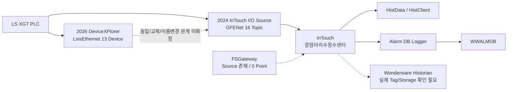

# Wonderware · DeviceXPlorer · InTouch · Historian 구조

## 목적

광암에서 확보한 2026 현장 자료와, 현장 방문 전에 제공받았던 2023/2024 InTouch HMI 백업을 대조하여 **소프트웨어의 역할, 실제 통신 Source, 시점별 차이**를 분리한다.

가장 중요한 원칙은 다음이다.

```text
설치되어 있다 ≠ 실제 통신 경로로 사용된다
기본 Application Name이다 ≠ 광암 실제 Application Name이다
2024 백업 상태 ≠ 2026 현재 런타임 상태다
```

---

## DeviceXPlorer의 정체 — 무엇이고 무엇이 아닌가

**DeviceXPlorer OPC Server는 TAKEBISHI가 개발한 산업용 통신 미들웨어/OPC Server다.** PLC와 통신하고 상위 HMI/SCADA/IT 프로그램에 OPC·DDE·SuiteLink 등의 인터페이스를 제공한다.

광암의 2026 현장 확보 `DXPSV.dxp`에서는:

```text
ProductVersion = 5.4.0.1
LibType = LsisEthernet
Device = P1, P2, P4, P6, P7, P8, P21, P22, P23, P25, P26, P27, P30
Remote TCP Port = 2004
```

가 확인된다.

따라서 **2026 현장 자료 기준 DeviceXPlorer가 LS ELECTRIC PLC 통신 설정을 갖고 있다는 것은 확정**이다.

다만 예전 문서에서 아래처럼 적었던 부분은 수정한다.

```text
"DXPSV.dxp 파일명"
+
"DeviceXPlorer Ver.5 기본 Application Name = DXPSV"
→ "광암 실제 InTouch Application Name도 DXPSV일 가능성이 높다"
```

이 추론은 **더 이상 사용하지 않는다.**

사전 제공 2024 InTouch 백업의 `dde.cfg`에서 실제 Application Name이 직접 확인됐기 때문이다.

```text
Application Name = \\192.9.211.120\GFENet
SuiteLink = 1
```

즉 `DXPSV`는 **제품 기본값/파일명 단서**이고, 광암의 실제 HMI 통신 Application Name은 적어도 2024 백업 시점에는 `GFENet`이었다.

---

## 구성요소별 역할과 현재 판단

| 구성요소 | 확인 내용 | 역할 | 현재 판단 |
|---|---|---|---|
| DeviceXPlorer | 5.4.0.1, `LsisEthernet` 13 Device | PLC 통신 미들웨어 | **2026 현장 설정 확인** |
| GFENet | `\\192.9.211.120\GFENet`, SuiteLink | 2024 InTouch의 PLC I/O Application | **2024 HMI에서 실제 사용 확인** |
| InTouch HMI | 2014 R2 SP1 v11.1 | HMI 화면, Tag, Alarm, 운전 조작 | **확인** |
| FS Gateway | `\\localhost\FSGateway`, Topic `OPC_DeviceGroup` | OPC/DDE/SuiteLink Gateway | **2024 HMI Source 정의 확인, Point 0개** |
| InTouch HistData | `\\192.9.211.120\HistData`, `ViewStream1` | InTouch History 조회/데이터 스트림 | **2024 HMI에서 13 Point 확인** |
| Wonderware Historian | 2014 R2 SP1 v11.6.13100 | 장기 공정 시계열 저장/조회 | **제품 구성 확인, 실제 광암 Tag/Storage 미확정** |
| Alarm DB Logger | InTouch 구성요소 | SQL Alarm/Event 기록 | `WWALMDB`와 연결되는 계층으로 판단 |
| InTouch VIEW | Primary `211.120`, Secondary `212.120` | HMI Node 간 Tag Source | **2024 이중 Source 구성 확인** |
| POS11 | `211.120 / 212.120` | 감시제어 OS POS11 LINE A/B | **과거 HUB/IP 문서에서 직접 식별** |

---

## 2024 InTouch HMI에서 실제로 확인된 PLC 통신

사전 제공 HMI 백업 최신 계열:

```text
광암아리수정수센터_POS11_2024.03.29
```

`INTOUCH.INI`:

```text
AppName0=광암아리수정수센터
```

`dde.cfg`의 대표 형식:

```text
Begin DDE Source Definition.
    Source Name:        P1
    Application Name:   \\192.9.211.120\GFENet
    Topic Name:         P1
    SuiteLink:          1
    Begin DDE Points
        ...
        <InTouch Tag>:  MWxxxx
        ...
    End DDE Points
End DDE Source Definition.
```

GFENet Source는 다음 16개다.

```text
P1, P2, P4, P6, P7, P8,
P21, P22, P23, P25, P26, P27, P30,
P52, P56, PLC3
```

이 가운데 다음 13개는 2026 DeviceXPlorer Device 이름과 정확히 일치한다.

```text
P1, P2, P4, P6, P7, P8,
P21, P22, P23, P25, P26, P27, P30
```

이 일치는 매우 중요하다.

```text
2024 InTouch GFENet Topic
          ↕
2026 DeviceXPlorer Device
```

논리적인 PLC 대상 구성이 동일하게 유지되고 있다는 강한 교차근거다.

다만 **`GFENet`이 DeviceXPlorer의 사용자 정의 SuiteLink Application Name인지, 별도/구형 통신서버인지**는 현재 자료만으로 확정하지 않는다.

---

## `P52`, `P56`, `PLC3`는 보조 Topic 성격이 더 구체화됨

2024 HMI에는 현재 13개 Device 목록에 없는 Source가 추가로 존재한다.

| Source | Point 수 | Tag 성격에서 보이는 내용 | 현재 판단 |
|---|---:|---|---|
| P52 | 417 IOReal / Logged=No 417 | `여과지동_P2P52`에 P2와 함께 분류 | **P2/여과지 계열 보조 Analog Topic 근거 강함** |
| P56 | 72 IOReal / Logged=No 72 | `활성탄여과지_P6P56`에 P6와 함께 분류 | **P6/활성탄 계열 보조 Analog Topic 근거 강함** |
| PLC3 | 1 | `GA_YU1_TBD123 / 침전지 대표탁도 / MW2600` | 보조 Source 가능성 우선, 별도 PLC 대수로 해석하지 않음 |

이 3개를 바로 별도 PLC 3대로 해석하지 않는다.

---


## HMI Tag DB에서 직접 확인된 Logging / Alarm 성격

`광암정수센터_HMI자료정리.xlsx`의 `광암_태그` Sheet는 `:IOAccess / :IODisc / :IOReal` 구조를 갖는다.

직접 집계:

```text
IODisc = 10,146
IOReal = 4,724

IOReal Logged=Yes = 4,214
IODisc Logged=Yes = 12
IODisc AlarmState=On = 3,498
```

따라서 광암 HMI Tag 구성은 **Analog 값은 History Logging 중심, Digital 값은 Alarm/Event 중심** 성격이 강하게 보인다.

단 `Logged=Yes`는 InTouch Historical Logging 설정을 의미할 수 있으므로 **Wonderware Historian Server 저장 확정 근거로 사용하지 않는다.**

## FSGateway에 대한 판정은 오히려 더 명확해졌다

기존에는 FSGateway 바이너리 존재만 확인되어 “설치만 확인, 실제 사용 미확정”이었다.

이번 2024 InTouch `dde.cfg`에서는 실제 Source 정의가 확인됐다.

```text
Source Name = OPC
Application Name = \\localhost\FSGateway
Topic Name = OPC_DeviceGroup
SuiteLink = 1
Point 수 = 0
```

따라서 다음처럼 정리한다.

```text
FSGateway 설치만 존재한다        → 이전 판단
FSGateway Source도 HMI에 정의돼 있다 → 새로 확인
하지만 해당 Source의 Point는 0개   → 주 PLC 데이터 경로였다는 증거 없음
```

즉 2024 백업 기준 주 PLC I/O는 `GFENet` Source에 14,983 Point가 있고, FSGateway는 0 Point다.

**따라서 FSGateway가 주 PLC 통신 경로였을 가능성은 낮아졌지만, 2026 현재 다른 용도로 사용 중인지까지 부정하지 않는다.**

---

## 211 / 212 이중망의 실제 사용 근거

2024 `dde.cfg`의 `INTOUCH` Source에는 다음이 직접 기록돼 있다.

```text
Primary Data Source
Application Name = \\192.9.211.120\VIEW
Topic Name = TAGNAME

Secondary Data Source
Application Name = \\192.9.212.120\VIEW
Topic Name = TAGNAME
```

과거 HUB/IP 문서에서는 `211.x=LINE A`, `212.x=LINE B`로 직접 명명되어 있고 `211.120/212.120` 모두 `감시제어 OS POS11`로 적혀 있다.

따라서 두 대역이 단순 우연히 같이 존재하는 것이 아니라, **POS11과 PLC 계층을 포함하는 LINE A/B 이중망으로 관리된 직접 근거**가 생겼다.

다만 이것만으로:

```text
모든 PLC의 211.x = Primary
모든 PLC의 212.x = Standby
```

라고 확정하지 않는다.

---

## History 계층 — 새로 확인된 것과 아직 모르는 것

### 새로 확인

`dde.cfg`:

```text
Source Name = HistdataViewstr
Application Name = \\192.9.211.120\HistData
Topic Name = ViewStream1
Point 수 = 13
```

`itocx.cfg / itguid.cfg`:

```text
aaHistClientQuery
aaHistClientTrend
aaHistClientTagPicker
HistClient
AlmDbViewCtrl
```

따라서 InTouch Application에 **History 조회/Trend/데이터 접근 UI가 구성된 것은 사실**이다.

### 아직 미확정

이 `HistData`가 보여주는 과거값이 정확히 어디에 저장돼 있었는지는 별도 확인이 필요하다.

가능한 계층:

```text
InTouch 자체 Historical Logging
Wonderware Historian Server
또는 둘 다
```

사전 제공 원본 트리에는 다음 파일도 존재한다고 `00_ALL_FILES.csv`에서 확인됐다.

```text
tagname.x
dhistcfg.ini
alarm.cfg
historian.txt
```

다만 Upload-Lite에서는 용량 제한/선별 규칙으로 포함되지 않았다.

다만 기본 Tag Type/Comment/AccessName/Item/Logged/Alarm 정보는 이번 `광암_태그` Sheet에서 14,870개를 이미 확보했다. 따라서 `tagname.x`를 기다리지 않고 PLC 주소 JOIN을 시작할 수 있다. `dhistcfg.ini / historian.txt`는 실제 History 저장계층 확정을 위해 여전히 우선 확보한다.

---

## 현재 최종 구조 해석



---

## AI 관점 우선순위

1. **14,870개 HMI Tag Master + 14,983개 dde.cfg Point를 PLC Address Dictionary와 연결한다.**
2. 현재 2026 InTouch DBDump와 비교해 2024→2026 Tag 변경을 확인한다.
3. 현재 2026 DeviceXPlorer GUI에서 실제 SuiteLink Application Name을 확인한다.
4. `GFENet ↔ DeviceXPlorer` 관계를 확정한다.
5. `dhistcfg.ini / historian.txt / Historian Tag Export`로 실제 저장 Tag/보존기간을 확인한다.
6. `HistData`의 `211.120` vs `192.168.0.120` 주소 차이를 해소한다.
7. `WWALMDB` Alarm/Event를 동일 시간축에 결합한다.
8. Historian 누락 항목만 별도 실시간 Collector를 검토한다.

## 관련 문서

- [[01-광암-데이터흐름-및-통신구조]]
- [[03-광암-실제-연결-확인-파일-및-설정위치]]
- [[../30-데이터-분석/03-광암-InTouch-dde-cfg-통신매핑-분석]]
- [[../30-데이터-분석/04-광암-HMI-TagDB-및-IP맵-교차분석]]
- [[../30-데이터-분석/01-WWALMDB-AlarmDB-vs-Historian]]
- [[../90-근거-기록/2026-09-09-사전제공-HMI-자료-대조-기록]]
- [[../90-근거-기록/2026-09-08-Wonderware-자료분석-기록]]
