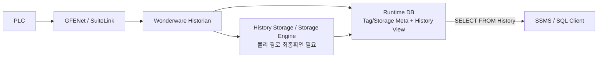

---
doc_id: GW-SYS-002
title: Wonderware DeviceXPlorer InTouch Historian 구조
plant: 광암
category: 시스템분석
status: review
revision: 0.3
last_updated: 2026-09-09
source_refs:
  - SRC-WONDERWARE-GW-20260908
---

# Wonderware · DeviceXPlorer · InTouch · Historian 구조

## 목적

광암에서 확보한 `Wonderware.zip`을 기준으로 **각 소프트웨어의 역할과 실제로 확인된 통신 구성을 분리**한다. 설치 파일이 존재한다는 사실과 현장에서 실제 경로로 사용된다는 사실을 혼동하지 않는 것이 핵심이다.


## DeviceXPlorer의 정체 — 무엇이고 무엇이 아닌가

**DeviceXPlorer OPC Server는 일본 TAKEBISHI(たけびし)가 개발한 산업용 통신 미들웨어/OPC Server다.** PLC, CNC, Robot 등 현장 제어기와 통신하고, 상위 HMI/SCADA/IT 프로그램에는 OPC·DDE·SuiteLink 등의 표준/범용 인터페이스로 데이터를 제공하는 역할을 한다.

광암에서는 `DXPSV.dxp`에 `LsisEthernet` Device가 구성되어 있으므로 DeviceXPlorer가 **LS ELECTRIC PLC용 통신 드라이버 서버이자 InTouch의 I/O 데이터 소스** 역할을 하는 것으로 보는 것이 맞다.

```text
DeviceXPlorer = HMI가 아님
DeviceXPlorer = Historian/DB가 아님
DeviceXPlorer = PLC 프로그램(XG5000)이 아님
DeviceXPlorer = Wonderware DAServer 제품 자체가 아님

DeviceXPlorer = PLC/장비 ↔ 상위 HMI/SCADA 사이의 산업용 통신 미들웨어 / OPC·SuiteLink 서버
```

TAKEBISHI 공식 가이드에는 Wonderware InTouch가 DeviceXPlorer에 **DDE/SuiteLink로 직접 연결**할 수 있다고 명시되어 있다. DeviceXPlorer Ver.5의 SuiteLink Application Name 기본값은 `DXPSV`이며, InTouch Access Name의 Application/Topic을 DeviceXPlorer 설정과 일치시켜 연결한다.

따라서 광암에서 `DXPSV.dxp`라는 이름은 단순 파일명이 아니라, **Ver.5 DeviceXPlorer의 기본 SuiteLink Application Name `DXPSV`와도 일치하는 중요한 단서**다. 다만 광암에서 기본값이 변경되지 않았는지는 실제 DeviceXPlorer GUI와 InTouch Access Name으로 최종 확인한다.

## 구성요소별 역할

| 구성요소 | 확인 버전 | 역할 | 광암에서의 현재 판단 |
|---|---|---|---|
| DeviceXPlorer | 5.4.0.1 | PLC/장비 통신 서버, OPC 등 상위 인터페이스 제공 | **PLC 통신 핵심으로 확인** |
| LsisEthernet Driver | DeviceXPlorer 내부 | LS ELECTRIC PLC Ethernet 통신 | **13개 Device에서 확인** |
| InTouch HMI | 2014 R2 SP1 v11.1 | HMI 화면, Tag, Alarm, 운전 조작 | **구성요소 확인** |
| FS Gateway | 3.0 SP1 | OPC/DDE/SuiteLink 등 프로토콜 Gateway | **설치 확인, 실제 사용 미확정** |
| Wonderware Historian | 2014 R2 SP1 v11.6.13100 | 공정 Tag의 장기 시계열 저장/조회 | **구성요소 확인, 현장 Tag 설정 미확보** |
| Alarm DB Logger | InTouch 구성요소 | 알람/이벤트를 SQL Server DB에 기록 | `WWALMDB`와 연결되는 계층으로 판단 |

## DeviceXPlorer 설정에서 확인된 내용

설정 파일:

```text
Wonderware/InTouch/DXPSV.dxp
```

핵심 XML:

```text
<!-- DeviceXPlorer 5 Configuration File -->
<CONFIGURATION ProductVersion="5, 4, 0, 1">
...
<DEVICE ... LibType="LsisEthernet" ...>
```

13개 Ethernet Port는 모두 원격 TCP Port `2004`를 사용한다. 각 설비별 `DEVICE` 이름은 P1, P2, P4, P6, P7, P8, P21, P22, P23, P25, P26, P27, P30으로 구성된다.


## 광암에서 직접 연결 여부를 가르는 핵심

TAKEBISHI가 안내하는 InTouch 직접 연결은 다음 형태다.


InTouch WindowMaker의 `Special → Access Names`에서 다음 값을 확인한다.

```text
Application Name = DXPSV ?
Topic Name = DeviceXPlorer Device/Topic과 동일 ?
Protocol = SuiteLink 또는 DDE ?
```

`Application=DXPSV`이고 Topic까지 DeviceXPlorer와 일치하면 FSGateway 없이 직접 연결된 것으로 볼 수 있다. 반대로 Application이 FSGateway 계열이면 Gateway 경유 구성을 조사한다.

또한 현재 `DXPSV.dxp`에는 설비 Device는 다수 정의되어 있지만 정적 `<TAG>`는 1개뿐이다. DeviceXPlorer는 InTouch Item Name에서 `M100`, `D123` 같은 **동적 PLC 주소 지정**을 지원하므로, 광암의 실제 주소 매핑은 InTouch DBDump/Tag Dictionary 쪽에 존재할 가능성이 높다.

세부 현장 확인 절차는 [[03-광암-실제-연결-확인-파일-및-설정위치]] 참조.

## FSGateway를 아직 실제 경로라고 확정하면 안 되는 이유

`Wonderware/DAServer/FSGateway` 아래에는 실행 바이너리와 라이브러리가 존재한다. 그러나 InTouch 2014 R2 SP1 Readme에는 **FS Gateway 3.0 SP1이 InTouch 설치의 hidden feature로 설치될 수 있음**이 명시되어 있다.

따라서 아래 두 경우가 모두 가능하다.

### 경우 A — DeviceXPlorer에서 InTouch로 직접 연결


### 경우 B — FSGateway를 경유


현재 확보한 설치 폴더에는 **FSGateway 런타임 설정 파일이 확인되지 않았으므로 어느 경로인지 확정할 수 없다.**

## 확정을 위해 필요한 InTouch 설정

InTouch Application 원본에서 다음을 확인한다.

```text
Access Name
→ Application Name
→ Topic Name
→ Protocol
→ I/O Tag Item Name
```

이 정보를 DeviceXPlorer 설정과 붙이면 다음 매핑이 가능해진다.

```text
PLC IP
→ DeviceXPlorer Device
→ DeviceXPlorer Item
→ InTouch Access Name / I/O Tag
→ Historian Tag
```

## Historian에서 현재까지 확인된 것과 아직 필요한 것

2026-09-09 `Runtime/Holding/backup2` 복원분석으로 Historian 운영 DB의 성격은 상당 부분 확인됐다.

**확인됨**
- `Runtime` DB = Historian Tag/Storage/IOServer/Topic 메타데이터 DB
- 최신 백업은 `backup2.bak` 안의 `Runtime`(2026-07-23)
- 최신 `Tag=2,434`, `AnalogTag=2,402`
- `StorageLocation`, `StorageNode`, `IOServer`, `Topic` 테이블 존재
- `History`, `AnalogHistory`, `DiscreteHistory`, `StringHistory` View 존재

**아직 필요**
- 실제 `StorageLocation.Path` 현재값 직접 조회
- History Block/Storage 원본
- 실제 장기 `Timestamp / Value / Quality` 데이터
- 실제 보존기간
- 장기 Export 방법/결과

## AI 관점 우선순위

1. Historian Tag/기간/Export를 먼저 확보한다.
2. InTouch Tag와 Historian Tag를 연결한다.
3. DeviceXPlorer를 통해 PLC 주소까지 역추적한다.
4. `WWALMDB` Alarm/Event를 동일 시간축에 합친다.
5. Historian 누락 항목만 별도 실시간 Collector를 검토한다.

## 관련 문서

- [[01-광암-데이터흐름-및-통신구조]]
- [[03-광암-실제-연결-확인-파일-및-설정위치]]
- [[../30-데이터-분석/01-WWALMDB-AlarmDB-vs-Historian]]
- [[../90-근거-기록/2026-09-08-Wonderware-자료분석-기록]]


## 2026-09-09 보강 — Historian 실제 Export 확보

`historian.txt`는 Wonderware Historian Import/Export 형식으로 확인됐다.

```text
IOServer = 192.9.211.120
Application = GFENet
ProtocolType = SuiteLink
AnalogTag = 2,224
DiscreteTag = 11
```

Storage:

```text
D:\Historian\Data\Circular
D:\Historian\Data\Buffer
D:\Historian\Data\Permanent
```

따라서 최소 2022 시점에는 중앙 Wonderware Historian이 GFENet Source를 직접 수집하는 실제 구성이 있었다.

현재 InTouch `dhistcfg.ini`는 `bLoggingEnabled=0`이므로 **InTouch 로컬 History와 중앙 Historian을 같은 것으로 해석하지 않는다.**

또 2026 `HistdataViewstr`는 `\\192.9.211.120\HistData / ViewStream1`이다. 사전 정리 Excel의 `192.168.0.120`보다 현재 파일 근거는 `192.9.211.120`이 강하다.

상세: [[../30-데이터-분석/05-광암-2026-HMI-DDE-Historian-통합매핑-결과]]


## Historian DB와 실제 값 저장소를 분리해서 이해

```text
Runtime DB
= Tag명, ItemName, 저장주기, IOServer, Topic, Storage 경로 등 메타데이터

History Storage
= 실제 공정값 Timestamp / Value / Quality 장기 이력
```

이번 BAK 분석으로 `Runtime DB`는 확보됐지만 `History Storage`는 아직 확보되지 않았다.

따라서 `Runtime.bak` 또는 `backup2.bak`를 받았다는 이유만으로 “AI 학습용 Historian 데이터를 확보했다”고 기록하지 않는다.

상세: [[../30-데이터-분석/06-광암-Historian-Runtime-DB-분석-및-AI학습데이터-확보판정]]


## 2026-09-09 현장 사진 추가 확인 — POS11 Runtime History 실제 조회

SSMS 현장 사진으로 다음을 직접 확인했다.

```text
SQL Server/Node : POS11
Database        : Runtime
Query Source    : History
Tag             : PCS5_HV1A_2_TA
Result          : DateTime + vValue + Quality 계열 실제 행 반환
```

사용된 Historian 조회조건에는 다음이 보인다.

```text
wwRetrievalMode = Cyclic
wwCycleCount    = 100
wwQualityRule   = Extended
wwVersion       = Latest
```

따라서 `Runtime`은 단순 메타데이터 DB만이 아니라 **Wonderware Historian의 SQL 조회 인터페이스를 제공하는 운영 DB**로 확인한다.

구조는 다음과 같이 갱신한다.



**주의:** 사진은 `History`를 통해 실제 값을 조회할 수 있음을 증명하지만, 실제 장기값의 물리 저장파일 위치까지 증명하지는 않는다. 물리경로는 `StorageLocation.Path`와 POS11 파일시스템을 추가 확인한다.

근거: [[../90-근거-기록/2026-09-09-POS11-Runtime-History-실조회-사진근거]]
