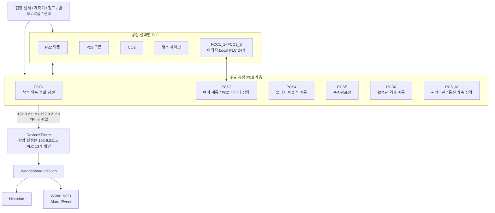

# 광암 PLC XG5000 구조 및 통신 맵

## 0. 목적

`PLC-COLLECT-COMPLETE-20260908-161455-0c958e` 수집본의 XG5000 프로젝트를 기준으로 **광암 PLC 계층, 공정별 역할, PLC 간 통신관계, 상위 Wonderware 연결 지점**을 정리한다.

이 문서는 다음을 명확히 구분한다.

- **자료로 확인된 내용**: 수집 로그, 프로젝트 파일명, XG5000 프로젝트 분석에서 확인된 구성
- **강한 분석 판단**: 여러 프로젝트의 통신영역과 Station 수가 일치하여 구조적으로 타당한 관계
- **추가 확인 필요**: 실제 현장 런타임 최신본, Primary/Standby 의미, 개별 국번 매핑, Historian 저장 경로

---

## 1. XG5000 원본 수집 상태

수집 로그 기준:

| 항목 | 결과 |
|---|---:|
| 원본 스캔 폴더 | 259 |
| 전체 스캔 파일 | 1,738 |
| 선택된 XG5000 프로젝트 `.xgwx` | **155** |
| 복사 성공 | **155** |
| 수집 오류 | **0** |

> **주의:** `.xgwx` 155개는 PLC 155대를 의미하지 않는다. 동일 설비의 과거본, 수정본, `OLD` 폴더, 날짜별 백업이 포함되어 있다. 실제 현장 PLC 대수와 최신 운전 프로젝트는 별도 정규화가 필요하다.

수집 README에는 이번 패키지가 **InTouch/Historian/DB 파일을 수집하지 않았음**이 명시되어 있다. 따라서 이 패키지만으로 최종 DB 저장 위치를 확정하지 않는다.

---

## 2. 현재 파악된 PLC 계층



현재 핵심은 **광암이 단일 PLC 구조가 아니라 공정별 PLC + 여과지 FCC 로컬 PLC + 상위 PCS 계층으로 분산된 구조**라는 점이다.

---

## 3. 주요 PLC/프로젝트 역할 정리

| PLC/계열 | XG5000 분석에서 확인된 주요 기능 | 현재 판단 |
|---|---|---|
| **PCS1** | 착수정 AUTO, 약품투입, 혼화지 AUTO, 침전지 AUTO, 인발밸브 AUTO, 전력감시, 계측기기 통신 | 주요 정수공정 제어 PLC |
| **PCS2** | 여과지역세 AUTO, 착수정 유입밸브, 염소설비, 활성탄 급수펌프, 주변전실 통신, 전력감시 | 여과계통 제어 + FCC 데이터 집약 중심 |
| **P23 오존** | 수동운전, 자동운전, 대수운전, 오존 제어연산, 상위통신 | 오존 공정 제어 PLC |
| **PCS4** | 배슬러지지, 농축조, 배출수지, 저류조 AUTO | 슬러지/배출수 계통 제어 |
| **PCS5** | 중계펌프 AUTO, Equipment Control | 중계펌프장 제어 |
| **PCS6** | 회수조, 역세순번 결정, 역세여과공정 | 활성탄/역세 공정 제어 |
| **PCS_M** | AI/DI/AO/DO, 고속링크, 계측기 통신 | 관리본관 통신·계측 집약 계열 |
| **P22 약품** | AUTO, PID, Control, Network | 약품투입 로컬 제어 |
| **CO2** | 유량적산, 컨트롤밸브, 가압펌프, 용해수펌프, 기화기 | CO2 공정 제어 |
| **염소제어반** | 염소제어반 운전 로직 | 염소 로컬 제어 |
| **FCC1_1~FCC3_8** | REMOTE/SEMI_AUTO/LOCAL, 역세 펌프·브로워 지령, RUN/STOP/ERROR | 여과지 로컬 제어 PLC 24개 |

> 프로그램 기능은 확보 원본에서 확인한 내용이지만, **어느 파일이 현재 PLC에 다운로드된 최종 운전본인지**는 현장 Online Compare 또는 PLC Upload와 대조하여 최종 확정해야 한다.

---

## 4. FEnet 이중 통신망으로 보이는 구조

주요 PLC 프로젝트에서 반복적으로 다음 두 대역이 확인된다.

```text
192.9.211.xxx
192.9.212.xxx
```

그리고 주요 PCS에서 FEnet Ethernet 모듈이 복수 구성된 흔적이 확인된다.

따라서 현재 판단은:

> **주요 PCS가 192.9.211.x / 192.9.212.x 두 FEnet 경로를 사용한다.**

단, 다음은 아직 확정하지 않는다.

```text
211망 = Primary
212망 = Standby
```

Primary/Secondary 또는 제어망/감시망의 실제 의미는 **네트워크 구성도, DeviceXPlorer 설정, PLC Online 상태**를 함께 봐야 한다.

Wonderware `DXPSV.dxp`에서 현재 직접 확인된 상위 수집 경로는 `192.9.211.x` 계열이다. 따라서 `212.x`가 상위 HMI에서 어떻게 쓰이는지는 별도 확인 대상이다.

---

## 5. PCS2 ↔ FCC 24개 구조

### 5.1 자료로 확인된 것

프로젝트 수집본에 다음 FCC가 존재한다.

```text
FCC1_1 ~ FCC1_8
FCC2_1 ~ FCC2_8
FCC3_1 ~ FCC3_8
```

총 **24개**다.

FCC 프로젝트에서는 로컬/리모트 운전과 역세 펌프·브로워 지령 등 실제 제어 로직이 확인되므로 단순 계측 수집기가 아니라 **여과지 로컬 제어 PLC**로 본다.

### 5.2 강한 분석 판단

PCS2 통신영역 분석에서는 Station 1~24에 대해 반복되는 송수신 Word 블록 구조가 확인된다.

대표 패턴:

```text
PCS2 공통 송신
%MW4936  ── 64 Word ──> FCC 측 공통영역

PCS2 Station 1
%MW5000  <── 50 Word ── FCC
%MW5050  ──> 50 Word ── FCC

Station 2 ... Station 24
동일한 50 Word 단위 반복 구조
```

FCC 측 대표 프로젝트에서는 대응되는 공통/송수신 영역이 확인된다.

```text
FCC 공통 수신   %MW936   64 Word
FCC → PCS2      %MW1000  50 Word
PCS2 → FCC      %MW1050  50 Word
```

따라서:

> **PCS2가 24개 FCC 여과지 제어계통의 데이터를 집약하고 명령/상태를 교환하는 중심 PLC라는 판단은 매우 강하다.**

### 5.3 아직 확인할 것

- Station 1 = FCC1_1 등 **국번 ↔ FCC 이름의 1:1 최종 매핑**
- PCS2의 FEnet과 FCC의 RAPIEnet 사이 실제 물리/논리 경유 구조
- 각 50 Word 영역의 변수 의미
- 현재 운전본 기준 주소 변경 여부

---

## 6. Wonderware와 대조되는 PLC 주소

기존 `DXPSV.dxp`에서 확인된 상위 통신 대상은 다음이다.

| DeviceXPlorer Device | 의미 | 원격 IP |
|---|---|---:|
| P1 | PCS#1 약품투입동 | `192.9.211.10` |
| P2 | PCS#2 여과지동 | `192.9.211.12` |
| P4 | PCS#4 탈수기동 | `192.9.211.14` |
| P7 | PCS_M 관리본관 | `192.9.211.16` |
| P8 | 관리본관 워터나우 프로그램 | `192.9.211.18` |
| P21 | CO2 설비 | `192.9.211.21` |
| P22 | PAC/약품 설비 | `192.9.211.22` |
| P23 | 오존투입설비 | `192.9.211.23` |
| P25 | 염소투입설비 | `192.9.211.25` |
| P26 | PCS#4 탈수기제어반 | `192.9.211.26` |
| P27 | 과산화수소 설비 | `192.9.211.28` |
| P30 | PCS#5 중계펌프장 | `192.9.211.30` |
| P6 | PCS#6 활성탄여과지동 | `192.9.211.32` |

이 표와 XG5000 프로젝트 내부 FEnet 설정을 대조하면 **PLC 프로젝트 ↔ DeviceXPlorer Device**를 확정할 수 있다.

---

## 7. 프로젝트 버전 정규화가 필요한 이유

수집본에는 동일 설비의 여러 버전이 공존한다.

예:

```text
PCS2
P2 - 광암_PCS2
0615_P2 - 광암_PCS2
Projects/OLD/...
FCC*_2506xx
FCC*_2607xx
PCS6_활성탄 / PCS6_활성탄_260721
관리본관_PCS_M_191011 / 20260904 계열
```

따라서 파일 수정일이 가장 늦다는 이유만으로 **현장 최신본이라고 확정하면 안 된다.**

정규화 시 최소 컬럼:

| canonical_plc | source_file | source_date | project_name | CPU | slot/module | IP_211 | IP_212 | program_count | symbol_count | status |
|---|---|---|---|---|---|---|---|---:|---:|---|

`status`는 다음처럼 관리한다.

```text
candidate-current
confirmed-current
old
duplicate
unknown
```

---

## 8. AI 관점에서 가장 중요한 데이터 계보

최종적으로 광암 AI에서 필요한 것은 PLC 프로그램 자체가 아니라 아래 연결이다.

```text
현장 계측값/상태
→ 실제 PLC
→ PLC 메모리 주소(%MW/%MX/%IX/%QX ...)
→ PLC 간 고속링크/네트워크 이동 주소
→ DeviceXPlorer Device/Topic
→ InTouch Access Name / Tag / Item
→ Historian Tag
→ Historian 실제 장기 데이터
→ AI Canonical Feature
→ AI Master DB
```

예를 들어 원수 탁도 하나도 최종적으로 다음 형태로 추적 가능해야 한다.

```text
RAW_TURBIDITY
← Historian Tag
← InTouch Tag
← Item/PLC Address
← PCS1 또는 해당 계측 PLC
← 현장 탁도계
```

---

## 9. 부족한 것

1. **현재 운전 중인 XG5000 프로젝트의 최종본 확정**
2. Station 1~24 ↔ FCC1_1~FCC3_8 최종 매핑
3. PLC 주소별 심볼/주석/프로그램/네트워크 블록 데이터 사전
4. InTouch DBDump의 Access Name / Item Name
5. Historian Tag 및 Source
6. Historian 실제 저장기간/주기/Quality
7. `192.9.212.x` 망의 실제 역할

---

## 10. 다음 작업 우선순위

1. **155개 XGWX 정규화** — 현재본/구버전/중복 후보 분리
2. **PLC 통신 Matrix 생성** — PLC, IP, 모듈, 고속링크, Station, 송수신 메모리
3. **PLC Address Dictionary 생성** — 주소, 심볼, 주석, 프로그램, 데이터형
4. **InTouch DBDump 확보** — PLC Address ↔ InTouch Tag 연결
5. **Historian Tag Export 확보** — InTouch ↔ Historian 연결
6. **AI Canonical Mapping 작성** — 광암 정수 AI 학습항목으로 정규화

## 관련 문서

- [[01-광암-데이터흐름-및-통신구조]]
- [[02-Wonderware-DeviceXPlorer-InTouch-Historian-구조]]
- [[03-광암-실제-연결-확인-파일-및-설정위치]]
- [[../30-데이터-분석/02-광암-PLC-태그-Historian-데이터계보-구축]]
- [[../90-근거-기록/2026-09-08-XG5000-PLC원본-분석-기록]]
