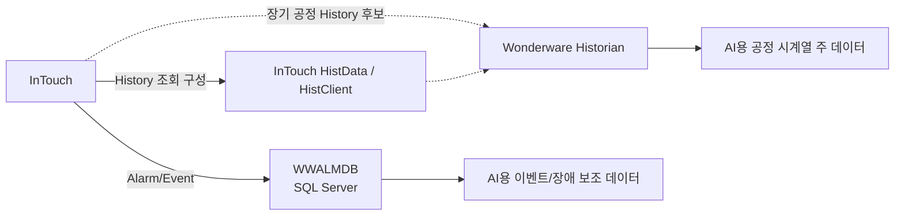

# WWALMDB AlarmDB와 Historian 분리

## 결론

광암에서 분석한 `WWALMDB`는 **Wonderware InTouch의 Alarm DB Logger 계열 SQL Server 알람·이벤트 DB**로 분류한다.

**공정 PV 장기 시계열을 저장하는 Wonderware Historian과는 다른 목적의 저장소다.**

## WWALMDB에서 기대할 데이터

- Alarm 발생 시각
- Alarm 상태 변화
- ACK 여부/시각
- 정상 복귀
- Provider/Group/Tag 관련 정보
- System alarm 및 process alarm
- 이벤트성 기록

이전 WWALMDB 재분석에서 `$System` 계열과 Alarm/State 성격의 데이터가 다수 확인된 것도 이 구조와 일치한다.

## History/Historian에서 기대할 데이터

2024 사전 HMI 백업에서는 `HistdataViewstr → \\192.9.211.120\HistData / ViewStream1` 13개 Point가 직접 확인됐다. 따라서 **과거값 조회 기능이 HMI에 구성돼 있었던 것은 확인**된다.

다만 이 `HistData` Source를 곧바로 Wonderware Historian Server의 실제 저장소라고 동일시하지 않는다. `dhistcfg.ini`, `historian.txt`, Historian SMC/Tag Export를 추가 대조해 실제 장기 저장계층을 확정한다.

### 장기 저장계층에서 기대할 데이터

- 유량/수량
- 탁도 등 수질 PV
- 약품 투입량
- 펌프/인버터 Hz
- 설비별 전력
- Set Point
- 운전상태 값
- 연속 또는 변화기반 시계열

## AI 학습 데이터 사용 구분

| 데이터 | 주 저장소 | AI에서의 용도 |
|---|---|---|
| 연속 공정 PV | Historian | 예측·최적화 모델의 주 학습 데이터 |
| Set Point | Historian/InTouch | 운전조건·제어조건 분석 |
| Alarm/Fault | WWALMDB | 이상구간 라벨, 장애 이벤트 분석 |
| ACK/복귀 | WWALMDB | 장애 지속시간, 운영 대응 분석 |
| PLC 실시간 값 | DeviceXPlorer/FEnet | Historian 누락 항목의 보완 수집 |

## 주의

`WWALMDB`에 공정 Tag 이름처럼 보이는 값이 일부 존재하더라도 그것만으로 해당 Tag의 연속 PV 이력이 저장된다고 판단하면 안 된다. Alarm DB에는 **알람 발생 시점의 Tag/Event 정보**가 저장될 수 있기 때문이다.

## 다음 확인

1. Historian 실제 서버/Instance 확인
2. Historian Tag 수와 Tag 목록 Export
3. 최초/최종 Timestamp 확인
4. Historian Tag ↔ InTouch Tag 매핑
5. 2024 `dde.cfg` 14,983개 GFENet Tag/Item ↔ PLC Address 대조
6. `dhistcfg.ini` / `historian.txt` 재수집
7. 현재 DeviceXPlorer Application Name 및 `GFENet` 관계 확인
8. Historian 데이터와 WWALMDB Event를 Timestamp로 결합 가능한지 검증

## 관련 문서

- [[../20-현장-시스템/01-광암-데이터흐름-및-통신구조]]
- [[../20-현장-시스템/02-Wonderware-DeviceXPlorer-InTouch-Historian-구조]]
- [[03-광암-InTouch-dde-cfg-통신매핑-분석]]
- [[../90-근거-기록/2026-09-09-사전제공-HMI-자료-대조-기록]]
- [[../90-근거-기록/2026-09-08-Wonderware-자료분석-기록]]
