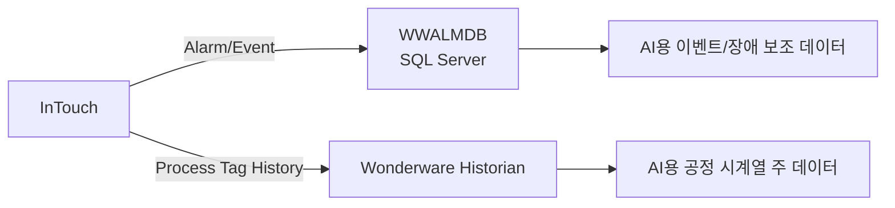

---
doc_id: GW-DATA-001
title: WWALMDB AlarmDB와 Historian 분리
plant: 광암
category: 데이터분석
status: review
revision: 0.2
last_updated: 2026-09-09
source_refs:
  - SRC-WONDERWARE-GW-20260908
  - SRC-WWALMDB-BAK-ANALYSIS
---

# WWALMDB AlarmDB와 Historian 분리

## 결론

광암에서 분석한 `WWALMDB`는 **Wonderware InTouch의 Alarm DB Logger 계열 SQL Server 알람·이벤트 DB**로 분류한다.

**공정 PV 장기 시계열을 저장하는 Wonderware Historian과는 다른 목적의 저장소다.**



## WWALMDB에서 기대할 데이터

- Alarm 발생 시각
- Alarm 상태 변화
- ACK 여부/시각
- 정상 복귀
- Provider/Group/Tag 관련 정보
- System alarm 및 process alarm
- 이벤트성 기록

이전 WWALMDB 재분석에서 `$System` 계열과 Alarm/State 성격의 데이터가 다수 확인된 것도 이 구조와 일치한다.

## Historian에서 기대할 데이터

- 유량/수량
- 탁도 등 수질 PV
- 약품 투입량
- 펌프/인버터 Hz
- 설비별 전력
- Set Point
- 운전상태 값
- 연속 또는 변화기반 시계열

## AI 학습 데이터 사용 구분

| 데이터 | 주 저장소 | AI에서의 용도 |
|---|---|---|
| 연속 공정 PV | Historian | 예측·최적화 모델의 주 학습 데이터 |
| Set Point | Historian/InTouch | 운전조건·제어조건 분석 |
| Alarm/Fault | WWALMDB | 이상구간 라벨, 장애 이벤트 분석 |
| ACK/복귀 | WWALMDB | 장애 지속시간, 운영 대응 분석 |
| PLC 실시간 값 | DeviceXPlorer/FEnet | Historian 누락 항목의 보완 수집 |

## 주의

`WWALMDB`에 공정 Tag 이름처럼 보이는 값이 일부 존재하더라도 그것만으로 해당 Tag의 연속 PV 이력이 저장된다고 판단하면 안 된다. Alarm DB에는 **알람 발생 시점의 Tag/Event 정보**가 저장될 수 있기 때문이다.

## 다음 확인

1. **4개 History Storage 용량/파일수 확인**
2. 용량 가능 시 원본 Storage + 최신 Runtime BAK 확보
3. AI 대상 Tag 선정 후 장기간 `Timestamp/TagName/Value/Quality` Query Export
4. 실제 최초/최종 Timestamp와 보존기간 확인
5. Historian 데이터와 WWALMDB Event를 Timestamp로 결합 가능한지 검증

## 관련 문서

- [[../20-현장-시스템/01-광암-데이터흐름-및-통신구조]]
- [[../20-현장-시스템/02-Wonderware-DeviceXPlorer-InTouch-Historian-구조]]
- [[../90-근거-기록/2026-09-08-Wonderware-자료분석-기록]]


## 2026-09-09 Historian 직접 근거 추가

`WWALMDB ≠ Historian` 판단은 그대로 유지된다.

이번에는 `historian.txt`에서 실제 Wonderware Historian 구성을 직접 확인했다.

```text
IOServer: 192.9.211.120 / GFENet / SuiteLink
Historian Tag: 2,235
Storage(2026 현재 직접확인): `D:\Historian\Data\Circular`, `R:\Overflow\Data`, `D:\Historian\Data\Buffer`, `D:\Historian\Data\Permanent`
```

따라서 광암에는 최소 2022 시점 **공정 시계열 Historian 계층이 실제 구성돼 있었음**을 추가 확정한다.

`WWALMDB`는 Alarm/Event SQL 이력, Historian은 공정 시계열 Tag 저장으로 분리한다.


## 2026-09-09 Runtime/Holding/backup2 BAK 분석으로 추가 확정

이제 저장소를 세 계층으로 구분한다.

| 계층 | 확보 여부 | 역할 | AI 용도 |
|---|---|---|---|
| `WWALMDB` | 확보 | Alarm/Event SQL 이력 | 이상구간/장애 이벤트 보조 |
| `Runtime` | 확보 | Historian Tag/Storage 메타데이터 | Tag 사전/주소/주기/Storage 경로 해석 |
| 실제 `History Storage` | **운영 조회 확인 / 원본·장기간 Export 미인수** | 장기간 공정 `Timestamp/Value/Quality` | 예측·최적화 주 학습 데이터 |

`backup2.bak`는 이름과 달리 원래 DB가 **`Runtime`**이며, 2026-07-23 백업이다. 최신 Runtime에는 Tag 2,434개, AnalogTag 2,402개가 등록돼 있다.

그러나 `ManualAnalogHistory`, `ManualDiscreteHistory`, `ManualStringHistory`는 0건이고, 실제 장기간 공정값을 포함하는 저장본은 이 BAK들에서 확인되지 않았다.

따라서 **현재 확보된 DB를 “AI 학습용 Historian DB 확보 완료”로 표기하면 안 된다.** 정확한 표현은:

> **Historian 설정/메타 DB 확보 완료. 운영 POS11에서는 `Runtime.dbo.History`를 통한 실제 값 조회가 확인됐으나, 실제 History Storage 원본과 장기간 AI 학습용 Export는 아직 우리 측에 인수되지 않음.**

상세: [[06-광암-Historian-Runtime-DB-분석-및-AI학습데이터-확보판정]]


## 2026-09-09 POS11 실조회로 추가 확인

현장 SSMS 사진에서 `POS11 / Runtime` 상태로 `FROM History` 쿼리가 실행되고 `PCS5_HV1A_2_TA`의 `DateTime / vValue / Quality` 계열 값이 실제 반환되는 것이 확인됐다.

따라서 현재 구분은 다음과 같다.

```text
WWALMDB                 = Alarm/Event SQL DB
Runtime                  = Historian 메타 + History SQL 조회 인터페이스
운영 Historian 실제 값    = 조회 가능 확인
장기간 AI 학습용 Export   = 아직 미인수
```

근거: [[../90-근거-기록/2026-09-09-POS11-Runtime-History-실조회-사진근거]]
