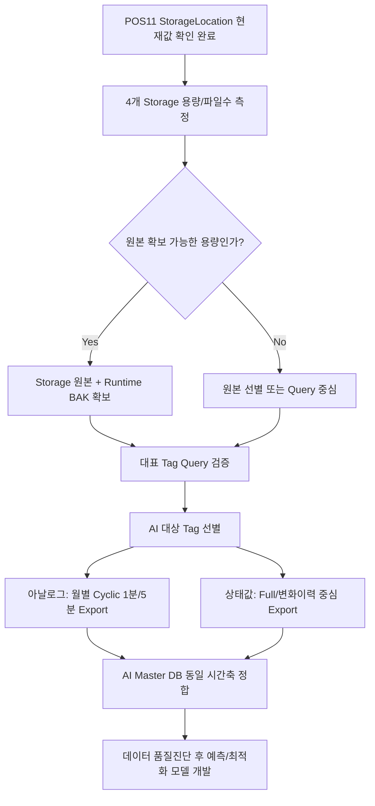

---
doc_id: GW-DATA-008
title: 광암 Historian AI 학습데이터 추출전략
plant: 광암
category: 데이터확보
status: action-required
revision: 1.0
last_updated: 2026-09-09
source_refs:
  - POS11 Runtime History 실조회 사진
  - POS11 StorageLocation / StorageNode 실조회 사진
  - Runtime.bak / backup2.bak 분석
---

# 광암 Historian AI 학습데이터 추출전략

## 1. 결론

현장 체류시간이 짧고 재방문 비용이 큰 조건에서는 **원본 Storage 확보 + 최소 검증 Query + 사후 AI용 Query Export**의 2단계 전략이 가장 효율적이다.

```text
현장
├─ ① 4개 Storage 실제 용량/파일수 확인
├─ ② 용량 감당 가능 시 원본 Storage 확보 검토
├─ ③ 최신 Runtime BAK + Tag 메타데이터 확보
└─ ④ 대표 Tag 소량 Query로 실제 데이터 정상성만 확인

사무실/분석환경
├─ ⑤ AI 대상 Tag 선별
├─ ⑥ Analog는 Cyclic 방식으로 1분/5분 정규주기 Export
├─ ⑦ RUN/STOP·AUTO/MANUAL·Fault 등 상태변수는 Full/변화이력 중심 Export
└─ ⑧ 동일 시간축으로 Master DB 구축
```

> **원본 Storage는 재방문 위험을 줄이기 위한 보험성 원본**, **SQL History Export는 AI 학습용 정식 데이터**로 역할을 구분한다.

---

## 2. 현재 확인된 실제 Storage 경로

2026-09-09 POS11의 `Runtime.dbo.StorageLocation` 실조회 사진에서 다음이 직접 확인됐다.

```text
StorageType 1 → D:\Historian\Data\Circular
StorageType 2 → R:\Overflow\Data
StorageType 3 → D:\Historian\Data\Buffer
StorageType 4 → D:\Historian\Data\Permanent
StorageNode 1 → POS11
```

따라서 경로 자체는 더 이상 추정이 아니다. 다만 각 StorageType의 세부 동작 의미, `R:`의 물리적 정체, 보존기간은 추가 확인한다.

근거: [[../90-근거-기록/2026-09-09-POS11-StorageLocation-StorageNode-실조회-사진근거]]

---

## 3. 현장에서 먼저 할 일 — 용량 판단

아래 4개 경로를 각각 측정한다.

```powershell
$Paths = @(
    "D:\Historian\Data\Circular",
    "R:\Overflow\Data",
    "D:\Historian\Data\Buffer",
    "D:\Historian\Data\Permanent"
)

foreach ($p in $Paths) {
    if (Test-Path -LiteralPath $p) {
        $files = Get-ChildItem -LiteralPath $p -File -Recurse -ErrorAction SilentlyContinue
        $bytes = ($files | Measure-Object Length -Sum).Sum
        [PSCustomObject]@{
            Path  = $p
            Files = $files.Count
            GB    = [math]::Round($bytes / 1GB, 2)
            TB    = [math]::Round($bytes / 1TB, 3)
        }
    } else {
        [PSCustomObject]@{
            Path  = $p
            Files = 0
            GB    = 0
            TB    = 0
            Note  = "PATH NOT FOUND"
        }
    }
}
```

드라이브 상태도 같이 확인한다.

```powershell
Get-CimInstance Win32_LogicalDisk |
Select-Object DeviceID, DriveType,
@{N="TotalGB";E={[math]::Round($_.Size/1GB,1)}},
@{N="FreeGB";E={[math]::Round($_.FreeSpace/1GB,1)}}

Get-PSDrive -PSProvider FileSystem
```

특히 `R:`가 로컬/매핑/별도 Storage인지 확인한다.

---

## 4. 원본 Storage를 언제 가져올 것인가

### 우리가 제안하는 실무 판단

| 실제 총용량 | 권장 대응 |
|---:|---|
| 수십~수백 GB | 전체 원본 확보 우선 검토 |
| 500GB~1TB | 2TB 이상 SSD 준비 후 전체 확보 검토 |
| 1~2TB | 4TB SSD 등 복사시간/매체를 함께 고려 |
| 수 TB 이상 | 전량 복사보다 Storage/기간 선별 또는 Query Export 중심으로 전환 |

이 표는 광암 Historian 제품 규칙이 아니라 **현장 시간·매체·재방문 위험을 고려한 우리 작업 기준**이다.

### 원본 확보 시 최소 세트

```text
- D:\Historian\Data\Circular
- R:\Overflow\Data
- D:\Historian\Data\Buffer
- D:\Historian\Data\Permanent
- 최신 Runtime.bak
- 가능하면 Holding.bak
- StorageLocation / StorageNode 조회결과
- Tag / AnalogTag Export
- Historian 버전/노드 정보
- 복사 전후 파일수·총바이트 비교 또는 Manifest
```

> 운영 중 Storage를 단순 복사한 것을 **완전한 복구용 정식 백업이라고 단정하지 않는다.** 서비스 중지나 강제복사는 현장 승인 없이 수행하지 않는다.

---

## 5. AI 학습용 데이터는 왜 Query Export가 최종형인가

AI가 직접 필요한 데이터는 물리 Storage 파일 자체가 아니라 다음 구조다.

```text
TagName
DateTime
Value / vValue
Quality
```

추가로 Master DB에서는 다음을 연결한다.

```text
Description
Unit
PLC/Item Address
RUN/STOP
Hz
Set Point
AUTO/MANUAL
Alarm/Fault
공정/설비 구분
```

따라서 원본 Storage를 확보하더라도 **최종 AI 학습본은 Historian Query 결과를 표준 시간축으로 변환**한다.

---

## 6. 모든 2,400여 Tag를 무작정 추출하지 않는다

최신 Runtime 백업에는 Historian Tag가 약 2,434개, AnalogTag가 약 2,402개 등록돼 있다.

하지만 광암 정수 AI 1차 대상은 우선 다음으로 좁힌다.

```text
원수량 / 정수량 / 주요 유량
원수·공정·정수 탁도 및 주요 수질
PAC/CO2/H2O2/염소 등 약품 투입량 및 Set Point
펌프 RUN/STOP
인버터 운전 Hz
가동대수
설비별 전력
AUTO/MANUAL
Fault/Alarm
운전 Set Point
```

Tag 사전과 공정분류가 먼저 있어야 대량 추출량을 줄이고 의미 없는 Tag를 제외할 수 있다.

---

## 7. 아날로그 값 — Cyclic 기반 정규주기 추출

탁도·유량·약품량·전력처럼 연속값은 AI 학습 시 동일 시간축이 중요하다.

**우리가 제안하는 방향:** Historian `Cyclic` 조회로 1분 또는 5분 정규주기를 만든다.

예시:

```sql
USE Runtime;

DECLARE @StartDate datetime = '2025-01-01 00:00:00';
DECLARE @EndDate   datetime = '2025-02-01 00:00:00';
DECLARE @CycleCount int = DATEDIFF(MINUTE, @StartDate, @EndDate) + 1;

SELECT
    TagName,
    DateTime,
    vValue,
    Quality
FROM History
WHERE TagName IN (
    'AE_901',
    'AE_902A',
    'AOP_INJQUAN_PV'
)
  AND wwRetrievalMode = 'Cyclic'
  AND wwCycleCount = @CycleCount
  AND wwQualityRule = 'Extended'
  AND wwVersion = 'Latest'
  AND DateTime >= @StartDate
  AND DateTime <  @EndDate
ORDER BY TagName, DateTime;
```

> 사진에서 `Cyclic / wwCycleCount / Extended / Latest` 사용은 직접 확인됐다. 다만 **1분/5분 주기와 최종 CycleCount 산정방식은 우리가 AI 학습용으로 제안하는 추출 설계**이며, 실제 서버 부하와 Historian 동작을 짧은 테스트로 검증한다.

월 단위로 파일을 분할한다.

```text
2025-01_수질.csv
2025-01_약품.csv
2025-01_펌프.csv
2025-01_전력.csv
...
```

---

## 8. 상태값 — Full/변화이력 중심 추출

다음은 단순 5분 Cyclic만 사용하면 중간 전환이 사라질 수 있다.

```text
RUN/STOP
AUTO/MANUAL
Fault
Interlock
Permit
설비 Mode
```

따라서 상태변수는 **저장된 변화점이 보존되도록 `Full` 또는 Historian의 상태/이벤트 조회 방식으로 짧은 기간을 나누어 추출하는 방향을 우선 검토**한다.

이후 AI Master DB에서는:

```text
변화 시점 이력
→ 1분 기준 시간축 생성
→ 상태를 다음 변화 시점까지 유지(Forward Fill)
→ 아날로그 데이터와 JOIN
```

방식으로 정합화한다.

> `Full`의 실제 반환량과 서버부하는 현장에서 장기 실행하지 말고 대표 Tag/짧은 기간으로 검증한다.

---

## 9. 현장에서 최소 Query만 수행한다

현장에서는 대량 Export를 끝내려 하지 않는다.

최소 확인:

1. `Tag / AnalogTag` 전체 목록 Export
2. 대표 아날로그 Tag 5~10개 최근 1일 조회
3. 대표 상태 Tag 몇 개 최근 1일 조회
4. 가능하면 과거 1개월 구간 조회 1회
5. 실제 최초/최종 보존기간을 판단할 수 있는 샘플 확인

이 정도만 정상 확인되면 대량 추출설계는 사무실에서 한다.

---

## 10. 최종 권장 흐름



## 11. 우선순위

1. **4개 Storage 용량/파일수 측정**
2. `R:` 정체 확인
3. 용량 가능 시 원본 Storage 확보
4. 최신 Runtime BAK + Tag/AnalogTag 확보
5. 대표 Tag Query 정상성 확인
6. AI 대상 Tag 선정
7. 월별 자동 Export 도구 개발
8. Master DB 구축 및 데이터 품질진단

AI 모델 선택은 장기간 데이터의 실제 기간·주기·결측률을 확인한 뒤 확정한다.
