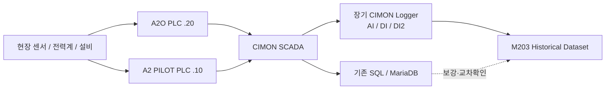
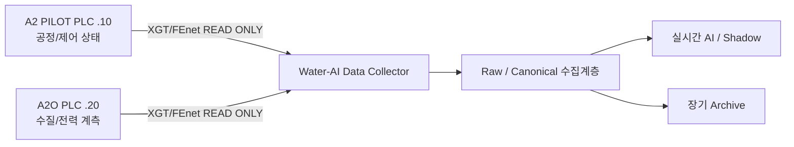

# 중랑 데이터 흐름 및 시스템 경계

## 현재 확인된 내용

- **2026-09-07 현장방문 확인**: 중랑 PLC 통신은 **LS ELECTRIC XGT / FEnet 기반**이다.
- PLC 자체에는 장기간 운전이력을 보존하는 구조가 없으므로 과거 AI 학습은 상위 저장계층의 이력을 이용해야 한다.
- **A2O PLC**: `192.168.90.20`. 확보 XG5000 원본 기준 수질·전력 계측/수집 계통이다. M203 전력은 A2O PLC의 `%MD6070~6077` 계열에서 확인된다.
- **A2 PILOT PLC**: `192.168.90.10`. `중랑처리장_A2O_Pilot_260508.xgwx` 원본을 확보했고 M203의 주요 RUN/FAULT, AUTO/MANUAL, DO Mode, Timer, Hz 경로를 소스 기준으로 역분석했다.
- **CIMON SCADA**: 기존 운영 HMI·Tag·Logger·SQL 적재 허브다. 과거이력 해석과 새 PLC 직접수집기의 교차검증 기준으로 사용한다.
- **기존 운영 DB**: `suyo.tb_suyo`는 `Num / TAGNAME / DESCRIPT / PV / DATETIME1` 5개 물리 컬럼의 Long Tag History 구조로 확인됐다.
- **장기 CIMON Logger는 확보 완료**다. 현재 기준 기간은 `2025-09-24 ~ 2026-08-05`, 총 674개 파일 중 CLD 665개이며 대표 CLD↔CSV 검증도 수행됐다.
- **최종 신규 실시간 수집 경로는 SCADA/MySQL 종속이 아니라 PLC 직접수집**으로 설계한다. 기존 SCADA/Logger/SQL은 제거하지 않고 유지한다.

## 두 데이터 경로를 구분한다

### A. 과거 학습·검증 경로 — 지금 즉시 사용

이 경로의 목적은 **과거 실제 운전이력으로 Signal 의미를 확인하고 M203 Dataset/Baseline/모델/Replay를 먼저 개발하는 것**이다. SQL/운영 DB 정상화가 끝날 때까지 AI 개발을 기다리지 않는다.

### B. 신규 실시간 경로 — Collector 병행 개발

> **원칙:** 신규 Collector는 PLC **READ-only**부터 검증한다. AI가 PLC를 우회하여 인버터나 설비를 직접 제어하는 구조로 사용하지 않는다.

## 현재 확인된 4개 데이터 계통

| 계통 | PLC/주소 | SCADA | 기존 이력 | 향후 직접수집 | 핵심 의미 |
|---|---|---|---|---|---|
| A2O 전력 | A2O `.20`, `%MD6000~6127` | `AI.E_*` | AI Logger/SQL | Collector READ | 전력 예측·M&V·에너지 최적화 |
| A2O 수질 | A2O `.20`, `%MD2000~2013` | `AI.WQ.*` | 기존 SQL Active 여부는 신호별 확인 | Collector READ | 수질 Feature 후보 |
| A2 PILOT 공정/제어 | A2 PILOT `.10`, `%MW10.x~`, `%MW100~` 등 | `PID.*` | AI/DI Logger + 일부 SQL | Collector READ | 유량·DO·MLSS·RUN/FLT·Mode·Set Point |
| ETHERFOS | A2 PILOT `.10` 경유 | `ETHERFOS.*` | SQL/SCADA 기준 확인 | 필요 Signal만 선정 | NH4/NO3/TOC/TN/TP/pH/SS/PO4P 등 |

## 현재 M203 Rule 확인수준

A2 PILOT 원본 확보 전제는 이미 해소됐다. 다음은 원본으로 확인됐다.

- AUTO/MANUAL `%MW21.3`
- A/B RUN·FAULT `%MW11.3/.4/.6/.7`
- DO `%MW106`, DO High/Middle/Low 상태 `%MW160.0/.1/.2`
- Timer/DO Mode/Mode별 Hz 계통
- 최저 Hz `%MW169`
- 최종 내부 Hz Set `M203_HZ_SET`
- VVVF 출력 `%MW340`
- 실제 Hz `%MW343`

다만 아래는 **추가 확인 필요**로 유지한다.

1. `M203_INTLOCK` 접점별 정확한 Boolean 식
2. DO High/Middle/Low ↔ Long/Middle/Short 정지시간 최종 1:1 대응
3. `AO_MOD %MW1102` 값 0의 정확한 HMI 명칭
4. `%MW1116 AO_MA_HZ`의 정확한 Ladder 기능
5. 제작사/현장 승인 기준 최대 Hz 및 최종 상·하한

## 현재 데이터 처리 우선순위

1. [[../30-데이터-분석/04-M203-Signal-Master-v0.9|M203 Signal Master v0.9]] 완성 및 QA
2. Signal Master Freeze 후 전체 장기 CLD Batch 변환
3. [[../30-데이터-분석/05-M203-Master-Dataset-정의|M203 Master Dataset v0.1]] 생성
4. 전체기간 Baseline
5. XGBoost/LightGBM **머신러닝 회귀모델** 비교
6. Historical/Shadow Replay
7. Collector 동시운전 시 `PLC Direct ↔ SCADA Logger` 겹침 검증 후 Signal Master v1.0 승격

## PLC Direct ↔ Legacy 검증 원칙

Collector가 가동되면 일정 기간 기존 Logger와 동시수집해 신호별로 아래 판정을 남긴다.

- `PASS`: 값/의미 일치
- `PASS_SCALE`: 스케일 변환 후 일치
- `PASS_DELAY`: 시간지연 보정 후 일치
- `PASS_AVG`: Logger 평균/집계 규칙 확인
- `MISMATCH`: 의미 또는 값 불일치
- `UNKNOWN`: 근거 부족

PLC와 SCADA 값이 다르다고 즉시 오류로 보지 않는다. SCADA Scale, 계산 Tag, 평균, Mirror 주소 여부를 함께 확인한다.

## 개발 제안과 공식 DB의 구분

- 장기 CLD 분석작업은 **원본 보존 + Parquet + DuckDB 로컬 분석공간**을 사용할 수 있다.
- 이것은 프로젝트의 공식 운영/Canonical DB 엔진을 DuckDB로 확정한다는 뜻이 아니다.
- 공식 원천 DB 구조는 [[../../00-공통/30-데이터-표준/00-원천데이터-DB-구축-가이드|원천 데이터 DB 구축 가이드]]의 A/B안과 4인 검토 Gate로 확정한다.

## 관련 문서

- [[02-A2O-PLC-SCADA-매핑-상세]]
- [[03-A2-PILOT-SCADA-매핑-상세]]
- [[07-A2-PILOT-PLC-Rule-Book]]
- [[08-M203-PLC-Cause-Tree]]
- [[../30-데이터-분석/03-장기-SCADA-Logger-데이터-확보현황]]
- [[../30-데이터-분석/04-M203-Signal-Master-v0.9]]
- [[../70-개발-검증/01-M203-AI-개발-실행순서-및-도구선정]]
