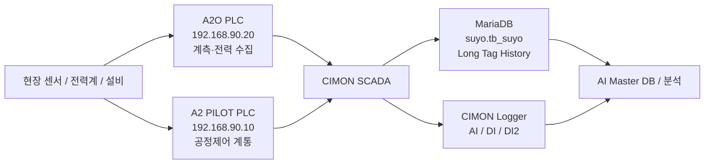

# 중랑 데이터 흐름 및 시스템 경계

## 현재 확인된 내용

- **A2O PLC**: `192.168.90.20`. 확보 XG5000 원본 기준 계측·전력 수집 PLC로 확인되며, `계측기통신_씨맥`, `서브미터통신`, `DATA_SWAP` 관련 흐름을 확인할 수 있다.
- **A2 PILOT PLC**: `192.168.90.10`. CIMON에서 `PID.*`, `ETHERFOS.*`가 이 PLC 주소를 읽는 구조가 확인되지만, 내부 Sequence/Interlock/Run Permit/Timer/최소·최대 Hz Rule은 A2 PILOT XG5000 원본 없이 확정할 수 없다.
- **CIMON SCADA**: PLC 값을 취합하고 HMI·태그·Logger·SQL 적재의 허브 역할을 한다.
- **운영 DB**: `suyo.tb_suyo`는 `Num / TAGNAME / DESCRIPT / PV / DATETIME1`의 5개 물리 컬럼을 가진 Long Tag History 구조로 확인되었다.
- Live `tb_suyo` Active Tag는 분석자료 기준 `AI.E_* 100 + PID.* 71 + ETHERFOS.* 55 = 226`이다.
- A2O 수질계측 `AI.WQ.*` 14개는 XG5000/SCADA 주소가 확인되지만 현재 분석된 `tb_suyo` Active 226개에는 포함되지 않은 것으로 정리되어 있다.

## 데이터 흐름

## 현재 확인된 4개 데이터 계통

| 계통 | PLC/주소 | SCADA | 현재 DB 상태 | 핵심 의미 |
|---|---|---|---|---|
| A2O 전력 | A2O `.20`, `%MD6000~6127` 계열 | `AI.E_*` | 100 Tag Active | 전력 예측·M&V·에너지 최적화 |
| A2O 수질 | A2O `.20`, `%MD2000~2013` | `AI.WQ.*` | 현재 226 Active에는 없음 | 수질 Feature 후보 14개 |
| A2 PILOT 공정 | A2 PILOT `.10`, `%MW10.x~`, `%MW100~` 등 | `PID.*` | 71 Tag Active | 유량·DO·MLSS·RUN/FLT·Set Point 등 |
| ETHERFOS | A2 PILOT `.10` 경유, `%MW500~609`, `%MW700~701` | `ETHERFOS.*` | 55 Tag Active | NH4/NO3/TOC/TN/TP/pH/SS/PO4P 등 |

## 추가 확인 필요

- A2 PILOT PLC 원본 XG5000을 확보해 내부 Sequence, Interlock, Run Permit, Timer, 최소·최대 Hz, AUTO/MANUAL Rule을 확인해야 한다.
- ETHERFOS 분석기 자체에서 A2 PILOT PLC 메모리로 들어오는 실제 통신방식과 PLC 내부 수신 프로그램은 현재 자료만으로 확정할 수 없다.
- 외부 AI Data Agent가 FEnet에 추가 접속할 때의 실운영 세션 여유·부하·네트워크 영향은 Read-only 런타임 시험이 필요하다.

## 개발 제안

- 기존 SCADA/Logger를 대체하지 않고 **Read-only AI Data Agent를 병렬 추가**한다.
- Raw DB에는 `cycle_id`, `sample_time`, `received_at`, `quality`를 분리 저장한다.
- AI는 PLC를 우회하여 설비를 직접 제어하지 않고 SCADA/PLC 안전조건을 경유한다.

## 관련 문서

- [[02-A2O-PLC-SCADA-매핑-상세]]
- [[03-A2-PILOT-SCADA-매핑-상세]]
- [[04-ETHERFOS-태그-상세]]
- [[../30-데이터-분석/01-DB-구조와-시간축-해석]]
- [[../30-데이터-분석/02-AI-수집-우선순위]]
