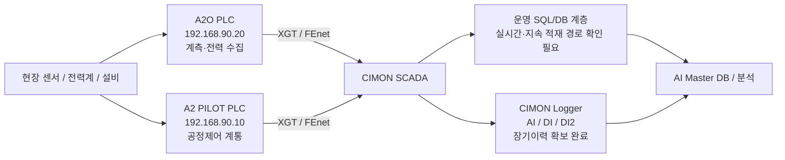

# 중랑 데이터 흐름 및 시스템 경계

## 현재 확인된 내용

- **2026-09-07 현장방문 확인**: 중랑에서 확인한 PLC 통신은 **LS ELECTRIC XGT / FEnet 기반**이다.
- **2026-09-07 현장방문 확인**: PLC 자체에는 과거 운전데이터를 별도로 장기 백업하지 않는다. 따라서 과거 AI 학습이력은 SCADA/Logger/DB 등 상위 저장계층에서 확보해야 한다.
- **A2O PLC**: `192.168.90.20`. 확보 XG5000 원본 기준 계측·전력 수집 PLC로 확인되며, `계측기통신_씨맥`, `서브미터통신`, `DATA_SWAP` 관련 흐름을 확인할 수 있다.
- **A2 PILOT PLC**: `192.168.90.10`. 2026-09-07 PC 수집본에서 XG5000 원본 `중랑처리장_A2O_Pilot_260508.xgwx/.state`를 확보했다. Project State에서 `Analog_Input`, `CONTROL_MAIN`, `VVVF_Control`, `VVVF_통신`과 교번/간헐/모터/유량제어 계열 Function Block 구조를 확인했다. **원본 미확보 이슈는 해소**되었고, 현재는 Ladder 접점·Run Permit·Interlock·최대 Hz·고장대체 Sequence를 Rule Book v1.0으로 기준화하는 단계다.
- **CIMON SCADA**: PLC 값을 취합하고 HMI·태그·Logger·SQL 적재의 허브 역할을 한다.
- **장기 SCADA Logger 데이터 확보 완료**: 2025-09-24~2026-08-05, 총 674개 파일(CLD 665개)이며 AI/DI/DI2 Logger의 장기 운전이력과 샘플링·CLD↔CSV 검증자료가 이미 확보되어 있다. [[../30-데이터-분석/03-장기-SCADA-Logger-데이터-확보현황]]
- **운영 DB**: `suyo.tb_suyo`는 `Num / TAGNAME / DESCRIPT / PV / DATETIME1`의 5개 물리 컬럼을 가진 Long Tag History 구조로 확인되었다.
- Live `tb_suyo` Active Tag는 분석자료 기준 `AI.E_* 100 + PID.* 71 + ETHERFOS.* 55 = 226`이다.
- A2O 수질계측 `AI.WQ.*` 14개는 XG5000/SCADA 주소가 확인되지만 현재 분석된 `tb_suyo` Active 226개에는 포함되지 않은 것으로 정리되어 있다.

## 데이터 흐름

> PLC 자체에는 과거이력 장기백업이 없지만, **중랑의 장기 운전이력은 CIMON SCADA Logger(CLD/CSV) 형태로 이미 확보되어 있다.** 9/7 PC의 `junglang` SQL 연결실패는 이 장기 Logger 데이터의 존재를 부정하는 근거가 아니며, 향후 AI 실시간·지속 연계를 위한 **운영 SQL/DB 경로 확인 이슈**로 별도 관리한다.

## 현재 확인된 4개 데이터 계통

| 계통 | PLC/주소 | SCADA | 현재 DB 상태 | 핵심 의미 |
|---|---|---|---|---|
| A2O 전력 | A2O `.20`, `%MD6000~6127` 계열 | `AI.E_*` | 100 Tag Active | 전력 예측·M&V·에너지 최적화 |
| A2O 수질 | A2O `.20`, `%MD2000~2013` | `AI.WQ.*` | 현재 226 Active에는 없음 | 수질 Feature 후보 14개 |
| A2 PILOT 공정 | A2 PILOT `.10`, `%MW10.x~`, `%MW100~` 등 | `PID.*` | 71 Tag Active | 유량·DO·MLSS·RUN/FLT·Set Point 등 |
| ETHERFOS | A2 PILOT `.10` 경유, `%MW500~609`, `%MW700~701` | `ETHERFOS.*` | 55 Tag Active | NH4/NO3/TOC/TN/TP/pH/SS/PO4P 등 |

## 추가 확인 필요

- A2 PILOT 원본은 확보했다. 이제 M203→M204→M102 순으로 내부 Sequence, Interlock, Run Permit, Timer, 최소·최대 Hz, AUTO/MANUAL Rule을 Ladder 수준에서 기준화하고 현장 확인을 받아야 한다.
- ETHERFOS 분석기 자체에서 A2 PILOT PLC 메모리로 들어오는 실제 통신방식과 PLC 내부 수신 프로그램은 현재 자료만으로 확정할 수 없다.
- 외부 AI Data Agent가 FEnet에 추가 접속할 때의 실운영 세션 여유·부하·네트워크 영향은 Read-only 런타임 시험이 필요하다.
- 확보된 장기 SCADA Logger 데이터와 A2 PILOT Rule을 먼저 연결해 M203 학습 Dataset을 만든다.
- 수집 HMI의 `junglang` SQL 연결실패는 **실시간/연속 적재용 운영 DB의 위치·DSN·DBMS·정상 적재 상태**를 확인하는 별도 연계과제로 병행한다.

## 개발 제안

- 기존 SCADA/Logger를 대체하지 않고 **Read-only AI Data Agent를 병렬 추가**한다.
- Raw DB에는 `cycle_id`, `sample_time`, `received_at`, `quality`를 분리 저장한다.
- **이미 확보한 장기 SCADA Logger 이력**을 초기 학습/검증에 사용하고, 이후 FEnet 또는 운영 DB 실시간 수집을 결합하여 AI Master DB를 구성한다.
- AI는 PLC를 우회하여 설비를 직접 제어하지 않고 SCADA/PLC 안전조건을 경유한다.

## 관련 문서

- [[02-A2O-PLC-SCADA-매핑-상세]]
- [[03-A2-PILOT-SCADA-매핑-상세]]
- [[07-A2-PILOT-PLC-Rule-Book]]
- [[04-ETHERFOS-태그-상세]]
- [[../30-데이터-분석/01-DB-구조와-시간축-해석]]
- [[../30-데이터-분석/02-AI-수집-우선순위]]
- [[../90-근거-기록/2026-09-07-중랑-현장방문-확인기록]]
- [[../90-근거-기록/2026-09-11-중랑-260907-PC수집본-재분석]]
