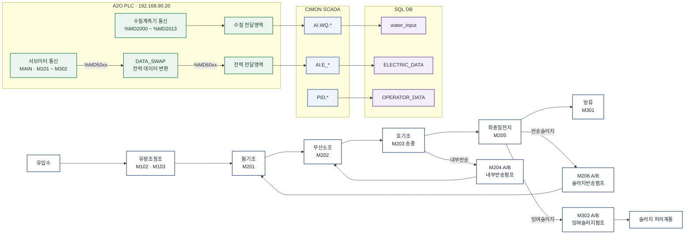

# 중랑 A2O 공정도 초안

> 원본 `.mmd`를 별도 첨부하지 않고 Obsidian에서 바로 렌더링되는 Mermaid 블록으로 변환했다.

```mermaid
flowchart LR
    IN["유입수"] --> EQ["유량조정조<br/>M102 · M103"]
    EQ --> ANA["혐기조<br/>M201"]
    ANA --> ANOX["무산소조<br/>M202"]
    ANOX --> AER["호기조<br/>M203 송풍"]
    AER --> SED["최종침전지<br/>M205"]
    SED --> OUT["방류<br/>M301"]

    AER -->|"내부반송"| M204["M204 A/B<br/>내부반송펌프"]
    M204 --> ANOX

    SED -->|"반송슬러지"| M206["M206 A/B<br/>슬러지반송펌프"]
    M206 --> ANA

    SED -->|"잉여슬러지"| M302["M302 A/B<br/>잉여슬러지펌프"]
    M302 --> WASTE["슬러지 처리계통"]

    subgraph A2O["A2O PLC · 192.168.90.20"]
        WQPLC["수질계측기 통신<br/>%MD2000 ~ %MD2013"]
        PWR["서브미터 통신<br/>MAIN · M101 ~ M302"]
        SWAP["DATA_SWAP<br/>전력 데이터 변환"]
        WQPLC --> A2OWQ["수질 전달영역"]
        PWR -->|"%MD50xx"| SWAP
        SWAP -->|"%MD60xx"| A2OPWR["전력 전달영역"]
    end

    subgraph SCADA["CIMON SCADA"]
        SCWQ["AI.WQ.*"]
        SCPWR["AI.E_*"]
        SCPID["PID.*"]
    end

    A2OWQ --> SCWQ
    A2OPWR --> SCPWR

    subgraph DB["SQL DB"]
        WATER["water_input"]
        ELEC["ELECTRIC_DATA"]
        OPER["OPERATOR_DATA"]
    end

    SCWQ --> WATER
    SCPWR --> ELEC
    SCPID --> OPER

    classDef process fill:#ffffff,stroke:#4f6b8a,stroke-width:2px,color:#172033;
    classDef plc fill:#eaf6ef,stroke:#4f9569,stroke-width:2px,color:#183b26;
    classDef scada fill:#eef4fa,stroke:#5c7ea5,stroke-width:2px,color:#18324b;
    classDef db fill:#f2eefa,stroke:#7967a8,stroke-width:2px,color:#342a50;

    class IN,EQ,ANA,ANOX,AER,SED,OUT,M204,M206,M302,WASTE process;
    class WQPLC,PWR,SWAP,A2OWQ,A2OPWR plc;
    class SCWQ,SCPWR,SCPID scada;
    class WATER,ELEC,OPER db;
```

## 확인 필요

- 설비번호/공정명/흐름은 현장 원본과 최종 대조 필요
- A2 PILOT 제어 Rule은 본 공정도만으로 확정하지 않음
