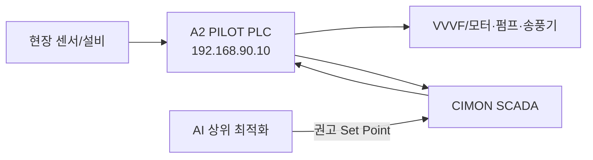
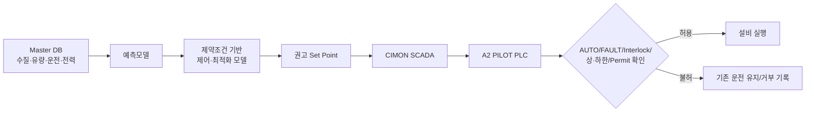

# 중랑 A2 PILOT PLC Rule Book

> [!important] 문서 상태
> **v0.9 = 기술 기준화 중**이다. 2026-09-07 현장 PC 수집본에서 A2 PILOT XG5000 원본과 SCADA 주소를 확보해 제어구조를 확인할 수 있게 되었지만, **각 Ladder 접점의 최종 논리·Run Permit·고장대체 시퀀스와 현장 운전자의 승인까지 완료된 v1.0은 아니다.**

## 1. 현재 확정된 제어 계층

- A2 PILOT XG5000 원본 파일이 확보되었다: `중랑처리장_A2O_Pilot_260508.xgwx` / `.state`.
- Project State에서 `Analog_Input`, `CONTROL_MAIN`, `VVVF_Control`, `VVVF_통신` 프로그램 구조를 확인했다.
- 사용자 Function Block/기능 항목으로 `A_B_선택`, `교번운전`, `간헐운전`, `모터운전`, `유량제어` 등이 존재한다.
- 따라서 A2 PILOT은 단순 계측 PLC가 아니라 **공정 운전 및 VVVF 제어 Rule을 가진 제어 PLC**로 관리한다.
- AI는 이 PLC를 우회하지 않는다. **AI → SCADA → A2 PILOT 안전·운전 Rule → 설비** 순서를 기본으로 한다.

## 2. Rule 확정 등급

| 등급 | 의미 | 현재 사용 방법 |
|---|---|---|
| **확정** | 원본 파일/SCADA 주소/프로젝트 구조로 확인 | Signal Master와 AI I/O 설계에 사용 가능 |
| **기술검토중** | 원본은 있으나 Ladder 접점·분기·타이머 연쇄를 아직 v1.0으로 기준화하지 않음 | Shadow 설계까지만 사용, 자동제어 근거로 사용 금지 |
| **현장확인필요** | 운전자 관행, 고장대체, Permit, 실제 상·하한 등 소스만으로 부족 | 현장 승인 후 v1.0 반영 |

## 3. 우선 Rule — M203 송풍기

**AI 1차 PoC 대상.** DO와 VVVF 설정/실제 Hz를 한 흐름으로 추적할 수 있어 Shadow Mode 검증에 가장 적합하다.

| 구분 | SCADA Tag | PLC 주소 | 의미 | 상태 |
|---|---|---:|---|---|
| 공정값 | `PID.DO_205.AI_DO_205` | `%MW106` | 반응조 DO | 확정 |
| DO 경계 | `PID.DO_205.AO_DO_H_SET` | `%MW157` | DO High 설정 | 확정 |
| DO 경계 | `PID.DO_205.AO_M_SET` | `%MW158` | DO Middle 설정 | 확정 |
| DO 경계 | `PID.DO_205.AO_DO_L_SET` | `%MW159` | DO Low 설정 | 확정 |
| 상태 | `PID.DO_205.AI_DO_HI/MID/LO` | `%MW160.0~2` | DO 구간 상태 | 확정 |
| 운전모드 | `PID.M_203A.AO_OP_SEL1` | `%MW161.0` | 지령운전 / 자체운전 | 확정 |
| 운전모드 | `PID.M_203A.AO_OP_SEL2` | `%MW161.1` | VVVF / 타이머 | 확정 |
| 운전모드 | `PID.M_203A.AO_OP_SEL3` | `%MW161.2` | VVVF 자동 / 수동 | 확정 |
| Set Point | `PID.M_203A.AO_DOA_SV` | `%MW162` | 자동 목표 DO | 확정 |
| 수동 설정 | `PID.M_203A.AO_DOM_SV` | `%MW163` | 수동 목표 주파수 | 확정 |
| 제어파라미터 | `AI_FLA_SHZ / AI_DOA_HZW / AI_DOA_HZT / AI_DOA_DOQ` | `%MW164 / 166 / 167 / 168` | 시작 Hz / Hz폭 / 제어주기 / DO 허용오차 | 확정 |
| 하한 | `PID.M_203A.AI_HZ_LOW` | `%MW169` | VVVF 최저 Hz | 확정 |
| 타이머 | `AO_TM_ONSV / AO_TM_OFFSVH/M/L` | `%MW172~175` | 운전/정지시간 설정 | 확정 |
| 실제값 | `PID.M_203A.AI_HZ_IN` | `%MW343` | 실제 VVVF 운전 Hz | 확정 |
| 상태/명령 | `DI_RUN / DI_FLT / DO_AMC / DO_RUC / DO_STC` | `%MW11.3~4 / %MW21.3~5` | RUN/FAULT/AUTO-MAN/RUN/STOP | 확정 |
| 교번 | `PID.M_203B.DO_203A/B` | `%MW21.6~7` | 송풍기 A/B 선택 | 확정 |

### M203에서 아직 v1.0 전에 확인할 것

- DO High/Middle/Low 상태가 실제로 Hz 증가·유지·감소에 연결되는 **정확한 Ladder 접점 조합**
- Fault 발생 시 A/B 대체 운전 순서와 지연시간
- Run Permit 및 Interlock 전체 조건
- 최대 Hz 상한과 현장 허용 운전 범위
- 통신 이상/센서 이상 시 Fail-safe 동작

## 4. 우선 Rule — M204 내부반송펌프

현재 SCADA 기준으로 **MLSS 운전 / 타이머 간헐운전** 구조가 명확히 확인된다. ORP 값 `%MW105`도 수집되지만, **ORP가 M204 제어 접점으로 직접 사용되는지는 아직 Ladder 확인 전이므로 확정하지 않는다.**

| 구분 | SCADA Tag | PLC 주소 | 의미 | 상태 |
|---|---|---:|---|---|
| 공정값 | `PID.MLSS_206.AI_MLSS_206` | `%MW107` | 반응조 MLSS | 확정 |
| 보조 공정값 | `PID.ORP_204.AI_ORP_204` | `%MW105` | 반응조 ORP | 값 존재 확정 / 제어연계 미확정 |
| 유량 | `PID.FM_200.AI_FL` | `%MW101` | 내부반송 유량 | 확정 |
| 운전모드 | `PID.M_204A.AO_OP_SEL1` | `%MW180.0` | MLSS 운전 / 타이머 | 확정 |
| 운전모드 | `PID.M_204A.AO_OP_SEL2` | `%MW180.1` | MLSS 자동 / 수동 | 확정 |
| Set Point | `PID.M_204A.AO_MLSSA_SV` | `%MW181` | 자동 목표 MLSS | 확정 |
| 수동 설정 | `PID.M_204A.AO_MLSSM_SV` | `%MW182` | 수동 목표 Hz | 확정 |
| 제어파라미터 | `AI_FLA_SHZ / AI_MLSSA_HZW / AI_MLSSA_HZT / AI_MLSSA_MLSSQ` | `%MW183 / 185 / 186 / 187` | 시작 Hz / Hz폭 / 주기 / 허용오차 | 확정 |
| 하한 | `PID.M_204A.AI_HZ_LOW` | `%MW188` | VVVF 최저 Hz | 확정 |
| 실제값 | `PID.M_204A.AI_HZ_IN` | `%MW353` | 실제 VVVF Hz | 확정 |
| 타이머 | `AO_TM_ONSV/OFFSV`, `AI_TM_ONPV/OFFPV` | `%MW191~194` | 간헐운전 설정/진행 | 확정 |
| 상태/명령 | `DI_RUN / DI_FLT / DO_AMC / DO_RUC / DO_STC` | `%MW11.9~10 / %MW21.9~11` | 상태와 명령 | 확정 |
| 교번 | `PID.M_204B.DO_204A/B` | `%MW21.12~13` | A/B 선택 | 확정 |

## 5. 우선 Rule — M102 유량조정펌프

M102는 **목표유량 기반 자동운전 / 수동 Hz / 타이머 간헐운전** 설정이 확인된다. Project State에는 `유량제어` Function Block도 존재하므로 기존 PLC의 유량제어 구조를 유지하고 AI는 상위 목표값을 제안하는 방향을 우선 검토한다.

| 구분 | SCADA Tag | PLC 주소 | 의미 | 상태 |
|---|---|---:|---|---|
| 유입유량 | `PID.FM_100.AI_FL` | `%MW100` | 원수 유입 유량 | 확정 |
| 운전모드 | `PID.M_102A.AO_OP_SEL1` | `%MW110.0` | 유량운전 / 타이머 | 확정 |
| 운전모드 | `PID.M_102A.AO_OP_SEL2` | `%MW110.1` | 유량 자동 / 수동 | 확정 |
| Set Point | `PID.M_102A.AO_FLA_SV` | `%MW111` | 자동 목표유량 | 확정 |
| 수동 설정 | `PID.M_102A.AO_FLM_SV` | `%MW112` | 수동 목표 Hz | 확정 |
| 제어파라미터 | `AI_FLA_SHZ / AI_FLA_HZW / AI_FLA_HZT / AI_FLA_FLQ` | `%MW113 / 115 / 116 / 117` | 시작 Hz / Hz폭 / 주기 / 허용오차 | 확정 |
| 하한 | `PID.M_102A.AI_HZ_LOW` | `%MW118` | VVVF 최저 Hz | 확정 |
| 실제값 | `PID.M_102A.AI_HZ_IN` | `%MW313` | 실제 VVVF Hz | 확정 |
| 타이머 | `AO_TM_ONSV/OFFSV`, `AI_TM_ONPV/OFFPV` | `%MW121~122 / %MW1017~1018` | 간헐운전 설정/진행 | 확정 |
| 상태/명령 | `DI_RUN / DI_FLT / DO_AMC / DO_RUC / DO_STC` | `%MW10.4~5 / %MW20.4~6` | 상태와 명령 | 확정 |
| 교번 | `PID.M_102B.DO_102A/B` | `%MW20.7~8` | A/B 선택 | 확정 |

## 6. AI 연계 원칙

- 1단계는 **Shadow Mode**: 계산만 하고 실제 제어 없음.
- 2단계는 **운영자 승인형**: 권고값을 사람이 보고 적용.
- 3단계는 충분한 검증과 현장 승인 후 **제한적 자동제어**.
- PLC Rule Book v1.0 승인 전에는 AI가 운전 Hz를 직접 쓰는 구조를 사용하지 않는다.

## 7. v1.0 완료조건

| 확인항목 | 완료조건 | 현재 |
|---|---|---|
| Ladder 상세 | M203→M204→M102의 실제 접점/분기/Timer 추적 | 진행 |
| Safety | AUTO/MANUAL, Fault, Interlock, Run Permit, Min/Max Hz | 일부 확인 / 상세 추적 필요 |
| 교번/대체 | A/B 교번과 Fault 대체운전 Sequence | 구조 존재 확인 / 상세 필요 |
| Signal Master | PLC 주소↔SCADA Tag↔DB/Logger↔Canonical ID | 진행 |
| 현장 확인 | 실제 운전 Rule과 PLC 소스 차이 확인 | 미확인 |
| 승인 | 파이브텍/현장 확인 기록 | 미완료 |

## 관련 문서

- [[03-A2-PILOT-SCADA-매핑-상세]]
- [[01-중랑-데이터흐름-및-시스템경계]]
- [[../30-데이터-분석/02-AI-수집-우선순위]]
- [[../80-산출물/03-중랑-확정사항-기반-실행계획-20260911]]
- [[../90-근거-기록/2026-09-11-중랑-260907-PC수집본-재분석]]
- [[../../00-프로젝트관리/09-리스크등록부]]
- [[../../00-프로젝트관리/10-이슈로그]]
