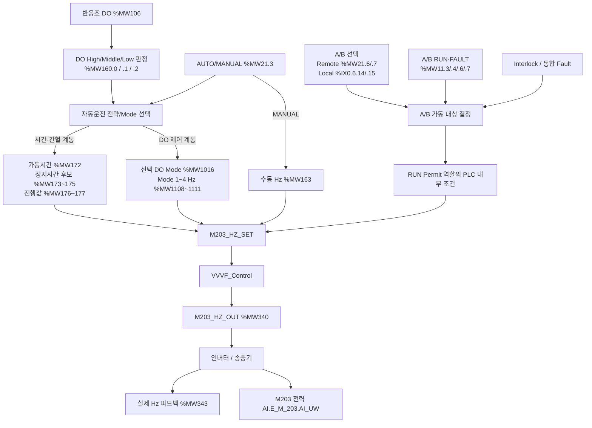

# M203 송풍기 PLC 제어 Cause Tree

## 목적

`왜 M203이 그 시점에 RUN/STOP 되었고 왜 그 Hz로 운전되었는가`를 **A2 PILOT PLC 원본의 제어 Rule**에서 먼저 설명하고, 장기 SCADA Logger에서 당시 실제 상태를 붙이는 기준 문서다.

## 한눈에 보는 제어 흐름

## 소스에서 확정된 원인 계층

| 계층 | PLC/SCADA 변수 | 확인 내용 | 판단 |
|---|---|---|---|
| 운전모드 | `M203_Auto_Man %MW21.3` | AUTO/MANUAL 선택이 PLC 입력으로 사용됨 | 확정 |
| 수동 RUN/STOP | `%MW21.4 / %MW21.5` | HMI에서 RUN/STOP을 각각 3초 Pulse로 전달 | 확정 |
| A/B 선택 | `%MW21.6 / %MW21.7`, `%IX0.6.14 / .15` | Remote/Local A/B 선택 변수가 별도 존재 | 확정 |
| A/B 상태 | `%MW11.3/.4/.6/.7` | A/B RUN·FAULT를 PLC가 판단에 사용 | 확정 |
| 안전조건 | `M203_INTLOCK`, `M203_Fault %MW347.3` | 통합 Interlock/Fault 내부 Rule이 존재 | 확정 |
| DO 입력 | `반응조_DO %MW106` | DO-205가 자동제어 입력으로 사용 | 확정 |
| DO 상태 | `%MW160.0/.1/.2` | High/Middle/Low 상태 Bit 존재 | 확정 |
| DO 판정 안정화 | `T#10S` | Analog_Input에서 DO High/Low 판정과 10초 시간요소가 사용됨 | 구조 확정, 세부 접점 극성은 XG5000 화면 최종 확인 |
| 자동 시간운전 | `%MW172~177` | 가동설정/정지설정/진행시간과 간헐운전 FB 존재 | 확정 |
| DO Mode | `%MW1016` | 실제 선택된 DO Mode가 1~4 값으로 SCADA/Logger에 노출 | 확정 |
| Mode별 Hz | `%MW1108~1111` | DO Mode 1~4 별 Hz 설정값 존재 | 확정 |
| 최종 내부 Set | `M203_HZ_SET` | CONTROL_MAIN에서 만들어져 VVVF_Control로 전달 | 확정 |
| VVVF 출력 | `M203_HZ_OUT %MW340` | VVVF_Control의 송풍기 Hz 출력 | 확정 |
| 실제 피드백 | `PID.M_203A.AI_HZ_IN %MW343` | 장기 AI Logger에 실제 Hz가 저장됨 | 확정 |
| 에너지 결과 | `AI.E_M_203.AI_UW` | 장기 AI Logger에 M203 유효전력이 저장됨 | 확정 |

## `왜 이 Hz였나`를 복원하는 방법

1. 장기 Logger의 `PID.M_203A.AI_DO_MOD_SET`으로 당시 PLC가 선택한 DO Mode를 확인한다.
2. 같은 Timestamp의 `PID.DO_205.AI_DO_205`, `AI_HZ_IN`, A/B RUN/FAULT, 타이머 진행값을 붙인다.
3. PLC Rule Book에서 해당 Mode가 어느 Hz 후보/시간운전 계통으로 연결되는지 판정한다.
4. 장기 CLD에 없는 AUTO/MANUAL·Mode별 Set Point는 PLC 원본과 CIMON SQL 설정을 기본 근거로 사용한다. SQL 이력이 실제 남아 있으면 추가 결합한다.
5. 최종적으로 `rule_reason_code`를 생성해 AI 학습 데이터에 넣는다.

## 현재 남은 세부 확인

- `M203_INTLOCK`을 구성하는 개별 접점의 AND/OR/NC 극성은 XG5000 그래픽 Ladder에서 최종 대조한다.
- DO High/Middle/Low가 Long/Middle/Short 정지시간 중 어느 것을 선택하는지 프로그램에 분기 구조는 존재하지만, 바이너리 역해석만으로 접점-operand 연결 순서를 단정하지 않는다. XG5000 화면에서 1회 확인하면 확정 가능하다.
- `AO_MOD %MW1102`의 값 0 명칭은 SCADA 문자열이 일부 깨져 있어 추가 확인한다. 값 1에 `DO` 문구가 있는 것은 확인됐다.
- `AO_MA_HZ %MW1116`은 장기 Logger에 존재하지만 정확한 기능 연결은 Ladder에서 추가 확인한다.

## AI 적용 경계

AI는 `M203_HZ_OUT`을 직접 쓰지 않는다. 초기 적용은 **예측/최적 Hz 또는 상위 Set Point를 권고**하고, 실제 실행은 SCADA → A2 PILOT PLC의 AUTO/MANUAL·Fault·Interlock·A/B 선택·최저 Hz 등의 기존 안전 Rule을 통과하도록 한다.
