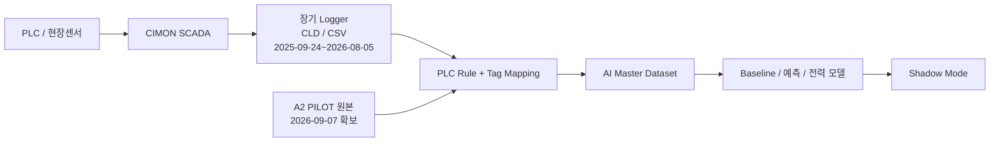

# 중랑 장기 SCADA Logger 데이터 확보현황

## 결론

**중랑 AI 학습에 사용할 장기 운전이력은 이미 확보되어 있다.** 현재 문제는 장기데이터의 존재 여부가 아니라, 확보된 SCADA Logger 시계열을 2026-09-07에 확보한 A2 PILOT PLC 제어 Rule과 정확히 연결하여 학습용 Master Dataset으로 만드는 것이다.

운영 SQL/DB의 실제 위치와 `junglang` 연결 상태 확인은 **향후 실시간·지속 수집 연계**를 위한 별도 과제이며, 기존 장기 Logger 데이터를 이용한 Baseline/모델 개발의 선행 차단조건으로 두지 않는다.

## 확보된 장기 데이터

| 항목 | 확인 내용 |
|---|---|
| 기간 | **2025-09-24 ~ 2026-08-05** |
| 파일 수 | **총 674개, CLD 665개** |
| AI Logger | **약 217 Tag / 약 15초 주기** |
| DI Logger | **약 120 Tag / 약 15초 주기** |
| DI2 Logger | **약 5 Tag / 약 1초 주기, M301 관련** |
| AI2 | 사실상 미사용으로 정리 |
| 데이터 형태 | CIMON SCADA Logger의 **CLD 원본 + CSV 변환/Export** |
| 검증 | CLD 직접 해석값과 CSV 비교 **58/58 일치** |
| 샘플링 | `Data_Sample_Package.zip`, 파일목록/기간/선정샘플 자료 생성 완료 |

## 이 데이터의 의미

기존 Logger 데이터에는 **과거에 실제로 어떻게 운전했는지**가 들어 있고, A2 PILOT 원본에는 **왜 그런 운전값이 나왔는지 판단하는 제어 Rule**이 들어 있다. 두 자료를 연결해야 `DO/ORP/MLSS/유량 → 운전모드/Set Point → 실제 Hz/RUN → kW` 관계를 해석할 수 있다.

## 현재 바로 가능한 작업

- 장기 Logger의 M203 관련 Tag 식별 및 시간축 정렬
- PLC 주소 ↔ SCADA Tag ↔ Logger 항목 ↔ Canonical ID 매핑
- M203 `DO → Mode → Set Point → 실제 Hz → RUN/FAULT → kW` Dataset 생성
- 결측/중복/통신이상 구간 품질진단
- M203 설비전력 **머신러닝 회귀모델** Baseline 개발
- PLC Rule을 제약조건으로 사용한 Shadow 권고값 생성

## 별도로 확인할 운영 DB 항목

9/7 HMI PC XLOG에서 `junglang` SQL 연결실패가 확인되었다. 이는 **이 HMI의 SQL/ODBC 경로가 정상인지 확인해야 한다는 의미**다.

확인 목적은 다음과 같다.

- 향후 AI 서버가 실시간 데이터를 어디서 지속적으로 받을 것인지 확정
- 운영 DB/SCADA/Logger 중 실시간 기준 Source를 결정
- 장애 시 Buffer/재전송/복구 방식 설계
- Master DB 자동 적재 경로 확정

**이 항목은 기존 장기 Logger 데이터 확보 여부와 분리하여 관리한다.**

## 관련 문서

- [[../20-현장-시스템/07-A2-PILOT-PLC-Rule-Book]]
- [[01-DB-구조와-시간축-해석]]
- [[02-AI-수집-우선순위]]
- [[../60-문제해결/01-CIMON-junglang-SQL-연결실패]]
- [[../80-산출물/03-중랑-확정사항-기반-실행계획-20260911]]
