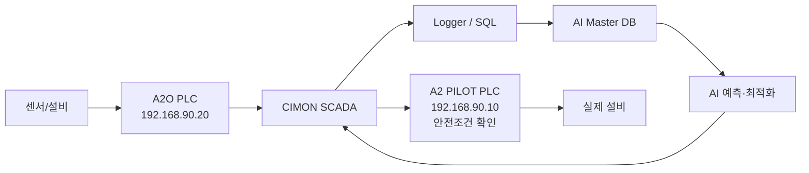

# 2차년도 RnR 및 통합연계 운영구조

> 중랑 하수 Pilot 중심. 원본 PDF/PPTX의 내용을 Obsidian 문서로 재구성했다.

## 한 장 결론

| 구분 | 역할 |
|---|---|
| 에이치코비 | 현장 DX / 데이터 신뢰성 / 설비 효율진단 / DT 기반 |
| 파이브텍·코이넷 | AI 예측·최적화 / 데이터·모델 통합연계 |
| 서울시립대학교 | 하수 공정 시뮬레이션 / 자동운전 로직 / 공정 안정성 |
| 경기대학교 | 정수 공정 / Pilot 적용평가 / 표준화 |
| 아이디알서비스 | DR / ESS·PV / Auto DR·주파수 DR |
| KTC | MRV / 초기 실증 데이터 분석 / 검증·성과 |
| 한국에너지4.0산업협회 | 가이드라인 / 이해관계자 의견수렴 / 확산 |
| 현장 실증시설 | 센서·PLC·SCADA / 운영 Rule / 실제 실증 |

## 핵심 책임 경계

### 에이치코비

- 현장 DX/계측 데이터화
- Pilot 시스템 운영·데이터 신뢰성
- 설비 효율·상태·예지진단
- DT 구현을 위한 시설 분석·설계

### 파이브텍 / 코이넷

- AI 학습용 데이터 구조·연계
- 수요(유입) 예측
- 수질/처리량 예측
- 설비 전력·에너지 최적화
- 모델 통합·DB/API·시각화 연계

### 서울시립대학교

- 하수 공정 시뮬레이션 로직
- Scheduling / Process model
- 자동운전 로직 설계·적용 평가
- 생물학적 공정 안정성
- 운전조건·수질·전력 성능 평가

## 중랑 기준 데이터·제어 흐름

## 시뮬레이션 경계

### 파이브텍의 AI/운영 시뮬레이션

- 유입/수질/전력 예측 결과 생성
- 운전조건 변경 시 결과 재계산
- 에너지 최적 운전 스케줄/Set Point 산출
- 실운영 데이터와 모델 결과 비교·검증
- 시각화/API 제공

### 서울시립대학교의 하수 공정 시뮬레이션

- 하수 공정별 Process model
- Scheduling 기반 자동운전 로직
- 오염부하·HRT·수질 안정성 평가
- 공정 제어로직 적용 전후 성능 평가
- 생물학적 처리공정·Microbiome 분석

## 기관 간 권장 인터페이스

### 파이브텍 → 서울시립대학교

- 동일 시간축 실운전 데이터
- 유입량·수질·전력 예측 결과
- 설비별 운전 Hz/RUN/전력
- AI 최적 Set Point 후보
- 모델 버전·시나리오 ID·예측 신뢰도

### 서울시립대학교 → 파이브텍

- 안정 운전 범위·공정조건
- 자동운전 로직/시나리오
- 수질 안정성 평가 결과
- 공정 제어 적용 전후 성능
- 최적화 결과의 공정 수용 가능 여부

## 파이브텍 ↔ 에이치코비 DT 연계

파이브텍/코이넷에서 DT에 제공할 후보:

- 실시간 표준 데이터
- 예측 결과
- 최적 Set Point 후보
- 이상/품질 상태
- 모델·시나리오·Timestamp
- REST/WebSocket 등 API

에이치코비 쪽:

- 가상시설/상태 동기화
- 운영 시나리오 입력
- AI 결과 시각화
- 실증·비교·모니터링
- 현장 DX/설비진단/DT 구현

## 지금 합의가 필요한 6가지

1. 시뮬레이션 모델 경계
2. 자동운전 로직 주체와 연결 방식
3. PLC 안전조건 승인 주체
4. DT API 규격
5. 데이터 표준/Signal Master 버전
6. 실증 판정 기준

## 공동 산출물 제안

- Signal Master
- Rule Book
- Model I/O Spec
- Scenario Spec
- DT/API Spec
- Validation Matrix

## 구분

### 자료에서 확인된 내용

기관별 개발내용과 중랑 현장분석에 근거한 역할·데이터 흐름.

### 추가 확인 필요

기관 간 상세 I/O 규격, 승인권자, 자동운전 책임경계는 문서에서 완전히 확정되어 있지 않다.

### 개발 제안

AI → SCADA → A2 PILOT PLC 안전조건 확인 → 실제 설비 순으로 연계하고, Shadow → 운영자 승인형 → 제한 자동 순으로 단계 적용한다.
