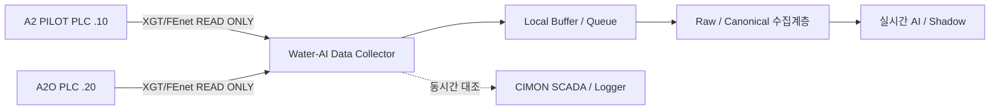

# 9.6 데이터 수집 모듈 개발 및 DB 적재 시험 실행계획

## 문서 목적

중랑 Pilot Plant의 핵심 신호를 **독립 Read-only PLC Direct Collector**로 수집하고 DB/Raw 계층에 안정적으로 적재하는 전 과정을 검증한다. 기존 CIMON SCADA/Logger를 대체하거나 수정하는 작업이 아니다.

## 현재 판단

- A2 PILOT `192.168.90.10`: M203 공정·운전·제어 상태의 주요 원천
- A2O `192.168.90.20`: M203 전력 및 일부 계측의 주요 원천
- 기존 CIMON Logger 장기이력은 이미 확보되어 있어 AI 오프라인 개발은 별도로 진행한다.
- 신규 Collector는 향후 실시간 AI/Shadow를 위한 경로이며 **Collector 완성까지 모델 개발을 대기하지 않는다.**

## 목표 구조



## 1차 적용 범위

| 구분 | 실행 내용 |
|---|---|
| 우선 설비 | **M203 송풍기** |
| PLC | **A2 PILOT `.10` + A2O `.20`** |
| 통신 | LS ELECTRIC XGT/FEnet 기반 READ-only |
| Tag 기준 | [[../30-데이터-분석/04-M203-Signal-Master-v0.9|M203(송풍기) Signal Master v0.9]] |
| 수집수 | 대표 15~30개 핵심 Signal부터 시작 |
| 저장 | Local Buffer + 검증용 Raw 계층 |
| 검증 | PLC Direct ↔ SCADA/Logger 동시간 비교 + 장애복구 + 24시간 연속수집 |
| 제외 | PLC Write, 자동제어, 기존 PLC/SCADA Logic 수정 |

## 1차 대표 Signal

### A2 PILOT `.10`

- DO `%MW106`
- MLSS `%MW107`
- ORP `%MW105` — 실제 필요/이력 확인 후
- 유입량 `%MW100`
- 송풍량 `%MW103`
- M203A/B RUN·FAULT `%MW11.3/.4/.6/.7`
- AUTO/MANUAL `%MW21.3`
- 선택 DO Mode `%MW1016`
- 최저 Hz `%MW169`
- 실제 Hz `%MW343`
- Interlock은 실제 읽기 가능한 주소/노출변수 확정 후 추가

### A2O `.20`

- M203 kWh `%MD6070`
- M203 kW/W `%MD6075`
- M203 PF `%MD6077`
- 필요 시 전류/전압 추가

## Collector 구성

| 모듈 | 주요 기능 | 목적 |
|---|---|---|
| FEnet Adapter | TCP 연결, READ 요청/응답, 응답코드 처리 | PLC 직접수집 |
| Poll Scheduler | 설정주기 기반 Batch Read | PLC 부하/세션 최소화 |
| Signal Mapping | Canonical ID ↔ PLC/SCADA/단위/Scale | 코드와 현장 설정 분리 |
| Quality / Timestamp | 원천/수신시간, 값 유효성, 품질코드 | AI 학습/운영 품질 |
| Local Queue | 미전송 레코드 임시저장 | 장애 시 유실 방지 |
| DB Writer | Batch Insert, 중복방지, 재전송 | 안정적 적재 |
| Health / Log | 연결·수집·적재·재시도·오류 | 운영 확인 |
| Compare | PLC Direct ↔ Legacy Logger 비교 | Signal v1.0 검증 |

## Signal Mapping 필드

```text
canonical_signal_id
plant_id
equipment_id
source_plc
plc_ip
plc_symbol
plc_address
data_type
scale
unit
interval_ms
quality_rule
legacy_scada_tag
legacy_logger_tag
```

Collector 자체 설정은 `M203(송풍기) Signal Master`에서 생성 가능한 구조를 우선한다. 주소를 코드 안에 하드코딩해 별도 정본을 만들지 않는다.

## 동시간 대조 판정

| 결과 | 의미 |
|---|---|
| PASS | 동일 의미/허용오차 내 값 일치 |
| PASS_SCALE | Scale 적용 후 일치 |
| PASS_DELAY | 시간지연 보정 후 일치 |
| PASS_AVG | SCADA Logger 평균/집계규칙 확인 |
| MISMATCH | 의미 또는 값 불일치 |
| UNKNOWN | 근거 부족 |

## 시험계획

| ID | 시험 | 판정 포인트 |
|---|---|---|
| TC-01 | A2 PILOT 연결 | 연결/재연결, 기존 제어 영향 없음 |
| TC-02 | A2O 연결 | 연결/재연결, 기존 수집 영향 없음 |
| TC-03 | Known Signal READ | 자료형·Scale 검증 |
| TC-04 | SCADA/Logger 동시간 대조 | PASS/SCALE/DELAY/AVG/MISMATCH 판정 |
| TC-05 | 1시간 연속수집 | 중복/누락 원인 추적 |
| TC-06 | DB 중단 | Local Buffer 지속 |
| TC-07 | DB 복구 | 미전송 Replay |
| TC-08 | 네트워크 단절 | 재연결 후 정상 복귀 |
| TC-09 | 프로세스 재시작 | Queue 유지/복구 |
| TC-10 | 24시간 시험 | 수집률·지연·Retry 통계 |
| TC-11 | PLC/SCADA 영향 확인 | 기존 HMI/제어/Logger 장애 없음 |

## 완료 기준

코드 존재만으로 완료하지 않는다.

- A2 PILOT/A2O 실제 READ 성공
- Raw 적재 성공
- SCADA/Logger와 대표 Signal 동시간 대조
- 장애·재시작 복구 성공
- 24시간 연속수집 증빙
- 기존 PLC/SCADA 운영 영향 없음 확인
- Signal Master v1.0 승격에 사용할 비교결과 생성

## DB 선택과의 관계

검증용 Raw 저장소를 먼저 사용할 수 있으나 **본 문서가 공식 프로젝트 DB 엔진을 결정하지 않는다.** 운영 Source/Canonical DB 구조는 공통 원천 DB 가이드와 4인 검토 Gate를 따른다.

## 추가 확인 필요

- FEnet Port/Channel/세션 여유
- 직접수집 주소별 자료형·Scale
- `M203_INTLOCK`의 직접 읽기 가능한 노출주소 여부
- Collector 설치 PC의 PLC 네트워크 접근성
- 공식 DB/Schema 선택 결과
- 현장 시험 가능 시간대
